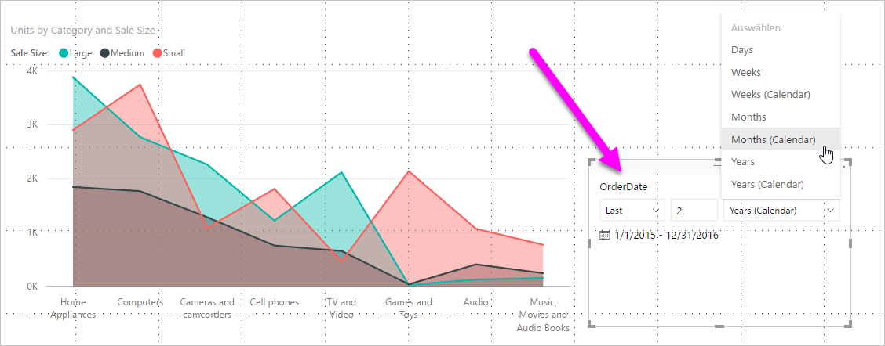

# Verwenden eines Slicers und Filters für relative Datumsbereiche in Power BI

[!INCLUDE [applies-to](../includes/applies-to.md)] [!INCLUDE [yes-desktop](../includes/yes-desktop.md)] [!INCLUDE [yes-service](../includes/yes-service.md)]

Mit dem **relativen Datenschnitt mit Datum** oder **relativem Datumsfilter** können Sie zeitbasierte Filter auf beliebige Datumsspalten in Ihrem Datenmodell anwenden. Zum Beispiel können Sie mit dem **relativen Datenschnitt mit Datum** nur Daten zu Verkäufen anzeigen lassen, die innerhalb der letzten 30 Tage (des letzten Monats, des Kalendermonats usw.) aufgetreten sind. Wenn Sie die Daten aktualisieren, wendet der relative Zeitraum automatisch die entsprechende relative Datumseinschränkung an.

## Verwenden des relativen Datenschnitts mit Datumsbereich

Der relative Datenschnitt mit Datum funktioniert wie jeder andere Datenschnitt. Erstellen Sie ein Visual vom Typ **Datenschnitt** für Ihren Bericht, und wählen Sie dann für **Feld** einen Datumswert aus. In der folgenden Abbildung wurde das Feld *OrderDate* ausgewählt.

Wählen Sie den Datenschnitt für Ihre Canvas aus, und klicken Sie dann auf das Caretzeichen in der oberen rechten Ecke des Datenschnittvisuals. Wenn das Visual Datumsdaten enthält, wird im Menü die Option **Relativ** angezeigt.

Wählen Sie für den relativen Datenschnitt mit Datum die Option *Relativ* aus.

Anschließend können Sie die Einstellungen auswählen.

Für die erste Einstellung im *relativen Datenschnitt mit Datum* stehen folgende Auswahlmöglichkeiten zur Verfügung:

* Letzte

* Weiter

* Diese

Mit der zweiten (mittleren) Einstellung im *relativen Datenschnitt mit Datum* können Sie eine Zahl eingeben, um den relativen Datumsbereich zu definieren.

Mit der dritten Einstellung können Sie den Datumswert auswählen. Die folgenden Auswahlmöglichkeiten stehen zur Verfügung:

* Tage

* Wochen

* Wochen (Kalender)

* Monate

* Monate (Kalender)

* Jahre

* Years (Calendar)

Wenn Sie in dieser Liste **Monate** auswählen und *2* in der mittleren Einstellung eingeben, geschieht Folgendes:

* Wenn heute der 20. Juli ist,

* werden die in den Visuals enthaltenen Daten vom Datenschnitt auf die letzten zwei Monate beschränkt,

* also vom 21. Mai bis zum 20. Juli (das heutige Datum).

Wenn Sie hingegen *Monate (Kalender)* auswählen, zeigen die eingeschränkten Visuals Daten vom 1. Mai bis zum 30. Juni (die letzten zwei vollständigen Kalendermonate).

## Verwenden des relativen Datumsbereichsfilters

Sie können auch einen relativen Datumsbereichsfilter für Ihre Berichtsseite oder für den gesamten Bericht erstellen. Hierzu ziehen Sie ein Datumsfeld in die **Filter auf Seitenebene** oder die **Berichtsstufenfilter** im Bereich **Feld**:

Anschließend können Sie den relativen Datumsbereich ändern. Dazu gehen Sie ähnlich der Anpassung des **relativen Datenschnitts mit Datum** vor. Wählen Sie in der Dropdownliste **Filtertyp** den Eintrag **Relative Datumsfilterung** aus.

Sobald Sie die **Relative Datumsfilterung** ausgewählt haben, werden Ihnen wie beim Datenschnitt drei zu ändernde Abschnitte, einschließlich eines numerischen Felds in der Mitte, angezeigt.

## Einschränkungen und Überlegungen

Die folgenden Überlegungen und Einschränkungen betreffen derzeit den **relativen Datenschnitt mit Datum** und den relativen Datumsfilter.

* Datenmodelle in **Power BI** enthalten keine Zeitzoneninformationen. In Modellen können Zeitangaben gespeichert werden, es gibt jedoch keinerlei Hinweise auf die entsprechende Zeitzone.

* Die Datenschnitte und Filter basieren immer auf der Zeit in UTC. Wenn Sie einen Filter in einem Bericht einrichten und an einen Kollegen in einer anderen Zeitzone senden, sehen Sie beide die gleichen Daten. Wenn Sie sich nicht in der UTC-Zeitzone befinden, müssen Sie und Ihr Kollege den Zeitversatz berücksichtigen.

* Sie können Daten, die in einer lokalen Zeitzone erfasst wurden, mithilfe des **Abfrage-Editors** in UTC konvertieren.

## Nächste Schritte

Erfahren Sie, wie Sie [Gruppierung und Quantisierung in Power BI Desktop verwenden](../desktop-grouping-and-binning.md).
