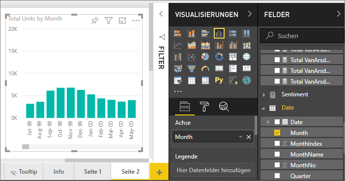
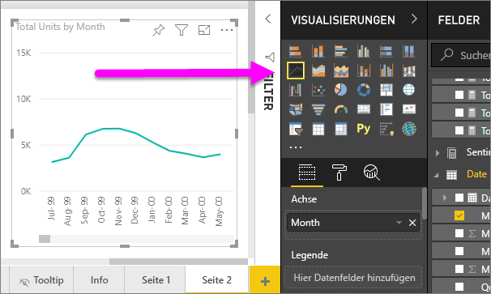
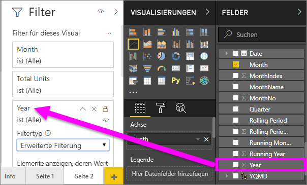
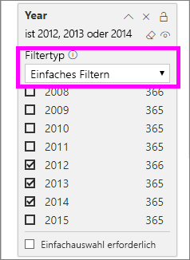
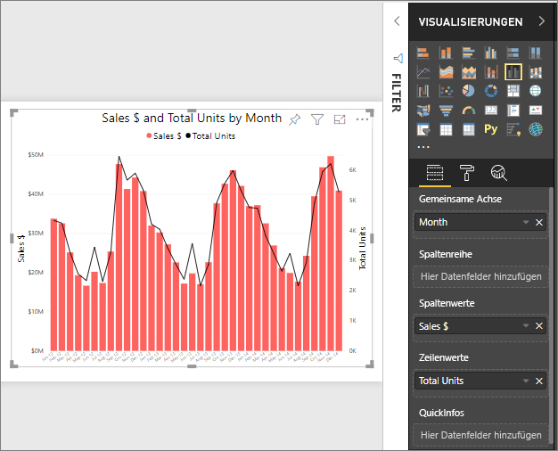
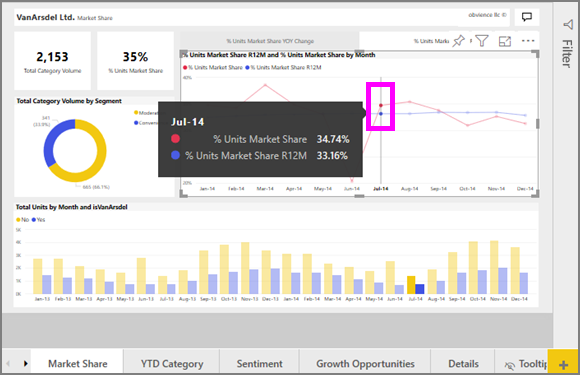

# Liniendiagramme in Power BI
Ein Liniendiagramm ist eine Reihe von Datenpunkten, die durch Punkte dargestellt und durch gerade Linien verbunden sind. Ein Liniendiagramm kann aus einer oder mehreren Linien bestehen. Liniendiagramme haben eine X- und eine Y-Achse. 

## Erstellen eines Liniendiagramms
Mit dieser Anleitung erstellen Sie anhand der Beispiel-App für Vertrieb und Marketing ein Liniendiagramm, das den Absatz des laufenden Jahres nach Kategorie anzeigt. Rufen Sie hierfür die Beispiel-App aus appsource.com ab.

1. Beginnen Sie auf einer leeren Berichtsseite. Wenn Sie den Power BI-Dienst verwenden, achten Sie darauf, den Bericht in der [Bearbeitungsansicht](../service-interact-with-a-report-in-editing-view.md) zu öffnen.

2. Wählen Sie im Bereich „Felder“ **SalesFact** \> **Gesamtanzahl der Einheiten** aus, und wählen Sie dann **Datum** > **Monat** aus.  Power BI erstellt ein Säulendiagramm im Zeichenbereich des Berichts.

    

4. Konvertieren Sie es in ein Liniendiagramm, indem Sie die Vorlage für Liniendiagramme im Bereich „Visualisierungen“ auswählen. 

    
   

4. Filtern Sie Ihr Liniendiagramm zur Anzeige der Daten aus den Jahren 2012-2014. Wenn der Bereich „Filter“ reduziert ist, erweitern Sie ihn jetzt. Wählen Sie im Bereich „Felder“ **Datum** \> **Jahr** aus, und ziehen Sie es in den Bereich „Filter“. Legen Sie es unter der Überschrift **Filter für dieses Visual**  ab. 
     
    

    Ändern Sie **Erweiterte Filter** zu **Basisfilter**, und wählen Sie **2012**, **2013** und **2014** aus.

    

6. Optional können Sie [die Textgröße und -farbe des Diagramms anpassen](power-bi-visualization-customize-title-background-and-legend.md). 

    

## Hinzufügen weiterer Linien zum Diagramm
Liniendiagramme können viele verschiedene Linien haben. In einigen Fällen können die Werte in den Linien so voneinander abweichen, dass sie nicht gut zusammen angezeigt werden können. Sie lernen, wie Sie unserem aktuellen Diagramm zusätzliche Linien hinzufügen, und erfahren dann, wie Sie das Diagramm formatieren, wenn die durch die Linien dargestellten Werte sehr unterschiedlich sind. 

### Hinzufügen zusätzlicher Linien
Anstatt die Gesamtanzahl der Einheiten für alle Regionen als einzelne Linie im Diagramm darzustellen, unterteilen wir die Gesamtanzahl der Einheiten nach Regionen. Fügen Sie zusätzliche Linien hinzu, indem Sie **Geografischer Raum** > **Region** in den Bereich „Legende“ ziehen.

   

### Verwenden von zwei Y-Achsen
Was ist, wenn Sie den Gesamtumsatz und die Gesamtanzahl der Einheiten im gleichen Diagramm betrachten möchten? Verkaufszahlen sind sehr viel höher als Einheitenzahlen, sodass das Liniendiagramm nicht verwendet werden kann. Tatsächlich scheint die rote Linie für die Gesamtanzahl der Einheiten bei 0 (null) zu liegen.

   

Um stark abweichende Werte im gleichen Diagramm anzuzeigen, verwenden Sie ein Kombinationsdiagramm. Unter [Kombinationsdiagramm in Power BI](power-bi-visualization-combo-chart.md) erfahren Sie alles über Kombinationsdiagramme. In unserem Beispiel unten können wir Verkäufe und Gesamtanzahl der Einheiten zusammen in einem Diagramm darstellen, indem wir eine zweite Y-Achse hinzufügen. 

   

## Hervorheben und Kreuzfiltern
Informationen zur Verwendung des Filterbereichs finden Sie unter [Hinzufügen eines Filters zu einem Bericht in Power BI](../power-bi-report-add-filter.md).

Die Auswahl eines Datenpunkts auf einem Liniendiagramm ermöglicht das Kreuzhervorheben und Kreuzfiltern anderer Visualisierungen auf der Berichtsseite und umgekehrt. Öffnen Sie hierfür die Registerkarte **Marktanteil**.  

In einem Liniendiagramm ist ein einzelner Datenpunkt der Schnittpunkt eines X- und Y-Achsenwerts. Wenn Sie einen Datenpunkt auswählen, fügt Power BI Markierungen hinzu, die anzeigen, welcher Punkt (für eine einzelne Linie) oder welche Punkte (bei zwei oder mehr Linien) die Quelle für Kreuzhervorheben und Kreuzfiltern der anderen Visualisierungen auf der Berichtsseite ist bzw. sind. Wenn Ihre Visualisierung sehr dicht ist, wählt Power BI den Punkt aus, der am nächsten an der Stelle liegt, wo Sie auf das visuelle Element klicken.

In diesem Beispiel haben wir einen Datenpunkt ausgewählt, der Folgendes umfasst: Juli 2014, Marktanteil der Einheiten R12 33,16 Prozent und Marktanteil der Einheiten 34,74 Prozent.

Beachten Sie, dass das Säulendiagramm kreuzhervorgehoben und das Messgerät kreuzgefiltert ist.

Informationen zum Steuern der Kreuzhervorhebung und Kreuzfilterung von Diagrammen finden Sie unter [Interaktionen mit Visualisierungen in einem Power BI-Bericht](../service-reports-visual-interactions.md).

## Zu beachtende Aspekte und Problembehandlung
* Ein Liniendiagramm kann keine zwei Y-Achsen haben.  Sie müssen stattdessen ein Kombinationsdiagramm verwenden.
* In den obigen Beispielen wurden die Diagramme so formatiert, dass der Schriftgrad vergrößert, die Schriftfarbe geändert, Achsentitel hinzugefügt, Diagrammtitel und Legende zentriert, der Ausgangspunkt beider Achsen auf 0 (null) gesetzt und vieles mehr durchgeführt wurde. Der Bereich „Formatierung“ (Farbrollensymbol) bietet zahlreiche Optionen, mit denen Sie Ihre Diagramme nach Wunsch gestalten können. Sie lernen diese Möglichkeit am besten kenn, indem Sie den Bereich „Formatierung“ öffnen und erforschen.

## Nächste Schritte

[Visualisierungstypen in Power BI](power-bi-visualization-types-for-reports-and-q-and-a.md)

