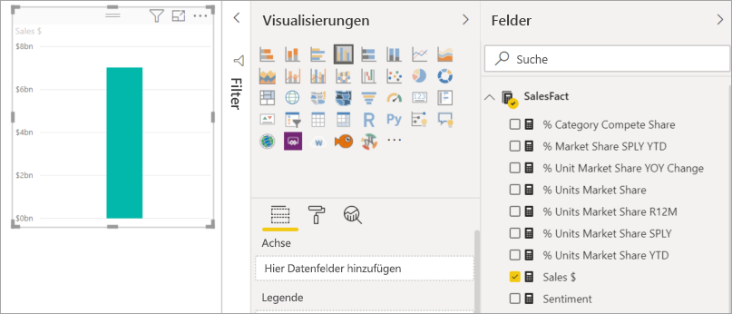
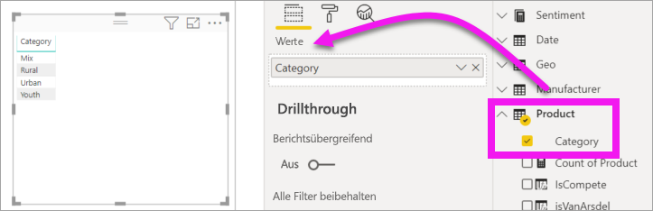
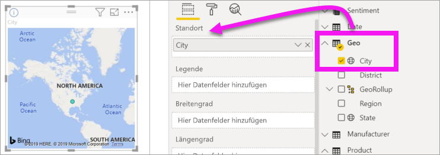
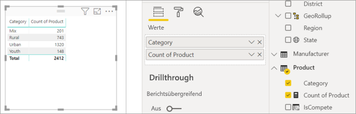
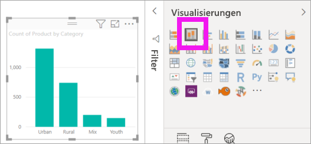
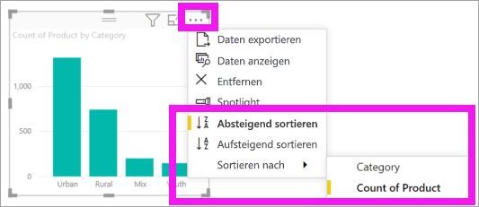

# Hinzufügen von Visuals zu einem Power BI-Bericht (Teil 1)

[!INCLUDE[consumer-appliesto-nyyn](../includes/consumer-appliesto-nyyn.md)]    

[!INCLUDE [power-bi-visuals-desktop-banner](../includes/power-bi-visuals-desktop-banner.md)]

Dieser Artikel enthält eine kurze Einführung in das Erstellen einer Visualisierung in einem Bericht. Er gilt sowohl für den Power BI-Dienst als auch für Power BI Desktop. Komplexere Inhalte [finden Sie in Teil 2](power-bi-report-add-visualizations-ii.md) dieser Serie.

## Voraussetzungen

In diesem Tutorial wird die [PBIX-Datei für Vertrieb und Marketing](https://download.microsoft.com/download/9/7/6/9767913A-29DB-40CF-8944-9AC2BC940C53/Sales%20and%20Marketing%20Sample%20PBIX.pbix) verwendet.

1. Klicken Sie im oberen linken Bereich der Power BI Desktop-Menüleiste auf **Datei** > **Öffnen**.
   
2. Suchen Sie nach Ihrer Kopie der **PBIX-Beispieldatei für Vertrieb und Marketing**.

1. Öffnen Sie die **PBIX-Beispieldatei für Vertrieb und Marketing** in der Berichtsansicht .

1. Auswählen  um eine neue Seite hinzuzufügen.

> [!NOTE]
> Eine Freigabe Ihres Berichts für einen Power BI-Kollegen erfordert, dass Sie und Ihr Kollege jeweils eine eigene Power BI Pro-Lizenz haben oder dass der Bericht in der Premium-Kapazität gespeichert wird. Weitere Informationen finden Sie unter [Freigeben von Berichten](../collaborate-share/service-share-reports.md).

## Hinzufügen von Visualisierungen zum Bericht

1. Erstellen Sie eine Visualisierung durch Auswahl eines Felds aus dem Bereich **Felder** .

    Beginnen Sie mit einem numerischen Feld wie **Sales** > **TotalSales**. Power BI erstellt ein Säulendiagramm mit einer einzelnen Spalte.

    

    Beginnen Sie alternativ mit einem Kategoriefeld, z.B. **Name** oder **Produkt**. Power BI erstellt eine Tabelle und fügt das Feld dem Bereich **Werte** hinzu.

    

    Beginnen Sie alternativ mit einem geografischen Feld wie **Geo** > **City** (Stadt). Power BI und Bing Maps erstellen eine Kartenvisualisierung.

    

## Ändern des Visualisierungstyps

 Erstellen Sie eine Visualisierung, und ändern Sie deren Typ. 
 
 1. Wählen Sie **Product** (Produkt) > **Category** (Kategorie) und dann **Product** > **Count of Product** (Produktanzahl) aus, um beide dem Bereich **Values** (Werte) hinzuzufügen.

    

1. Ändern Sie die Visualisierung in einem Säulendiagramm, indem Sie das Symbol **Gestapeltes Säulendiagramm** auswählen.

   

1. Um die Weise zu ändern, in der das Visual sortiert ist, wählen Sie **Weitere Aktionen** (...) aus.  Verwenden Sie die Sortieroptionen, um die Sortierrichtung der Sortierung (aufsteigend oder absteigend) und die Spalte, nach der sortiert wird (**Sortieren nach**), zu ändern.

   
  
## Nächste Schritte

 Fahren Sie fort mit:

* [Teil 2: Hinzufügen von Visualisierungen zu einem Power BI-Bericht](power-bi-report-add-visualizations-ii.md)

* [Mit den Visualisierungen](../consumer/end-user-reading-view.md) im Bericht interagieren
