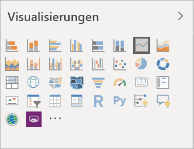
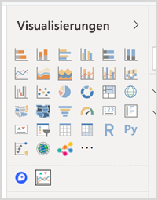

# Visualisierungen in Power BI-Berichten

[!INCLUDE[consumer-appliesto-yyyn](../includes/consumer-appliesto-yyyn.md)]    

Visualisierungen (kurz: Visuals) veranschaulichen Erkenntnisse an, die in den Daten ermittelt wurden. Ein Power BI-Bericht kann eine einzelne Seite mit einem Visual oder mehrere mit Visuals gefüllte Seiten enthalten. Im Power BI-Dienst können Visuals [aus Berichten an Dashboards angeheftet](../create-reports/service-dashboard-pin-tile-from-report.md) sein.

Es ist wichtig zwischen *Berichts-Designern* und *Berichtskonsumenten* zu unterscheiden.  Wenn Sie den Bericht erstellen oder ändern, sind Sie der Designer.  Designer verfügen über Bearbeitungsberechtigungen für den Bericht und das zugrunde liegende Dataset. In Power BI Desktop bedeutet dies, dass Sie das Dataset in der Datensicht öffnen und in der Berichtsansicht Visuals erstellen können. Im Power BI-Dienst bedeutet dies, dass Sie das Dataset oder den Bericht im Berichts-Editor in der [Bearbeitungsansicht](../consumer/end-user-reading-view.md) öffnen können. Wenn ein Bericht oder Dashboard [für Sie freigegeben](../consumer/end-user-shared-with-me.md) wurde, sind Sie ein *Nutzer* des Berichts. Sie können den Bericht und seine Visuals anzeigen und mit ihnen interagieren, jedoch nicht so viele Änderungen vornehmen, wie es ein *Designer* kann.

Im Power BI-Bereich „Visualisierungen“ stehen viele verschiedene Visualtypen zur Verfügung.

Eine noch größere Auswahl finden Sie auf der [Website der Microsoft AppSource-Community](https://appsource.microsoft.com). Dort können Sie [Power BI-Visuals](https://appsource.microsoft.com/marketplace/apps?page=1&product=power-bi-visuals) suchen und [herunterladen](../developer/visuals/custom-visual-develop-tutorial.md), die von Microsoft und der Community bereitgestellt werden.

Wenn Sie noch nicht mit Power BI gearbeitet haben oder Ihre Kenntnisse auffrischen möchten, finden Sie unten Links zu den Grundlagen von Power BI-Visualisierungen.  Alternativ finden Sie im Inhaltsverzeichnis (links neben diesem Artikel) weitere hilfreiche Informationen.

## Hinzufügen einer Visualisierung in Power BI

[Erstellen Sie Visualisierungen](power-bi-report-add-visualizations-i.md) auf Ihren Berichtsseiten Durchsuchen Sie die [Liste der verfügbaren Visualisierungen und verfügbaren Visualisierungstutorials](power-bi-visualization-types-for-reports-and-q-and-a.md). 

## Hochladen einer benutzerdefinierten Visualisierung und deren Verwendung in Power BI

Fügen Sie eine benutzerdefinierte Visualisierung hinzu, die Sie selbst erstellt oder auf der [Website der Microsoft AppSource-Community](https://appsource.microsoft.com/marketplace/apps?product=power-bi-visuals) gefunden haben. Sind Sie kreativ? Nutzen Sie Ihren Quellcode komplett, und erstellen Sie mit unseren [Entwicklertools](../developer/visuals/custom-visual-develop-tutorial.md) neue Typen von Visualisierungen, die Sie dann [für die Community freigeben](../developer/visuals/office-store.md) können. Informationen zur Entwicklung von benutzerdefinierten Visuals finden Sie unter [Entwickeln eines benutzerdefinierten Visuals für Power BI](../developer/visuals/custom-visual-develop-tutorial.md).

## Personalisieren des Bereichs „Visualisierungen“ (Vorschauversion)

Wenn Sie ein benutzerdefiniertes Visual für mehrere Berichte verwenden, können Sie die benutzerdefinierte Visualisierung an Ihren Visualisierungsbereich anheften. Klicken Sie zum Anheften der Visualisierung mit der rechten Maustaste auf das anzuheftende Visual, um es an diesen Bereich anzuheften.

Nachdem ein Visual angeheftet wurde, befindet es sich bei den anderen integrierten Visuals. Dieses Visual ist nun mit Ihrem angemeldeten Konto verknüpft und in neu erstellten Berichten enthalten, wenn Sie angemeldet sind. Dies erleichtert das Standardisieren eines bestimmten Visuals, ohne es jedem einzelnen Bericht hinzufügen zu müssen.

Solange sich diese Funktion in der Vorschauversion befindet, werden nur die angehefteten Visuals in Power BI Desktop angezeigt. Darüber hinaus müssen Sie angemeldet sein, damit diese Funktion verfügbar ist.

## Ändern des Visualisierungstyps

Versuchen Sie [den Visualisierungstyp zu ändern](power-bi-report-change-visualization-type.md), um zu sehen, welcher für Ihre Daten am besten geeignet ist.

## Anheften der Visualisierung

Wenn die Visualisierung Ihren Wünschen entspricht, können Sie sie im Power BI-Dienst als Kachel an ein [Dashboard anheften](../create-reports/service-dashboard-pin-tile-from-report.md). Wenn Sie die im Bericht verwendete Visualisierung ändern, nachdem Sie sie angeheftet haben, wird die Kachel im Dashboard nicht geändert. Wenn die Visualisierung ein Liniendiagramm war, bleibt sie ein Liniendiagramm, selbst wenn Sie sie im Bericht in ein Ringdiagramm geändert haben.

## Einschränkungen und Überlegungen
- Abhängig von der Datenquelle und der Anzahl an Feldern (Measures oder Spalten) kann es sein, dass ein Visual nur langsam geladen wird.  Aus Gründen der Lesbarkeit und Leistung wird empfohlen, Visuals auf 10 bis 20 Felder zu beschränken. 

- Der obere Grenzwert für Visuals liegt bei 100 Feldern (Measures oder Spalten). Reduzieren Sie die Anzahl der Felder, wenn das Laden des Visuals fehlschlägt.   

## Weitere Schritte

* [Visualisierungstypen in Power BI](power-bi-visualization-types-for-reports-and-q-and-a.md)
* [Power BI-Visuals](../developer/visuals/power-bi-custom-visuals.md)
