# ArcGIS Maps in Power BI Desktop

[!INCLUDE [power-bi-visuals-desktop-banner](../includes/power-bi-visuals-desktop-banner.md)]

Dieses Tutorial richtet sich an Personen, die eine ArcGIS Maps for Power BI-Karte erstellen. Sobald der *Designer* eine ArcGIS Maps for Power BI-Karte für einen Kollegen freigegeben hat, kann dieser die Karte anzeigen und mit ihr interagieren, jedoch keine Änderungen speichern. Weitere Informationen zum Anzeigen von ArcGIS-Karten finden Sie unter [Interagieren mit ArcGIS Maps for Power BI-Karten](power-bi-visualizations-arcgis.md).

Die Kombination von ArcGIS Maps und Power BI bietet völlig neue Möglichkeiten der Kartendarstellung, die über die Darstellung von Punkten auf einer Karte weit hinausgeht. Wählen Sie Basiskarten, Standorttypen, Designs, Symbolstile und Referenzebenen aus, um beeindruckende, aussagekräftige Kartenvisualisierungen zu erstellen. Die Kombination von autoritativen Datenebenen auf einer Karte mit räumlicher Analyse vermittelt ein tieferes Verständnis der Daten in der Visualisierung.

 Sie können auf einem mobilen Gerät zwar keine ArcGIS Maps for Power BI-Karten erstellen, aber diese anzeigen und mit ihnen interagieren. Siehe [Interagieren mit ArcGIS-Karten](power-bi-visualizations-arcgis.md).

> [!TIP]
> GIS steht für „Geoinformationssysteme“.

Im folgenden Beispiel werden in einem dunkelgrauen Zeichenbereich regionale Umsatzdaten als Heatmap auf einer demografischen Ebene des Medians des verfügbaren Einkommens im Jahr 2016 angezeigt. Wie Sie bei der weiteren Lektüre feststellen werden, bieten ArcGIS Maps for Power BI-Karten nahezu unbegrenzte erweiterte Mappingfunktionen, demografische Daten und noch eindrucksvollere Kartenvisualisierungen für optimales Storytelling.

> [!TIP]
> Besuchen Sie die [Seite von Esri zu ArcGIS Maps for Power BI](https://www.esri.com/powerbi), auf der Sie viele Beispiele und Kommentare von Kunden finden. Und besuchen Sie dann die [Seite für erste Schritte mit ArcGIS Maps for Power BI](https://doc.arcgis.com/en/maps-for-powerbi/get-started/about-maps-for-power-bi.htm) von Esri.

## Zustimmung des Benutzers
ArcGIS Maps for Power BI-Karten werden von Esri bereitgestellt (https://www.esri.com) ). Die Verwendung von ArcGIS-Karten für Power BI unterliegt den Nutzungsbedingungen und der Datenschutzrichtlinie von Esri. Power BI-Benutzer, die Visualisierungen von ArcGIS Maps für Power BI verwenden möchten, müssen die Informationen im Zustimmungsdialogfeld akzeptieren.

**Ressourcen**

[Nutzungsbedingungen](https://go.microsoft.com/fwlink/?LinkID=826322)

[Datenschutzrichtlinie](https://go.microsoft.com/fwlink/?LinkID=826323)

[Produktseite zu ArcGIS-Karten für Power BI](https://www.esri.com/powerbi)

## Voraussetzungen

In diesem Tutorial werden Power BI Desktop und die PBIX-Datei zum [Analysebeispiel für den Einzelhandel](https://download.microsoft.com/download/9/6/D/96DDC2FF-2568-491D-AAFA-AFDD6F763AE3/Retail%20Analysis%20Sample%20PBIX.pbix) verwendet. ArcGIS Maps for Power BI-Karten können auch mithilfe des Power BI-Diensts erstellt werden. 

1. Wählen Sie im oberen linken Bereich der Menüleiste **Datei** \> **Öffnen** aus.
   
2. Suchen Sie auf dem lokalen Computer die PBIX-Datei **Retail Analysis sample**.

1. Öffnen Sie das **Analysebeispiel für den Einzelhandel** in der Berichtsansicht .

1. Auswählen  um eine neue Seite hinzuzufügen.

   
## Erstellen einer ArcGIS Maps for Power BI-Kartenvisualisierung

Sehen Sie sich an, wie Will verschiedene Visualisierungen erstellt, und probieren Sie es dann anhand der PBIX-Datei zum [Analysebeispiel für Einzelhandel](../sample-datasets.md) selbst aus.
    

   > [!NOTE]
   > In diesem Video wird eine ältere Version von Power BI Desktop verwendet.
   > 

> [!VIDEO https://www.youtube.com/embed/EKVvOZmxg9s]

1. Wählen Sie im Bereich „Visualisierungen“ das Symbol „ArcGIS Maps for Power BI“ aus.
   
    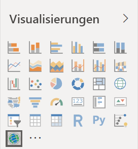    

2. Power BI fügt in die Berichtszeichenfläche eine leere Vorlage ein. Für dieses Tutorial verwenden wir die kostenlose Version.
   
   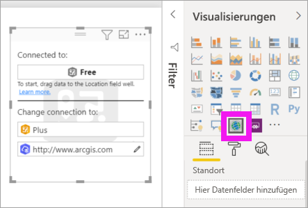

3. Ziehen Sie aus dem Bereich **Felder** ein Datenfeld in den Bucket **Ort** oder **Breitengrad** und/oder **Längengrad**. In diesem Beispiel verwenden wir **Store > Ort**.
   
   > [!NOTE]
   > ArcGIS-Karten für Power BI erkennt automatisch, ob die ausgewählten Felder als Form oder Punkt auf einer Karte angezeigt werden sollen. Sie können die Standardeinstellung in den Einstellungen anpassen (siehe unten).
   > 
   > 
   
    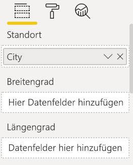

4. Ziehen Sie ein Measure aus dem Bereich **Felder** in den Bucket **Größe**, um die Darstellung der Daten anzupassen. In diesem Beispiel verwenden wir **Umsätze > Umsätze letztes Jahr**.
   
    

Sie haben Ihre erste ArcGIS Maps for Power BI-Karte erstellt. Als Nächstes werden wir unsere Karte mithilfe von Grundkarten, Positionstypen, Designs und vielem mehr weiterentwickeln und formatieren.

## Einstellungen und Formatierungen für ArcGIS Maps for Power BI-Karten
So greifen Sie auf die Formatierungsfunktionen für **ArcGIS-Karten für Power BI** zu:

1. Sie können auf zusätzliche Funktionen zugreifen, indem Sie **Weitere Aktionen** (...) in der rechten oberen Ecke der Visualisierung und anschließend **Bearbeiten** auswählen.
   
   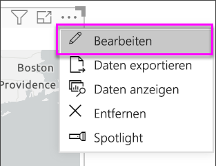
   
   Die Visualisierung wird erweitert, und die verfügbaren Funktionen werden am oberen Rand angezeigt. Wenn Sie eine Funktion auswählen, wird ein Aufgabenbereich mit detaillierten Optionen angezeigt. 
   
   
   

> [!TIP]
> **Esri** bietet eine [umfassende Dokumentation](https://go.microsoft.com/fwlink/?LinkID=828772) zu den Funktionen von **ArcGIS-Karten für Power BI**.

### Grundkarten
Es werden vier grundlegende Karten bereitgestellt: „Dunkelgrauer Zeichenbereich“, „Hellgrauer Zeichenbereich“, „OpenStreetMap“ und „Straßen“.  *Straßen* ist die ArcGIS-Standardgrundkarte.

Wenn Sie eine Grundkarte anwenden möchten, wählen Sie sie im Aufgabenbereich aus.

### Ortstyp
Die beste Darstellungsweise für Daten in der Karte wird von ArgGIS Maps for Power BI-Karten automatisch erkannt. Dabei werden Punkte und Begrenzungen ausgewählt. Mit den Optionen für den Positionstyp können Sie die Auswahl anpassen.

**Begrenzungen** kann nur verwendet werden, wenn die Daten geografische Standardwerte enthalten. Die Form, die auf der Karte angezeigt wird, wird von ArcGIS Maps for Power BI automatisch ermittelt. Geografische Standardwerte umfassen Länder, Bundesländer, Postleitzahlen usw. Wie bei der Geocodierung wird von Power BI jedoch möglicherweise nicht erkannt, dass ein Feld standardmäßig eine Begrenzung darstellen soll, oder es wird möglicherweise keine Begrenzung für Ihre Daten gefunden.  

### Kartendesign
Es werden vier Kartendesigns bereitgestellt. Von Power BI wird automatisch entweder das Design **Nur Ort** oder das Design **Größe** ausgewählt, je nachdem, welche Felder Sie den Buckets **Ort** und **Größe** hinzugefügt haben. Für unsere Karte wurde **Größe** als Standardwert festgelegt, da wir beiden Buckets Felder hinzugefügt haben. Probieren Sie die anderen Designs aus, und kehren Sie zur Einstellung **Größe** zurück, bevor Sie mit dem nächsten Schritt fortfahren.  

<table>
<tr><th>Design</th><th>Beschreibung</th>
<tr>
<td>Nur Ort</td>
<td>Zeichnet auf der Karte Datenpunkte oder ausgefüllte Begrenzungen, je nach dem Feld, das Sie dem Bucket „Ort“ hinzugefügt haben.</td>
</tr>
<tr>
<td>Wärmebild</td>
<td>Stellt die Intensität der Daten auf der Karte dar. Bereiche mit einer höheren Aktivität oder einem höheren Wert werden durch kräftigere und leuchtende Farben dargestellt. </td>
</tr>
<tr>
<td>Größe</td>
<td>Zeichnet auf der Karte Datenpunkte, je nach dem Feld, das Sie dem Bucket „Größe“ hinzugefügt haben.</td>
</tr>
<tr>
<td>Clustering</td>
<td>Punkte mit dem angegebenen Clusterradius werden in einem Symbol gruppiert, das die Anzahl der Punkte in diesem Bereich auf der Karte darstellt. </td>
</tr>
</table>

### Symbolformat
Mit Symbolformaten können Sie die Darstellung von Daten in der Karte genauer anpassen. Symbolformate sind kontextbezogen und abhängig vom ausgewählten Ortstyp und Kartendesign. Im folgenden Beispiel ist das Kartendesign auf **Größe** festgelegt, und an „Transparenz“, „Stil“ und „Größe“ wurden verschiedene Symbolformatanpassungen vorgenommen. 

### Markierungen
Fügen Sie Stecknadeln hinzu, um die Aufmerksamkeit auf bestimmte Punkte in der Karte zu lenken.  

1. Wählen Sie die Registerkarte **Pins** (Stecknadeln) aus.
2. Geben Sie im Suchfeld Schlüsselwörter (z.B. Adressen, Orte oder Sehenswürdigkeiten) ein, und wählen Sie sie in der Dropdownliste aus. Auf der Karte wird ein Symbol angezeigt, und der Standort wird auf der Karte automatisch vergrößert. Suchergebnisse werden im Bereich „Pins“ (Stecknadeln) als Infokarten für interessante Orte gespeichert. Sie können bis zu 10 Infokarten für interessante Orte speichern.
   
   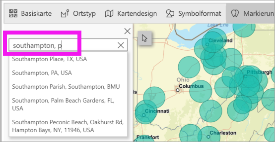
3. Diesem Standort wird eine Stecknadel hinzufügt, und Sie können die Farbe der Stecknadel ändern.
   
   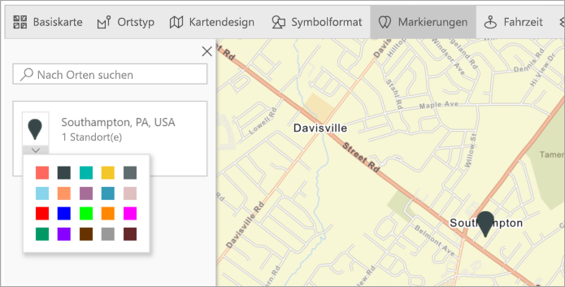
4. Sie können Stecknadeln hinzufügen und löschen.
   
   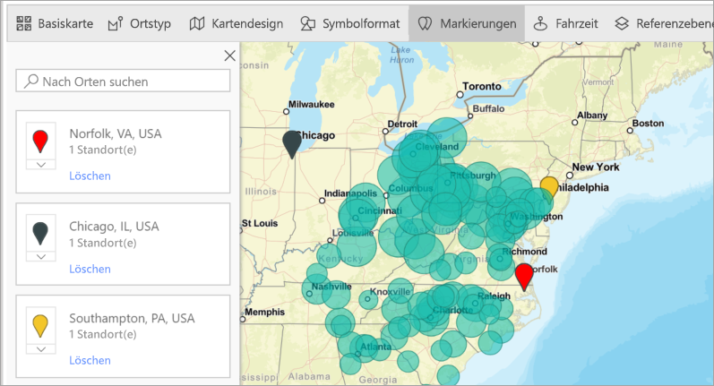

### Fahrzeit
Im Bereich „Drive time“ (Fahrzeit) können Sie einen Ort auswählen und dann bestimmen, welche anderen Kartenfeatures sich in einem angegebenen Radius oder innerhalb einer angegebenen Fahrzeit befinden. Im folgenden Beispiel ist ein Radius von 50 Meilen um Washington D.C. dargestellt.  Führen Sie die folgenden Schritte durch, um eine eigene Fahrzeitebene zu erstellen. 
    

1. Wählen Sie das Einfachauswahlwerkzeug und dann eine Stecknadel oder Blase aus. In diesem Beispiel haben wir für den Flughafen Charlotte Douglas eine Stecknadel ausgewählt.

   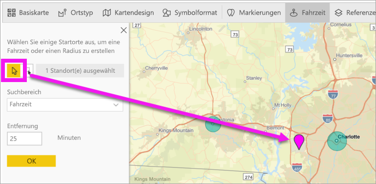
   
   > [!TIP]
   > Wenn Sie die Karte vergrößern, lassen sich Orte einfacher auswählen. Sie können die Karte vergrößern, indem Sie das Pluszeichen verwenden oder mit der Maus scrollen.
   > 
   > 
2. Angenommen, Sie landen auf dem Flughafen Charlotte Douglas und bleiben einige Tage, um zu ermitteln, welche Ihrer Filialen sich mit dem Auto in einer angemessenen Zeit erreichen lassen. Geben Sie für den Suchbereich **Fahrzeit** und für die Entfernung **25** Minuten ein. Wählen Sie „OK“ aus.    
   
    

    

3. In 25 Minuten lassen sich zwei Geschäfte erreichen. Der Radius wird in Violett dargestellt. Wählen Sie einen beliebigen Standort aus, um seine Details anzuzeigen. Optional können Sie den Radius durch Ändern der Farbe und Kontur formatieren.
   
    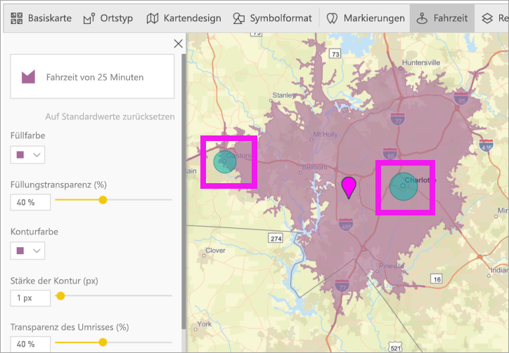

### Referenzebene
#### Referenzebene – Demografie
ArcGIS-Karten für Power BI stellen eine Auswahl von demografischen Ebenen bereit, mit denen Daten aus Power BI in Kontext gestellt werden können.

1. Wählen Sie die Registerkarte **Referenzebene** und anschließend **Demografie** aus.
2. Für jede aufgeführte Ebene wird ein Kontrollkästchen angezeigt. Aktivieren Sie ein Kontrollkästchen, um die entsprechende Ebene zur Karte hinzuzufügen.  In diesem Beispiel wurde das durchschnittliche Haushaltseinkommen hinzugefügt. 
   
    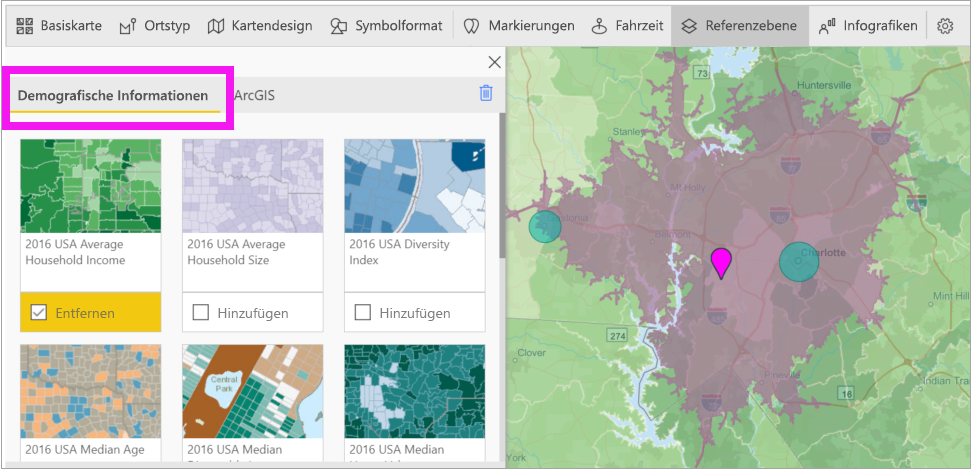
3. Jede Ebene ist außerdem interaktiv. Zeigen Sie auf eine Blase, um die Details anzuzeigen. Klicken Sie auf einen schattierten Bereich, um Details in Form von Diagrammen anzuzeigen. Hier haben wir die Postleitzahl 28227 ausgewählt, und wir können zwei Diagramme anzeigen.
   
    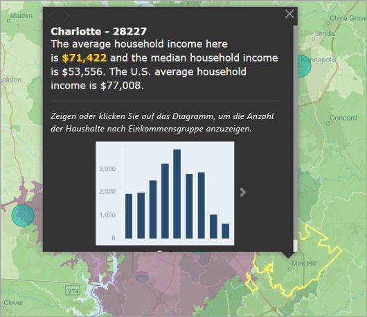

#### Referenzebene – ArcGIS
Über ArcGIS Online können Organisationen öffentliche Webkarten veröffentlichen. Darüber hinaus bietet Esri mit dem „Living Atlas“ einen Satz mit ausgewählten Webkarten. Auf der ArcGIS-Registerkarte können Sie alle öffentlichen Webkarten und Living Atlas-Karten durchsuchen und Ihrer Karte als Referenzebenen hinzufügen.

1. Wählen Sie die Registerkarte **Referenzebene** und anschließend **ArcGIS** aus.
2. Geben Sie Suchbegriffe ein, und wählen Sie dann eine Kartenebene aus. In diesem Beispiel wurden die Kongresswahlbezirke der USA ausgewählt.
   
    
3. Wählen Sie zum Anzeigen der Details einen schattierten Bereich aus. Die Option *Aus Referenzebene auswählen* wird angezeigt: Wählen Sie mit dem Tool zur Auswahl der Referenzebenen Begrenzungen oder Objekte in der Ebene aus.

 

## Auswählen von Datenpunkten
ArcGIS Maps for Power BI bietet fünf Modi für die Auswahl, damit Sie Ihre Daten genau und schnell auswählen können.

Ändern Sie den Auswahlmodus, indem Sie mit Ihrem Cursor auf das Symbol der einzelnen Auswahlmodi zeigen, wie im obigen Bild dargestellt. So wird der ausgeblendete Balken erweitert, und weitere Tools werden angezeigt:

Jedes Tool spielt eine einzigartige Rolle bei der Auswahl Ihrer Daten: 

 Wählt einzelne Datenpunkte aus.

 Zeichnet ein Rechteck auf der Karte und wählt die darin enthaltenen Datenpunkte aus.

 Ermöglicht die Verwendung von Begrenzungen oder Polygonen in den Referenzebenen zum Auswählen von enthaltenen Datenpunkten.

 Damit können Sie Daten mithilfe einer Pufferebene auswählen.

 Damit können Sie Datenpunkte auswählen, die sich ähneln.

> [!NOTE]
> Es können maximal 250 Datenpunkte gleichzeitig ausgewählt werden.
> 
> 

 

## Hilfe
**Esri** bietet eine [umfassende Dokumentation](https://go.microsoft.com/fwlink/?LinkID=828772) zu den Funktionen von **ArcGIS-Karten für Power BI**.

In der [Power BI-Community finden Sie einen Thread zu **ArcGIS Maps für Power BI**](https://go.microsoft.com/fwlink/?LinkID=828771) mit aktuellen Informationen. Dort können Sie auch Fragen stellen und Probleme melden.

Verbesserungsvorschläge können Sie an die [Ideensammlung für Power BI](https://ideas.powerbi.com) senden.

 

## Verwalten der Verwendung von ArcGIS-Karten für Power BI in Ihrer Organisation
Mit Power BI können Designer, Mandanten- und IT-Administratoren festlegen, ob ArcGIS Maps for Power BI-Karten verwendet werden sollen. Im Folgenden sind die Schritte aufgeführt, die von den einzelnen Rollen durchgeführt werden können. 

### Designeroptionen
In Power BI Desktop können Designer ArcGIS Maps for Power BI auf der Registerkarte „Sicherheit“ deaktivieren. Wählen Sie **Datei** > **Optionen und Einstellungen** und dann **Optionen** > **Sicherheit** aus. Wenn die entsprechende Option deaktiviert ist, werden ArcGIS-Karten nicht standardmäßig geladen.

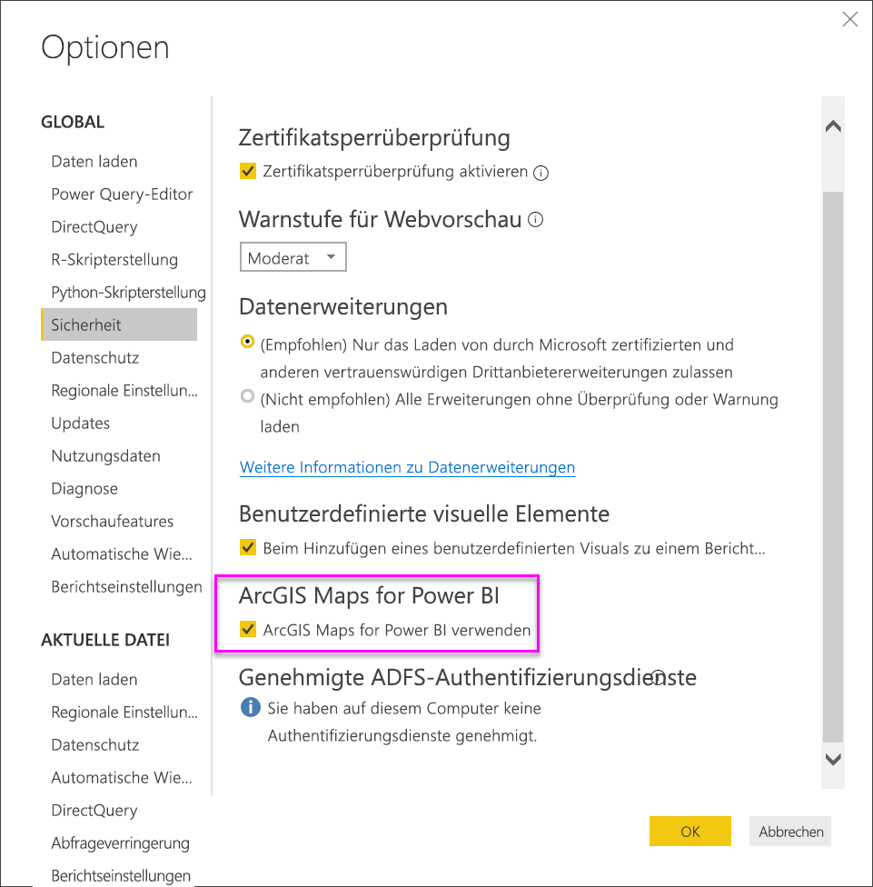

### Optionen für Mandantenadministrator
In PowerBI.com können Mandantenadministratoren ArcGIS Maps for Power BI für alle Benutzer deaktivieren. Wählen Sie **Einstellungen** > **Verwaltungsportal** > **Mandanteneinstellungen** aus. Bei einer Deaktivierung wird das ArcGIS Maps for Power BI-Symbol von Power BI im Bereich „Visualisierungen“ nicht mehr angezeigt.

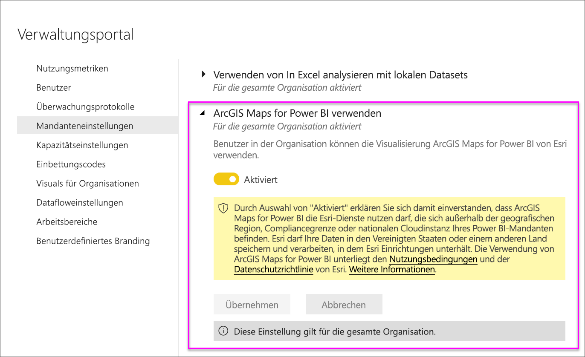

### Optionen für den IT-Administrator
Power BI Desktop unterstützt die Verwendung von **Gruppenrichtlinien** zum Deaktivieren von ArcGIS-Karten für Power BI auf allen in einer Organisation bereitgestellten Computern.

<table>
<tr><th>Attribut</th><th>Wert</th>
</tr>
<tr>
<td>Schlüssel</td>
<td>Software\Policies\Microsoft\Power BI Desktop&lt;/td&gt;
</tr>
<tr>
<td>valueName</td>
<td>EnableArcGISMaps</td>
</tr>
</table>

Der Wert 1 (dezimal) aktiviert ArcGIS-Karten für Power BI.

Der Wert 0 (dezimal) deaktiviert ArcGIS-Karten für Power BI.

## Überlegungen und Einschränkungen
ArcGIS Maps für Power BI ist in den folgenden Diensten und Anwendungen verfügbar:

<table>
<tr><th>Dienst/App</th><th>Verfügbarkeit</th></tr>
<tr>
<td>Power BI Desktop</td>
<td>Ja</td>
</tr>
<tr>
<td>Power BI service (app.powerbi.com)</td>
<td>Ja</td>
</tr>
<tr>
<td>Mobile Apps für Power BI</td>
<td>Ja</td>
</tr>
<tr>
<td>Power BI-Webveröffentlichung</td>
<td>Nein</td>
</tr>
<tr>
<td>Power BI Embedded</td>
<td>Nein</td>
</tr>
<tr>
<td>Einbettung in den Power BI-Dienst (PowerBI.com)</td>
<td>Nein</td>
</tr>
</table>

In Diensten und Anwendungen, für die ArcGIS Maps für Power BI nicht verfügbar ist, wird statt der Visualisierung ein leeres Visual mit dem Power BI-Logo angezeigt.

Bei der Geocodierung von Adressen werden nur die ersten 1500 Adressen verarbeitet. Ortsnamen und Länder sind von dieser Geocodierung-Einschränkung auf 1500 Einträge nicht betroffen.

 

**Wie interagieren ArcGIS Maps for Power BI miteinander?**
ArcGIS Maps for Power BI werden von Esri bereitgestellt (https://www.esri.com) ). Die Verwendung von ArcGIS Maps for Power BI unterliegt den [Nutzungsbedingungen](https://go.microsoft.com/fwlink/?LinkID=8263222) und der [Datenschutzrichtlinie](https://go.microsoft.com/fwlink/?LinkID=826323) von Esri. Power BI-Benutzer, die Visualisierungen von ArcGIS Maps for Power BI verwenden möchten, müssen die Informationen im Zustimmungsdialogfeld akzeptieren (Details finden Sie unter „Benutzerzustimmung“).  Die Verwendung von ArcGIS Maps for Power BI unterliegt den Nutzungsbedingungen und der Datenschutzrichtlinie von Esri, auf die auch über das Zustimmungsdialogfeld verwiesen wird. Jeder Benutzer muss seine Zustimmung geben, bevor er ArcGIS Maps for Power BI zum ersten Mal verwendet. Sobald der Benutzer seine Zustimmung gegeben hat, werden die Daten, die an das Visual gebunden sind, zumindest für die Geocodierung an die Esri-Dienste gesendet. Das bedeutet, dass Informationen zum Standort in Längen- und Breitengrade umgewandelt werden, die auf einer Karte dargestellt werden können. Gehen Sie davon aus, dass alle Daten, die an die Datenvisualisierung gebunden sind, an die Esri-Dienste gesendet werden können. Esri stellt u.a. Dienste wie Basiskarten, räumliche Analysen und Geocodierung bereit. Die ArcGIS Maps for Power BI-Visualisierung interagiert mit diesen Diensten unter Verwendung einer SSL-Verbindung, die von einem Zertifikat geschützt wird, das von Esri bereitgestellt und verwaltet wird. Zusätzliche Informationen zu ArcGIS Maps for Power BI erhalten Sie auf der [ArcGIS Maps for Power BI-Produktseite](https://www.esri.com/powerbi) von Esri.

Wenn sich ein Benutzer für ein Plus-Abonnement registriert, das von Esri über ArcGIS Maps for Power BI angeboten wurde, wird dadurch eine direkte Beziehung zu Esri hergestellt. Power BI sendet keine persönlichen Informationen über den Benutzer an Esri. Der Benutzer registriert sich für eine AAD-Anwendung, die von Esri bereitgestellt wird, und verwendet dabei seine eigene AAD-Identität. Außerdem vertraut er der Anwendung. Dadurch gibt er seine persönlichen Informationen direkt für Esri frei. Sobald der Benutzer einer ArcGIS Maps for Power BI-Visualisierung Plus-Inhalt hinzufügt, benötigen auch andere Power BI-Benutzer ein Plus-Abonnement von Esri, um den Inhalt anzeigen und bearbeiten zu können. 

Wenn Sie komplexe, technische Fragen zur Funktionsweise von ArcGIS Maps for Power BI haben, können Sie Esri über deren Supportwebsite kontaktieren.

**Welche Daten werden an Esri gesendet?**
Informationen zu den Daten, die an Esri übertragen werden, finden Sie auf deren [Dokumentationswebsite](https://doc.arcgis.com/en/maps-for-powerbi/get-started/data-transfer.htm).

**Fallen Gebühren für die Verwendung von ArcGIS-Karten für Power BI an?**

ArcGIS Map for Power BI wird von **Esri** ohne zusätzliche Kosten bereitgestellt. Sie müssen lediglich der Benutzervereinbarung zustimmen.  

**Ich erhalte in Power BI Desktop eine Fehlermeldung, dass der Cache voll ist**

Dieser Fehler ist bekannt und wird behoben.  Bis der Fehler behoben ist, leeren Sie den Cache, indem Sie Dateien am folgenden Speicherort löschen: C:\Benutzer\\AppData\Local\Microsoft\Power BI Desktop\CEF. Starten Sie dann Power BI neu.

**Unterstützen ArcGIS-Karten für Power BI Esri-Shapefiles?**

ArcGIS-Karten für Power BI erkennen automatisch Standardbegrenzungen wie Länder/Regionen, Staaten/Provinzen und Postleitzahlen. Wenn Sie Ihre eigenen Formen bereitstellen möchten, können Sie hierfür [Flächenkartogramme in Power BI Desktop](desktop-shape-map.md) verwenden.

**Kann ich meine ArcGIS-Karten offline anzeigen?**

Nein. Zum Anzeigen der Karten in Power BI ist eine Netzwerkverbindung erforderlich.

**Kann ich über Power BI eine Verbindung mit meinem ArcGIS Online-Konto herstellen?**

Noch nicht. [Stimmen Sie für diese Idee ab](https://ideas.powerbi.com/forums/265200-power-bi-ideas/suggestions/9154765-arcgis-geodatabases). Wir senden Ihnen eine E-Mail, wenn wir mit der Arbeit an dieser Funktion beginnen.  

## Nächste Schritte
[Interagieren mit einer ArcGIS-Karte, die für Sie freigegeben wurde](power-bi-visualizations-arcgis.md)

[Blogbeitrag mit Ankündigung der Verfügbarkeit von ArcGIS Maps für Power BI](https://powerbi.microsoft.com/blog/announcing-arcgis-maps-for-power-bi-by-esri-preview/) (in englischer Sprache)

Weitere Fragen? [Stellen Sie Ihre Frage in der Power BI-Community.](https://community.powerbi.com/)

