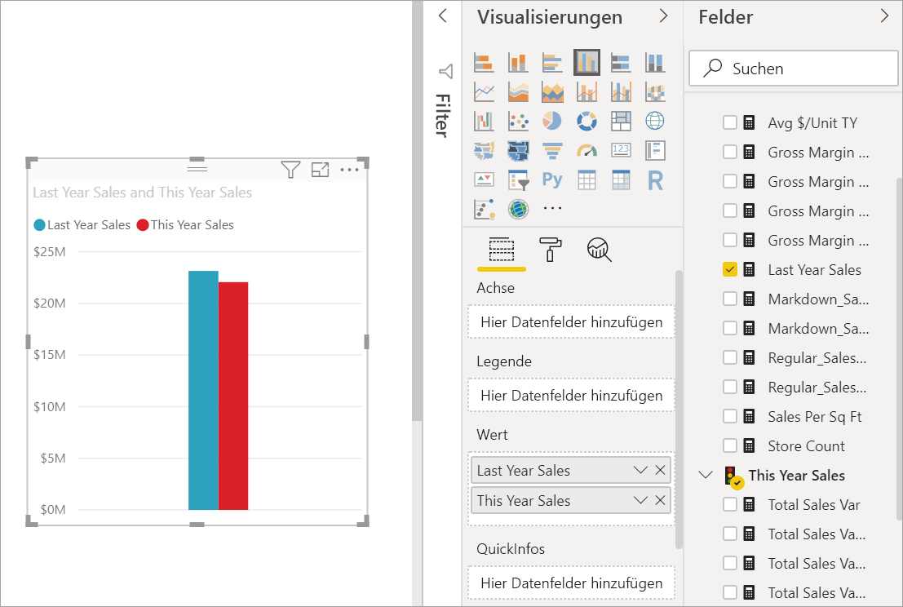
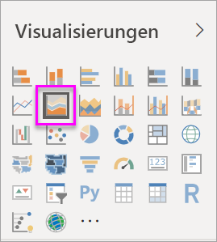
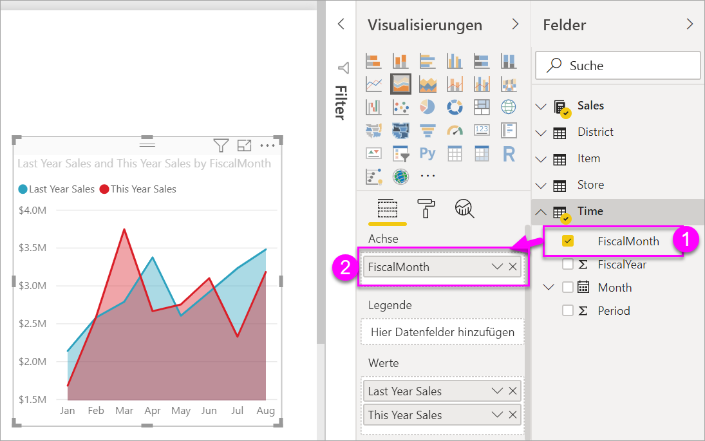

# Erstellen und Verwenden einfacher Flächendiagramme

[!INCLUDE[consumer-appliesto-nyyn](../includes/consumer-appliesto-nyyn.md)]

[!INCLUDE [power-bi-visuals-desktop-banner](../includes/power-bi-visuals-desktop-banner.md)]

Das grundlegende Flächendiagramm (auch bekannt als überlappendes Flächendiagramm) basiert auf dem Liniendiagramm. Der Bereich zwischen der Achse und der Zeile ist mit Farben gefüllt, um Volumen anzuzeigen. 

Flächendiagramme betonen das Ausmaß von Veränderungen im Laufe der Zeit und können dazu genutzt werden, um den gesamten Wert über einen Trend hinweg hervorzuheben. Beispielsweise können Daten, die den Gewinn im Zeitverlauf darstellen, in ein Flächendiagramm gezeichnet werden, um den Gesamtgewinn zu verdeutlichen.

> [!NOTE]
> Eine Freigabe Ihres Berichts für einen Power BI-Kollegen erfordert, dass Sie und Ihr Kollege jeweils eine eigene Power BI Pro-Lizenz haben oder dass der Bericht in der Premium-Kapazität gespeichert wird.

## Wann ein einfaches Flächendiagramm verwendet werden sollte
Einfache Flächendiagramme sind gut geeignet,

* um den Volumentrend über Zeit und Reihe hinweg anzuzeigen und zu vergleichen 
* für individuelle Reihen, die einen physisch zählbaren Satz darstellen

### Voraussetzungen
In diesem Tutorial wird die [PBIX-Datei mit einem Analysebeispiel für den Einzelhandel](https://download.microsoft.com/download/9/6/D/96DDC2FF-2568-491D-AAFA-AFDD6F763AE3/Retail%20Analysis%20Sample%20PBIX.pbix) verwendet.

1. Wählen Sie im oberen linken Bereich der Menüleiste **Datei** > **Öffnen** aus.
   
2. Suchen Sie Ihre Kopie der **PBIX-Datei mit einem Analysebeispiel für den Einzelhandel**.

1. Öffnen Sie die **PBIX-Datei mit einem Analysebeispiel für den Einzelhandel** in der Berichtsansicht .

1. Auswählen  um eine neue Seite hinzuzufügen.

## Erstellen eines grundlegenden Flächendiagramms
 

1. Diese Schritte unterstützen Sie beim Erstellen eines Flächendiagramms, das den Absatz des laufenden Jahres und den des Vorjahres pro Monat anzeigt.
   
   a. Wählen Sie im Bereich „Felder“ die Option **Sales \> Last Year Sales** (Verkäufe > Verkäufe im Vorjahr) und **This Year Sales > Wert** (Verkäufe in diesem Jahr) aus.

   

   b.  Konvertieren Sie das Diagramm in ein grundlegendes Flächendiagramm, indem Sie im Bereich „Visualisierungen“ das Symbol „Flächendiagramm“ auswählen.

   
   
   c.  Wählen Sie **Zeit \> FiscalMonth** aus, um die Angaben ebenfalls dem Bereich **Achse** hinzuzufügen.   
   
   
   d.  Wählen Sie die Auslassungspunkte in der oberen, rechten Ecke der Visualisierung aus, und wählen Sie **Nach FiscalMonth sortieren**, um das Diagramm sortiert nach Monaten anzuzeigen. Wenn Sie die Sortierreihenfolge ändern möchten, klicken Sie erneut auf die Auslassungspunkte und anschließend auf **Aufsteigend sortieren** oder **Absteigend sortieren**.

## Hervorheben und Kreuzfiltern
Informationen zur Verwendung des Filterbereichs finden Sie unter [Hinzufügen eines Filters zu einem Bericht in Power BI](../create-reports/power-bi-report-add-filter.md).

Um einen bestimmten Bereich im Diagramm hervorheben, wählen Sie diesen Bereich oder seinen oberen Rahmen aus.  Im Gegensatz zu anderen Visualisierungstypen erfolgt durch Hervorheben eines grundlegenden Flächendiagramms keine Kreuzfilterung der anderen Visualisierungen auf der Berichtsseite (sofern auf derselben Seite weitere Visualisierungen vorhanden sind). Flächendiagramme sind jedoch ein Ziel für das Kreuzfiltern, das von anderen Visualisierungen auf der Berichtsseite ausgelöst wird. 

1. Probieren Sie es aus, indem Sie Ihr Flächendiagramm auswählen und auf die Berichtsseite **New Store Analysis** kopieren (mit STRG+C und STRG+V).
2. Wählen Sie eine der schattierten Flächen des Flächendiagramms aus, und wählen Sie dann die andere schattierte Fläche aus. Es sollten keine Auswirkungen auf die anderen Visualisierungen auf der Seite zu sehen sein.
1. Wählen Sie nun ein Element aus. Beachten Sie die Auswirkungen auf das Flächendiagramm. Es wird kreuzgefiltert.

     

Weitere Informationen finden Sie unter [Interaktionen mit Visuals in einem Power BI-Bericht](../create-reports/service-reports-visual-interactions.md)

## Zu beachtende Aspekte und Problembehandlung   
* [Den Bericht zugänglicher für Menschen mit Behinderungen machen](../create-reports/desktop-accessibility-overview.md)
* Grundlegende Flächendiagramme sind beim Vergleichen der Werte nicht effektiv, was am Einschluss der überlappenden Bereiche liegt. Power BI verwendet Transparenz, um die Überlappung von Bereichen anzuzeigen. Dies funktioniert jedoch nur mit zwei oder drei unterschiedlichen Bereiche gut. Wenn Sie den Trend für mehr als drei Measures vergleichen möchten, sollten Sie Liniendiagramme verwenden. Wenn Sie das Volumen für mehr als drei Measures vergleichen möchten, sollten Sie Treemaps verwenden.

## Nächster Schritt
[Berichte in Power BI](power-bi-visualization-card.md)  
