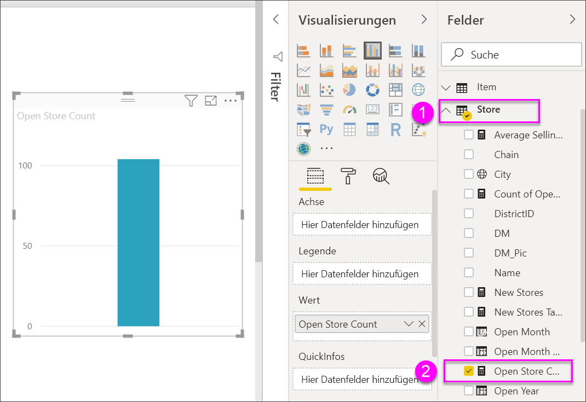
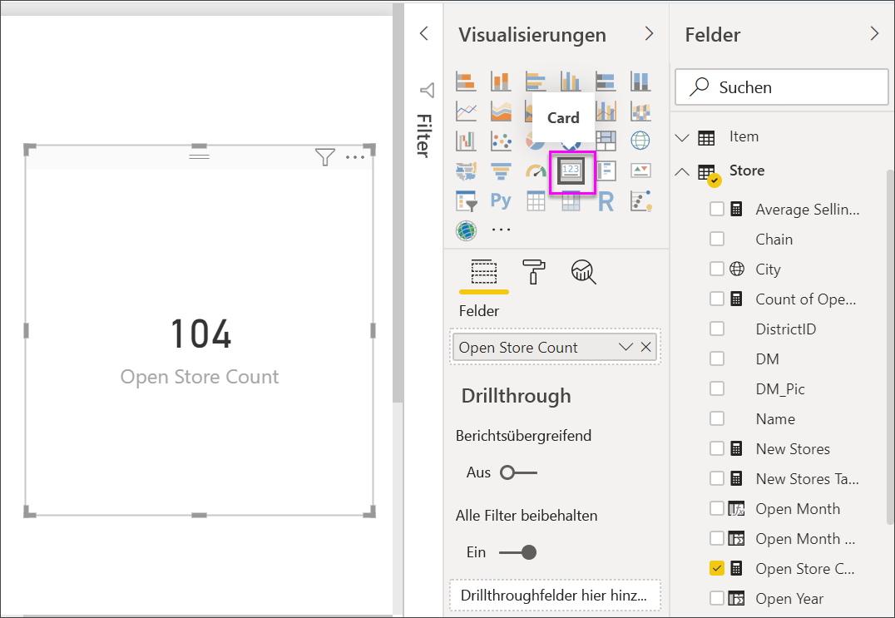
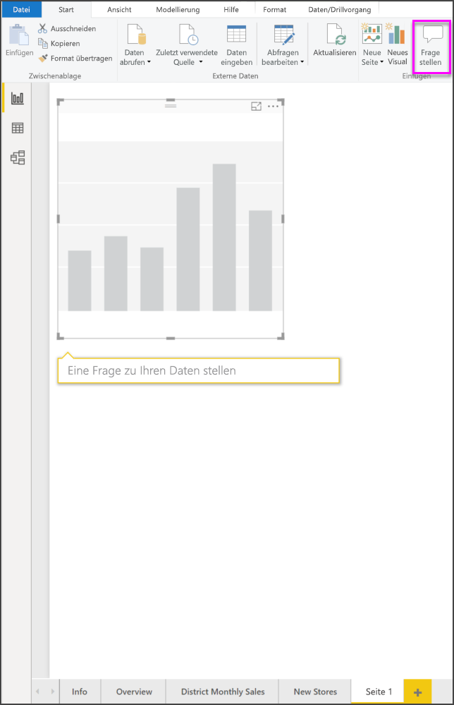
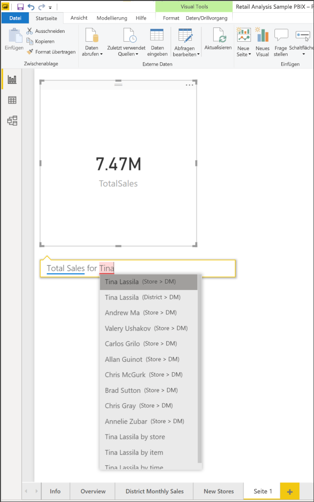
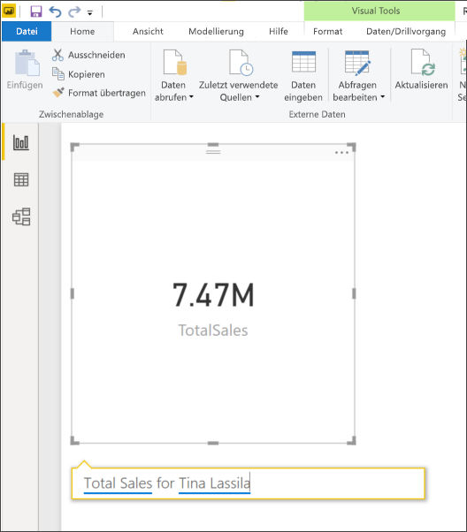
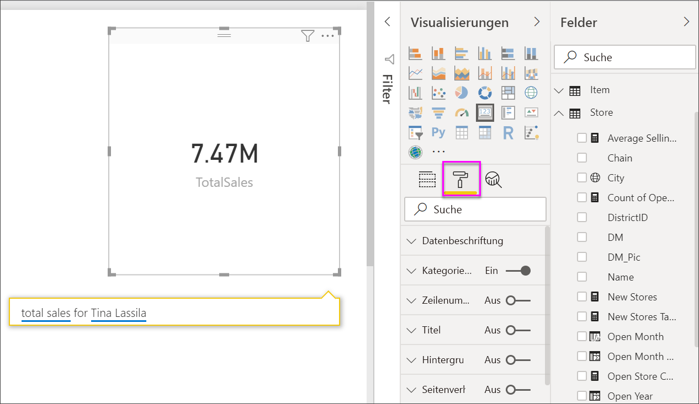
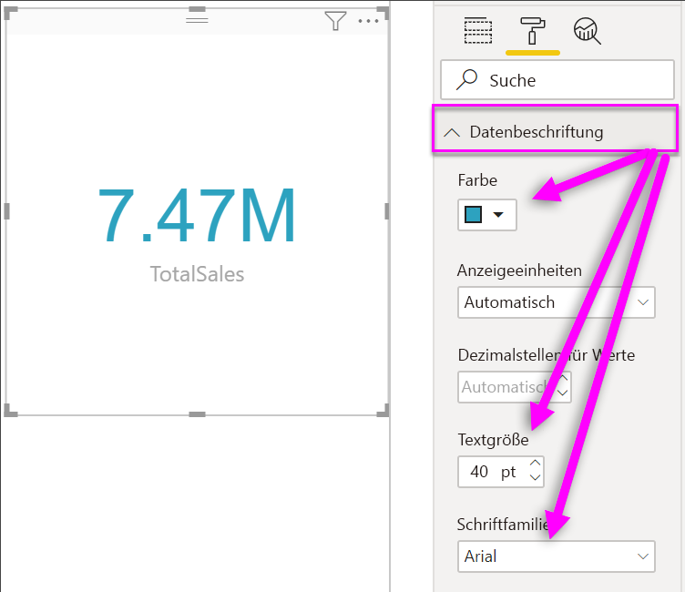
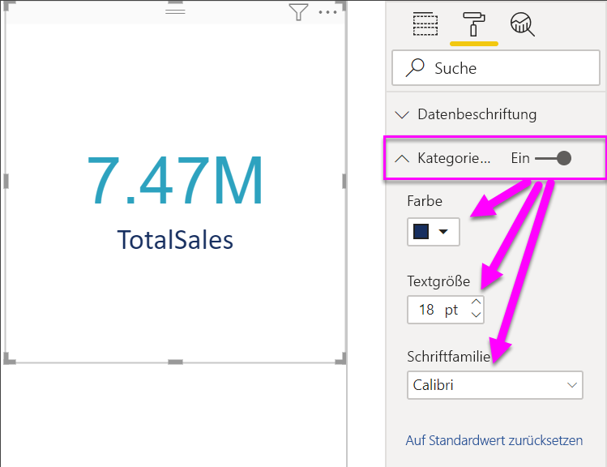
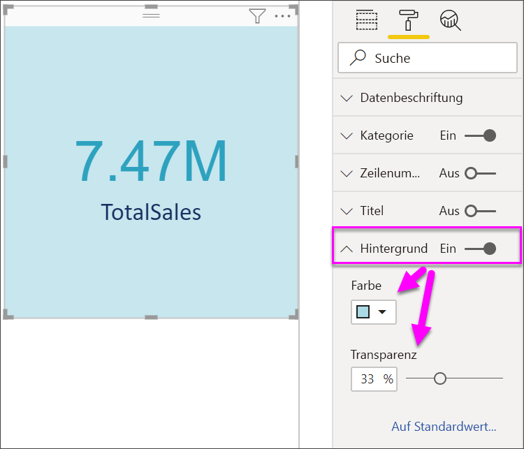

# Kartenvisualisierungen

[!INCLUDE [power-bi-visuals-desktop-banner](../includes/power-bi-visuals-desktop-banner.md)]

Manchmal ist eine einzelne Zahl das Wichtigste, das Sie in Ihrem Power BI-Dashboard oder Bericht nachverfolgen möchten, wie z.B. der Gesamtumsatz, der Marktanteil im Jahresverlauf oder die Gesamtverkaufschancen. Eine solche Visualisierung wird als *Karte* bezeichnet. Wie fast alle nativen Power BI-Visualisierungen können Karten im Berichts-Editor oder in Q&A erstellt werden.

## Voraussetzung

In diesem Tutorial wird die [PBIX-Datei mit einem Analysebeispiel für den Einzelhandel](https://download.microsoft.com/download/9/6/D/96DDC2FF-2568-491D-AAFA-AFDD6F763AE3/Retail%20Analysis%20Sample%20PBIX.pbix) verwendet.

1. Klicken Sie im oberen linken Bereich der Menüleiste auf **Datei** \> **Öffnen**.
   
2. Suchen Sie Ihre Kopie der **PBIX-Datei mit einem Analysebeispiel für den Einzelhandel**.

1. Öffnen Sie die **PBIX-Datei mit einem Analysebeispiel für den Einzelhandel** in der Berichtsansicht .

1. Auswählen  um eine neue Seite hinzuzufügen.

## Option 1: Erstellen einer Karte im Berichts-Editor

Eine Möglichkeit, eine Karte zu erstellen, besteht darin, den Berichts-Editor in Power BI Desktop zu verwenden.

1. Beginnen Sie mit einer leeren Berichtsseite, und wählen Sie das Feld **Store** \> **Anzahl offener Stores** aus.

    Power BI erstellt ein Säulendiagramm mit dieser einen Zahl.

   

2. Wählen Sie im Bereich „Visualisierungen“ das Kartensymbol aus.

   

Nun müssten Sie erfolgreich mithilfe des Berichts-Editors eine Karte erstellt haben. Im Folgenden wird die zweite Option zum Erstellen einer Karte mithilfe des Q&A-Fragefelds beschrieben.

## Option 2: Erstellen einer Karte aus dem Q&A-Fragefeld
Sie können als Alternative auch das Q&A-Fragefeld zum Erstellen von Karten verwenden. Das Q&A-Fragefeld ist in der Berichtsansicht von Power BI Desktop verfügbar.

1. Beginnen Sie mit einer leeren Berichtsseite.

1. Klicken Sie im oberen Bereich des Fensters auf das Symbol **Frage stellen**. 

    Power BI erstellt dann eine Karte und ein Feld für Ihre Frage. 

   

2. Geben Sie z. B. „Total Sales for Tina“ (Verkäufe insgesamt für Tina) in das Fragefeld ein.

    Im Fragefeld werden Vorschläge und Formulierungsalternativen angezeigt. Schließlich sehen Sie hier die Gesamtanzahl.  

   

   

Nun müssten Sie erfolgreich mithilfe des Q&A-Fragefelds eine Karte erstellt haben. Im Folgenden wird erläutert, wie Sie Ihre Karte entsprechend Ihrer Anforderungen formatieren können.

## Formatieren einer Karte
Sie haben viele Möglichkeiten, Beschriftungen, Text, Farben usw. zu ändern. Der einfachste Weg, um dies zu lernen, ist eine Karten zu erstellen und dann den Formatierungsbereich zu erkunden. Hier sehen Sie ein paar Beispiele der verfügbaren Formatierungsoptionen. 

Der Bereich „Formatierung“ ist bei der Interaktion mit der Karte in einem Bericht verfügbar. 

1. Öffnen Sie den Bereich „Formatierung“, indem Sie zuerst das Farbrollersymbol auswählen. 

    

2. Erweitern Sie **Datenbeschriftung**, wenn die Karte ausgewählt ist, und verändern Sie die Farbe, die Größe und die Schriftfamilie. Wenn Sie Tausende Filialen haben, können Sie **Anzeigeeinheiten** verwenden, um die Anzahl der Filialen in Tausenderschritten anzeigen und die Dezimalstellen ebenso zu steuern. Beispielsweise 125,8k anstatt 125.832,00.

    

3.  Erweitern Sie die **Kategoriebeschriftung**, und ändern Sie Farbe und Größe.

    

4. Erweitern Sie den **Hintergrund**, und verschieben Sie den Regler auf „On“ (Ein).  Sie können nun die Hintergrundfarbe und -transparenz ändern.

    

5. Machen Sie sich weiter mit den Formatoptionen vertraut, bis Ihre Karte so aussieht, wie Sie es sich vorstellen. 

## Zu beachtende Aspekte und Problembehandlung
Wenn kein Fragefeld angezeigt wird, wenden Sie sich an den System- oder Mandantenadministrator.    

## Nächste Schritte
[Kombinationsdiagramm in Power BI](power-bi-visualization-combo-chart.md)

[Visualisierungstypen in Power BI](power-bi-visualization-types-for-reports-and-q-and-a.md)
