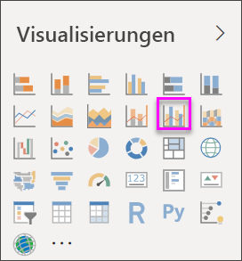
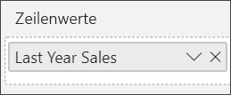
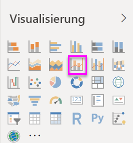
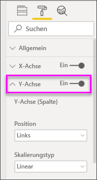
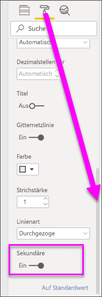

# Erstellen und Verwenden von Kombinationsdiagrammen in Power BI

[!INCLUDE [power-bi-visuals-desktop-banner](../includes/power-bi-visuals-desktop-banner.md)]

Ein Kombinationsdiagramm in Power BI ist eine einzelne Visualisierung, die ein Liniendiagramm und ein Säulendiagramm kombiniert. Die Kombination von zwei Diagrammen in einem ermöglicht einen schnelleren Vergleich von Daten.

Kombinationsdiagramme können ein oder zwei y-Achsen haben.

## Einsatz von Kombinationsdiagrammen
Kombinationsdiagramme sind gut für folgende Zwecke geeignet:

* Bei einem Liniendiagramm und ein Säulendiagramm mit der gleichen X-Achse
* Zum Vergleichen mehrerer Kennzahlen mit verschiedenen Wertebereichen
* Zum Verdeutlichen der Zusammenhänge zweier Kennzahlen in einer Visualisierung
* Zum Prüfen, ob eine Kennzahl das durch eine andere Kennzahl vorgegebene Ziel erfüllt
* Zur Platzersparnis im Zeichenbereich

### Voraussetzungen
Dieses Tutorial verwendet die [PBIX-Datei mit einem Analysebeispiel für den Einzelhandel](https://download.microsoft.com/download/9/6/D/96DDC2FF-2568-491D-AAFA-AFDD6F763AE3/Retail%20Analysis%20Sample%20PBIX.pbix).

1. Wählen Sie im oberen linken Bereich der Menüleiste **Datei** > **Öffnen** aus.
   
2. Suchen Sie Ihre Kopie der **PBIX-Datei mit einem Analysebeispiel für den Einzelhandel**.

1. Öffnen Sie die **PBIX-Datei mit einem Analysebeispiel für den Einzelhandel** in der Berichtsansicht .

1. Exklusiv  um eine neue Seite hinzuzufügen.

## Erstellen eines einfachen Kombinationsdiagramms mit einer Achse
In diesem Video sehen Sie, wie ein Kombinationsdiagramm anhand des Beispiels für Vertrieb und Marketing erstellt wird.
   > [!NOTE]
   > Dieses Video verwendet eine ältere Version von Power BI Desktop.
   > 
   > 
<iframe width="560" height="315" src="https://www.youtube.com/embed/lnv66cTZ5ho?list=PL1N57mwBHtN0JFoKSR0n-tBkUJHeMP2cP" frameborder="0" allowfullscreen></iframe>  

1. Beginnen Sie auf einer leeren Berichtsseite, und erstellen Sie ein Säulendiagramm, das den Absatz des laufenden Jahres und den Bruttogewinn pro Monat anzeigt.

    a.  Wählen Sie im Bereich „Felder“ die Option **Sales** \> **This Year Sales** > **Value** (Verkäufe > Verkäufe in diesem Jahr > Wert) aus.

    b.  Ziehen Sie **Sales** \> **Gross Margin This Year** (Verkäufe > Bruttogewinn in diesem Jahr) in den Bereich **Wert**.

    c. Wählen Sie **Zeit** \> **FiscalMonth** aus, um die Angaben ebenfalls dem Bereich **Achse** hinzuzufügen.

    
5. Wählen Sie **Weitere Optionen** (...) in der rechten oberen Ecke der Visualisierung und dann **Sortieren nach > FiscalMonth** aus. Wenn Sie die Sortierreihenfolge ändern möchten, klicken Sie erst erneut auf die Auslassungspunkte und anschließend auf **Aufsteigend sortieren** oder **Absteigend sortieren**. In diesem Beispiel wird **Aufsteigend sortieren** verwendet.

6. Konvertieren Sie das Säulendiagramm in ein Kombinationsdiagramm. Es gibt zwei Kombinationsdiagramme: **Line and stacked column** (gestapeltes Säulendiagramm mit Linien) und **Line and clustered column** (gruppiertes Säulendiagramm mit Linien). Wenn Sie das Säulendiagramm ausgewählt haben, wählen Sie im Bereich **Visualisierungen** die Option **Linien- und gruppiertes Säulendiagramm** aus.

    
7. Ziehen Sie aus dem **Felder**bereich die Option **Sales** \> **Last Year Sales** (Verkäufe > Verkäufe im letzten Jahr) in den Bucket **Zeilenwerte**.

   

   Das Kombinationsdiagramm sollten nun ungefähr so aussehen:

   

## Erstellen eines Kombinationsdiagramms mit zwei Achsen
In dieser Aufgabe vergleichen wir Bruttogewinn und Umsätze.

1. Erstellen Sie ein neues Liniendiagramm, das den **Bruttogewinn in Prozent im letzten Jahr** nach **FiscalMonth** nachverfolgt. Klicken Sie auf die Auslassungspunkte, um **Aufsteigend** nach **Monat** zu sortieren.  
Im Januar lag der Prozentsatz des Bruttogewinns bei 35 %, der Höchststand im April lag bei 45 %, im Juli fiel der Wert, und im August erreichte er wieder einen Spitzenwert. Sehen wir ein ähnliches Muster bei den Umsätzen im letzten und in diesem Jahr?

   
2. Fügen Sie dem Liniendiagramm **Verkäufe in diesem Jahr > Wert** und **Verkäufe im letzten Jahr** hinzu. Da der **Bruttogewinn % Vorjahr** wesentlich kleiner ist als die **Umsätze**, können diese Werte nur schwer verglichen werden.      

   
3. Konvertieren Sie das Liniendiagramm zu einem Linien- und gestapelten Säulendiagramm, damit die Visualisierung besser gelesen und interpretiert werden kann.

   

4. Ziehen Sie **Bruttogewinn % Vorjahr** aus **Spaltenwerte** in **Zeilenwerte**. Power BI erstellt zwei Achsen, sodass die Datasets anders skaliert werden können. Die linke Achse gibt den Dollarbetrag der Umsätze an, die rechte Achse die Prozentzahl. Und hier sehen Sie die Antwort auf unsere Frage: Ja, wir sehen ein ähnliches Muster.

       

## Hinzufügen von Titeln zu den Achsen
1. Wählen Sie das Farbrollensymbol  zum Öffnen des Formatierungsbereichs.
1. Wählen Sie den Pfeil nach unten aus, um die Optionen für die **Y-Achse** zu erweitern.
1. Nehmen Sie für **Y-Achse (Spalte)** die folgenden Einstellungen vor: Wählen Sie für **Position** die Option **Links**, für **Titel** die Option **Ein**, für **Stil** die Option **Nur Titel anzeigen** und für **Anzeigeeinheiten** die Option **Millionen** aus.

   
4. Scrollen Sie unter **Y-Achse (Spalte)** nach unten, bis **Sekundäre anzeigen** angezeigt wird. Da es so viele Optionen für die Y-Achsen gibt, müssen Sie möglicherweise beide Scrollleisten verwenden. Im Abschnitt „Sekundäre anzeigen“ werden für den Liniendiagrammanteil des Kombinationsdiagramms Formatierungsoptionen angezeigt.

   
5. Unter **Y-Achse (Linie)** ist für **Position** bereits die hier benötigte Option **Rechts** aktiviert. Stellen Sie **Titel**  auf **Ein**, und wählen Sie für **Stil** die Option **Nur Titel anzeigen**.

   Das Kombinationsdiagramm verfügt nun über zwei Y-Achsen mit jeweils eigenem Titel.

   

6. Optional können Sie die Schriftart, den Schriftgrad und die Farbe des Texts ändern und weitere Formatierungsoptionen festlegen, um die Darstellung und Lesbarkeit des Diagramms zu verbessern.

Jetzt haben Sie folgende Möglichkeiten:

* [Fügen Sie das Kombinationsdiagramm als Dashboardkachel hinzu.](../service-dashboard-tiles.md)
* [Speichern Sie den Bericht](../service-report-save.md).
* [Barrierefreiheit in Power BI Desktop-Berichten](../desktop-accessibility.md)

## Kreuzhervorheben und Kreuzfiltern

Das Markieren einer Spalte oder Zeile in einem Kombinationsdiagramm ermöglicht das Kreuzhervorheben und Kreuzfiltern anderer Visualisierungen auf der Berichtsseite und umgekehrt. Verwenden Sie [Visualinteraktionen](../service-reports-visual-interactions.md), um dieses Standardverhalten zu ändern.

## Weitere Schritte

[Ringdiagramme in Power BI](power-bi-visualization-doughnut-charts.md)

[Visualisierungstypen in Power BI](power-bi-visualization-types-for-reports-and-q-and-a.md)
