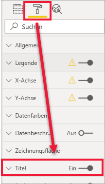
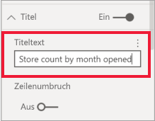
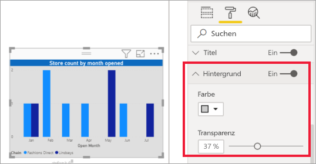
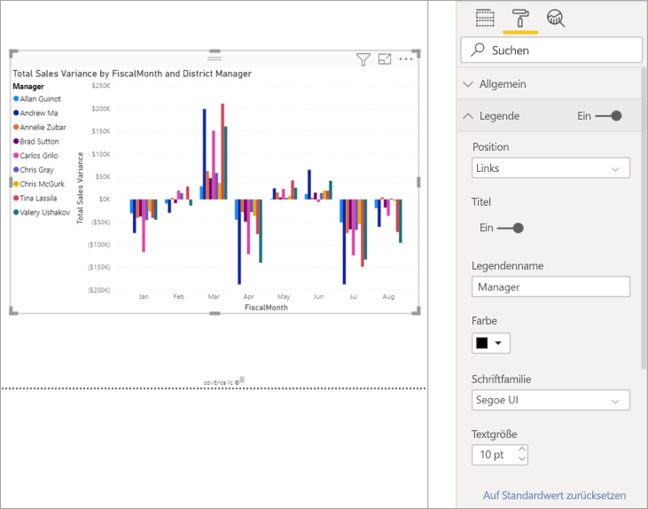

# Anpassen von Visualisierungstiteln, Hintergründen und Legenden

In diesem Tutorial lernen Sie einige verschiedene Möglichkeiten zum Anpassen von Visualisierungen kennen. Es gibt so viele Optionen zum Anpassen von Visualisierungen. Der beste Weg, um mehr über sie alle zu erfahren, ist die Erkundung des Bereichs **Format** (wählen Sie das Farbrollensymbol aus). Um Ihnen den Einstieg zu erleichtern, wird in diesem Artikel das Anpassen des Titels, der Legende und des Hintergrunds einer Visualisierung und das Hinzufügen eines Designs erläutert.

Sie können nicht alle Visualisierungen anpassen. Details hierzu finden Sie in der [kompletten Liste](#visualization-types-that-you-can-customize) der Visualisierungen.

## Voraussetzungen

- Der Power BI-Dienst oder Power BI Desktop

- Bericht zum Analysebeispiel für den Einzelhandel

## Anpassen der Visualisierungstitel in Berichten

Melden Sie sich bei Power BI Desktop an, und öffnen Sie das [Analysebeispiel für den Einzelhandel](../sample-datasets.md).

> [!NOTE]
> Wenn Sie eine Visualisierung an ein Dashboard anheften, wird sie zu einer Dashboardkachel. Sie können auch die Kacheln selbst mit [neuen Titeln und Untertiteln, Hyperlinks und Größenänderungen](../service-dashboard-edit-tile.md) anpassen.

1. Gehen Sie zur Seite **Neue Filialen** des Berichts zum **Analysebeispiel für den Einzelhandel**.

1. Wählen Sie das gruppierte Säulendiagramm **Anzahl eröffneter Filialen nach Eröffnungsmonat und Kette** aus.

1. Wählen Sie im Bereich **Visualisierungen** das Farbrollensymbol aus, um die Formatoptionen anzuzeigen.

1. Wählen Sie **Titel** aus, um diesen Abschnitt zu erweitern.

   

1. Setzen Sie den Schieberegler**Titel** auf **Ein**.

1. Um den Titel zu ändern, geben Sie *Ladenanzahl nach Öffnungsmonat* in das Feld **Titeltext** ein.

    

1. Ändern Sie **Schriftfarbe** in Weiß und **Hintergrundfarbe** in Blau.    

    a. Wählen in der Dropdownliste aus **Designfarben**, **Zuletzt verwendete Farben** oder **Benutzerdefinierte Farbe** eine Farbe aus.
    
    

    b. Wählen Sie die Dropdownliste aus, um das Farbfenster zu schließen.

1. Vergrößern Sie die Textgröße auf **16 pt**.

1. Die letzte Anpassung, die Sie am Diagrammtitel vornehmen, ist die Ausrichtung in der Mitte der Visualisierung.

    

    An diesem Punkt des Tutorials sollte der Titel Ihres gruppierten Säulendiagramms wie folgt aussehen:

    

Speichern Sie die Änderungen, die Sie vorgenommen haben, und fahren Sie mit dem nächsten Abschnitt fort.

Wenn Sie einmal alle Änderungen zurücksetzen müssen, wählen Sie **Auf Standardwert zurücksetzen** am unteren Rand des Anpassungsbereichs des **Titels** aus.

## Anpassen der Hintergründe von Visualisierungen

Erweitern Sie im gleichen gruppierten Säulendiagramm die Optionen für den **Hintergrund**.

1. Setzen Sie den **Hintergrund**-Schieberegler auf **Ein**.

1. Wählen Sie die Dropdownliste und dann eine graue Farbe aus.

1. Ändern Sie **Transparenz** in **74%** .

An diesem Punkt des Tutorials sollte der Hintergrund Ihres gruppierten Säulendiagramms wie folgt aussehen:

Speichern Sie die Änderungen, die Sie vorgenommen haben, und fahren Sie mit dem nächsten Abschnitt fort.

Wenn Sie einmal alle Änderungen zurücksetzen müssen, wählen Sie **Auf Standardwert zurücksetzen** am unteren Rand des Anpassungsbereichs des **Hintergrunds** aus.

## Anpassen der Legenden von Visualisierungen

1. Öffnen Sie die Berichtsseite **Übersicht**, und wählen Sie das Diagramm **Gesamtabweichung Verkäufe nach FiscalMonth und Regionalmanager** aus.

1. Wählen Sie in der Registerkarte **Visualisierung** das Farbrollensymbol aus, um den Bereich „Format“ zu öffnen.

1. Erweitern Sie die Optionen von **Legende**:

    

1. Setzen Sie den **Legende**-Schieberegler auf **Ein**.

1. Verschieben Sie die Legende auf die linke Seite der Visualisierung.

1. Fügen Sie einen Legendentitel hinzu, indem Sie **Titel** auf **Ein** umschalten.

1. Geben Sie *Manager* in das Feld **Legendenname** ein.

1. Ändern Sie **Farbe** in Schwarz.

Speichern Sie die Änderungen, die Sie vorgenommen haben, und fahren Sie mit dem nächsten Abschnitt fort.

Wenn Sie einmal alle Änderungen zurücksetzen müssen, wählen Sie **Auf Standardwert zurücksetzen** am unteren Rand des Anpassungsbereichs der **Legende** aus.

## Anpassen von Farben mithilfe eines Designs

Mit Berichtsdesigns können Sie Entwurfsänderungen auf den gesamten Bericht anwenden, z. B. die Verwendung von Unternehmensfarben, das Ändern von Symbolsätzen oder das Anwenden der neuen Standardformatierung für Visuals. Wenn Sie ein Berichtsdesign anwenden, verwenden alle Visuals im Bericht die Farben und Formatierung des ausgewählten Designs.

Wenn Sie ein Design auf den Bericht anwenden möchten, wählen Sie **Design wechseln** in der Menüleiste aus. Wählen Sie ein Design aus.  Im folgenden Bericht wird das Design **Solar** verwendet.

 

## Visualisierungstypen, die Sie anpassen können

Hier ist eine Liste der Visualisierungen und jeweils verfügbaren Anpassungsoptionen:

| Visualisierung | Title | Hintergrund | Legende |
|:--- |:--- |:--- |:--- |
| Area | ja | ja |ja |
| Balken | ja | ja |ja |
| Karte | ja | ja |n/v |
| Mehrzeilige Karte | ja | ja | n/v |
| Column | ja | ja | ja |
| Kombinationsdiagramm | ja | ja | ja |
| Ringdiagramm | ja | ja | ja |
| Flächenkartogramm | ja | ja | ja |
| Trichterdiagramm | ja | ja | n/v |
| Messgerät | ja | ja | n/v |
| Wichtigste Einflussfaktoren | ja | ja | n/v |
| KPI | ja | ja | n/v |
| Linie | ja | ja | ja |
| Zuordnung | ja | ja | ja |
| Matrix | ja | ja | n/v |
| Kreis | ja | ja | ja |
| Fragen | ja | ja | n/v |
| Punktdiagramm | ja | ja | ja |
| Form | ja | ja | ja |
| Slicer | ja | ja | n/v |
| Tabelle (Table) | ja | ja | n/v |
| Textfeld | Nein | ja | n/v |
| Treemap | ja | ja | ja |
| Wasserfall | ja | ja | ja |

## Weitere Schritte

- [Anpassen der Eigenschaften der X- und Y-Achse](power-bi-visualization-customize-x-axis-and-y-axis.md)

- [Erste Schritte mit Farbformatierung und Achseneigenschaften](service-getting-started-with-color-formatting-and-axis-properties.md)

Weitere Fragen? [Wenden Sie sich an die Power BI-Community](https://community.powerbi.com/)
