# Anpassen der Eigenschaften der X- und Y-Achse

[!INCLUDE[consumer-appliesto-nyyn](../includes/consumer-appliesto-nyyn.md)]    

[!INCLUDE [power-bi-visuals-desktop-banner](../includes/power-bi-visuals-desktop-banner.md)]

In diesem Tutorial lernen Sie verschiedene Möglichkeiten zum Anpassen der X- und Y-Achse in Ihren visuellen Elementen kennen. Nicht alle visuellen Elemente verfügen über Achsen. Kreisdiagramme haben z.B. keine Achsen. Außerdem variieren die Anpassungsoptionen visueller Elemente. Die vielen Optionen können nicht in einem einzigen Artikel behandelt werden, darum betrachten wir die gängigsten Anpassungen, damit Sie sich mit dem visuellen Bereich **Format** im Berichtszeichenbereich von Power BI vertraut machen können.  

Sehen Sie, wie Amanda ihre X- und Y-Achse anpasst. Sie zeigt außerdem die verschiedenen Möglichkeiten, bei Verwendung von Drilldown und Drillup die Verkettung zu steuern.

> [!NOTE]
> In diesem Video wird eine ältere Version von Power BI verwendet.

<iframe width="560" height="315" src="https://www.youtube.com/embed/9DeAKM4SNJM" frameborder="0" allowfullscreen></iframe>

## Voraussetzungen

- Power BI Desktop

- [Analysebeispiel für den Einzelhandel](https://download.microsoft.com/download/9/6/D/96DDC2FF-2568-491D-AAFA-AFDD6F763AE3/Retail%20Analysis%20Sample%20PBIX.pbix)

## Hinzufügen einer neuen Visualisierung

Bevor Sie die Visualisierung anpassen können, müssen Sie sie erstellen.

1. Öffnen Sie in Power BI Desktop das Analysebeispiel für den Einzelhandel.  

2. Wählen Sie unten das gelbe Plus-Symbol aus, um eine neue Seite hinzuzufügen. 

    

1. Wählen Sie im Bereich **Visualisierungen** das Symbol für das gestapelte Säulendiagramm aus. Dadurch wird im Berichtszeichenbereich eine leere Vorlage hinzugefügt.

    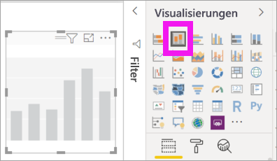

1. Um die Werte der X-Achse einzustellen, wählen Sie im Bereich **Felder** die Option **Zeit** > **FiscalMonth** aus.

1. Um die Werte der Y-Achse einzustellen, wählen Sie im Bereich **Felder** **Verkäufe** > **Verkäufe im letzten Jahr** und **Verkäufe** > **Verkäufe in diesem Jahr** > **Wert** aus.

    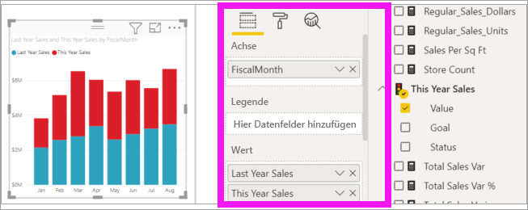

    Jetzt können Sie Ihre X-Achse anpassen. In Power BI steht Ihnen eine nahezu unbegrenzte Anzahl von Optionen zum Formatieren der Visualisierung zur Verfügung. 

## Anpassen der X-Achse
Es gibt zahlreiche Features, die für die X-Achse anpassbar sind. Sie können die Datenbezeichnungen und den Titel der X-Achse hinzufügen und ändern. Für Kategorien können Sie die Breite, Größe und Abstand von Balken, Spalten, Linien und Flächen ändern. Und für Werte können Sie die Anzeigeeinheiten, Dezimalstellen und Gitternetzlinien ändern. Das folgende Beispiel zeigt die Anpassung für ein Säulendiagramm. Fügen wir ein paar Anpassungen hinzu, um Sie mit den Optionen vertraut zu machen. Anschließend können Sie die restlichen Optionen selbstständig erkunden.

### Anpassen der Bezeichnungen der X-Achse
Die Bezeichnungen der X-Achse werden unterhalb der Spalten im Diagramm angezeigt. Momentan sind sie hellgrau, klein und schwer zu lesen. Das ändern wir jetzt.

1. Wählen Sie im Bereich **Visualisierungen** die Option **Format** (das Farbrollensymbol  ) aus, um die Anpassungsoptionen anzuzeigen.

2. Erweitern Sie die Optionen für die X-Achse.

   

3. Setzen Sie den **X-Achse**-Schieberegler auf **Ein**.

    

    Das Einstellen der X-Achse auf **Aus** empfiehlt sich zum Beispiel dann, wenn die Visualisierung ohne Bezeichnungen selbsterklärend ist oder wenn eine Berichtsseite zu voll ist und Sie Platz für weitere Daten schaffen müssen.

4. Formatieren Sie Textfarbe, Textgröße und Schriftart:

    - **Farbe**: Wählen Sie Schwarz aus.

    - **Textgröße**: Geben Sie *14* ein.

    - **Schriftfamilie**: Wählen Sie **Arial Black** aus.

    - **Innenabstand**: Geben Sie *40 %* ein.

        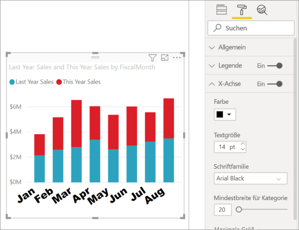
    
5. Vielleicht gefällt Ihnen nicht, wie der Text der X-Achse an einer Diagonalen dargestellt ist. Sie haben mehrere Optionen. 
    - Ändern Sie die Textgröße in eine Größe, die kleiner als 14 ist.
    - Vergrößern Sie die Visualisierung. 
    - Zeigen Sie weniger Spalten an und fügen Sie eine Scrollleiste hinzu, indem Sie den Wert für **Mindestbreite für Kategorie** erhöhen. 
    
    Hier haben wir die zweite Option ausgewählt und anhand einer der Leisten für die Größenanpassung die Visualisierung verbreitert. Jetzt ist Platz für den 14-Punkte-Text, ohne dass der Text in einem Winkel oder mit einer Scrollleiste angezeigt werden muss. 

   

### Anpassen des Titels der X-Achse
Wenn der Titel der X-Achse auf **Ein** eingestellt ist, wird der Titel der X-Achse unter den Bezeichnungen der X-Achse angezeigt. 

1. Beginnen Sie, indem Sie den Titel der X-Achse auf **Ein** stellen.  

    

    Zuerst wird Ihnen auffallen, dass die Visualisierung jetzt einen Standardtitel für die X-Achse enthält.  In diesem Fall ist es **FiscalMonth**.

   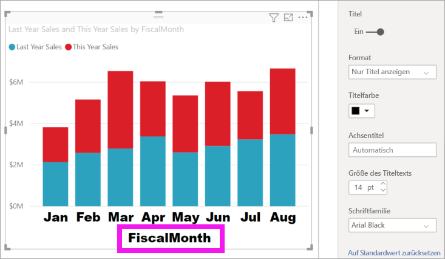

1. Formatieren Sie die Textfarbe, die Textgröße und die Schriftart des Titels:

    - **Titelfarbe**: Wählen Sie Orange aus.

    - **Achsentitel**: Geben Sie *Fiscal Month* ein (mit Leerzeichen).

    - **Größe des Titeltexts**: Geben Sie *18* ein.

    Nachdem Sie die Anpassungen abgeschlossen haben, wird Ihr gestapeltes Säulendiagramm in etwa so aussehen:

    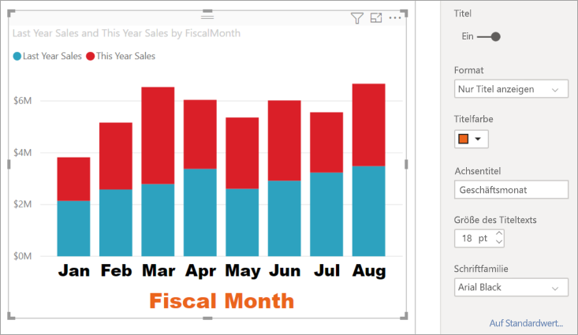

1. Speichern Sie die Änderungen, die Sie vorgenommen haben, und fahren Sie mit dem nächsten Abschnitt fort. Wenn Sie einmal alle Änderungen zurücksetzen müssen, wählen Sie **Standardwert wiederherstellen** am unteren Rand des Anpassungsbereichs der **X-Achse** aus. Als Nächstes passen Sie Ihre Y-Achse an.

## Anpassen der Y-Achse
Es gibt zahlreiche Features, die für die Y-Achse angepasst werden können. Sie können die Datenbezeichnungen, den Titel der Y-Achse und die Gitternetzlinien hinzufügen und ändern. Für Werte können Sie die Anzeigeeinheiten, Dezimalstellen, Ausgangs- und Endpunkt ändern. Und für Kategorien können Sie die Breite, Größe und Abstand von Balken, Spalten, Linien und Flächen ändern. 

Das folgende Beispiel setzt unsere Anpassung eines Säulendiagramms fort. Führen wir ein paar Änderungen aus, um Sie mit den Optionen vertraut zu machen. Anschließend können Sie die restlichen Optionen selbstständig erkunden.

### Anpassen der Bezeichnungen der Y-Achse
Die Bezeichnungen der Y-Achse werden standardmäßig auf der linken Seite angezeigt. Momentan sind sie hellgrau, klein und schwer zu lesen. Das ändern wir jetzt.

1. Erweitern Sie die Optionen für die Y-Achse.

   

1. Setzen Sie den **Y-Achse**-Schieberegler auf **Ein**.  

    

    Das Deaktivieren der Y-Achse empfiehlt sich u.a., um mehr Platz für weitere Daten zu schaffen.

1. Formatieren Sie Textfarbe, Textgröße und Schriftart:

    - **Farbe**: Wählen Sie Schwarz aus.

    - **Textgröße**: Geben Sie *10* ein.

    - **Anzeigeeinheiten**: Wählen Sie **Millionen** aus.

    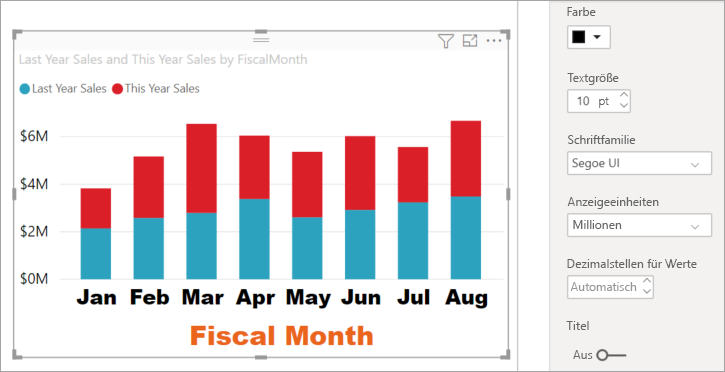

### Anpassen des Titels der Y-Achse
Wenn der Titel der Y-Achse auf **Ein** eingestellt ist, wird der Titel der Y-Achse neben den Bezeichnungen der Y-Achse angezeigt. Da dieses Visual durch eine Y-Achse nicht verbessert wird, lassen Sie **Titel** auf **Aus**. Wir werden später in diesem Tutorial einem visuellen Element mit zwei Achsen Titel für die Y-Achse hinzufügen. 

### Anpassen der Gitternetzlinien
Wir heben die Gitternetzlinien durch Ändern der Farbe und Erhöhen der Strichstärke hervor:

- **Farbe**: Wählen Sie Orange aus.

- **Strichstärke**: Geben Sie *2* ein.

Nach diesen Anpassungen sollte Ihr Säulendiagramm etwa so aussehen:

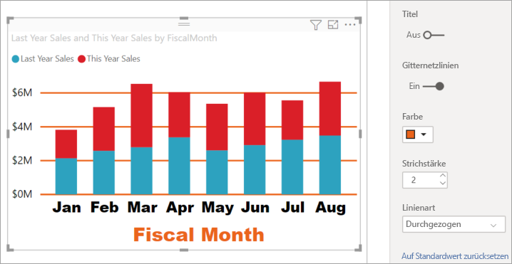

## Anpassen von Visualisierungen mit zwei Y-Achsen

Für einige Visualisierung haben zwei Y-Achsen Vorteile. Kombinationsdiagramme sind ein gutes Beispiel. Bevor wir zwei Y-Achsen formatieren können, erstellen wir ein Kombinationsdiagramm, das die Trends für Umsatz und Bruttomarge vergleicht.  

### Erstellen eines Diagramms mit zwei Y-Achsen

1. Wählen Sie das Säulendiagramm und ändern Sie es in ein *Linien- und gestapeltes Säulendiagramm*. Dieser Visualtyp unterstützt Werte in Liniendiagrammen mit einer Linie und Werte in Diagrammen mit gestapelten Säulen. 

    
   

2. Ziehen Sie **Verkäufe** > **Bruttomarge im Vorjahr %** aus dem Bereich „Felder“ in den Bucket **Zeilenwerte**.

    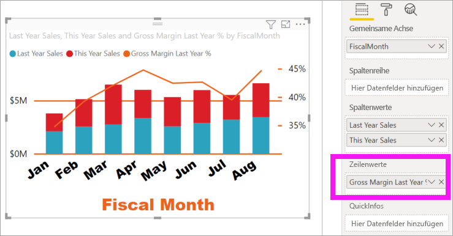

    
3. Formatieren Sie die Visualisierung neu, um die angewinkelten Bezeichnungen der X-Achse zu entfernen. 

   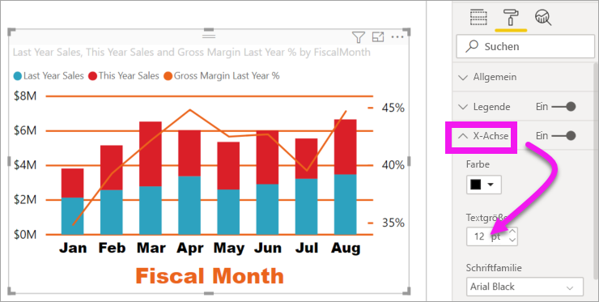

   Power BI erstellt zwei Y-Achsen und ermöglicht die unterschiedliche Skalierung der Werte. Die linke Achse misst die Umsätze in US-Dollar und die rechte die Prozentzahlen des Bruttogewinns.

### Formatieren der zweiten Y-Achse
Da wir die Visualisierung mit einer formatierten Y-Achse begonnen haben, hat Power BI die zweite Y-Achse mit den gleichen Einstellungen erstellt. Das können wir aber ändern. 

1. Wählen Sie im Bereich **Visualisierungen** das Farbrollensymbol aus, um die Formatoptionen anzuzeigen.

1. Erweitern Sie die Optionen für die Y-Achse.

1. Scrollen Sie nach unten, bis Sie die Option **Sekundäre anzeigen** finden. Überprüfen Sie, ob sie auf **Ein** gesetzt ist. Die zweite Y-Achse stellt das Liniendiagramm dar.

   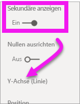

1. (Optional) Passen Sie die Schriftfarbe, die Größe und die Anzeigeeinheiten für die beiden Achsen an. Wenn Sie die **Position** für die Spaltenachse oder Zeilenachse wechseln, werden die Seiten der beiden Achsen vertauscht.

### Hinzufügen von Titeln zu beiden Achsen

Bei einer so komplexen Visualisierung ist es hilfreich, wenn den Achsen Titel hinzugefügt werden.  Mithilfe von Titeln können Ihre Kollegen nachvollziehen, was mit der Visualisierung angegeben werden soll.

1. Legen Sie **Titel** für **Y-Achse (Spalte)** und **Y-Achse (Linie)** auf **Ein** fest.

1. Legen Sie für **Stil** für beide die Option **Nur Titel anzeigen** fest.

   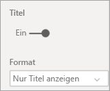

1. Das Kombinationsdiagramm zeigt nun zwei Achsen mit Titeln an.

   

1. Formatieren Sie die Titel. In diesem Beispiel haben wir einen der Titel verkürzt und den Schriftgrad für beide reduziert. 
    - Schriftgrad: **9**
    - Gekürzter **Achsentitel** für die erste Y-Achse (das Säulendiagramm): Umsatz im letzten und diesem Jahr 
    
     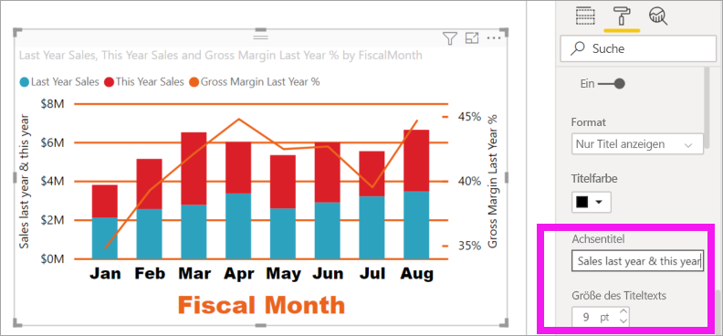

    Weitere Informationen finden Sie unter [Tipps und Tricks zur Farbformatierung in Power BI](service-tips-and-tricks-for-color-formatting.md) und [Anpassen der Titel, Legenden und Hintergründe von Visualisierungen](power-bi-visualization-customize-title-background-and-legend.md). 
    

## Nächste Schritte

- [Visualisierungen in Power BI-Berichten](power-bi-report-visualizations.md)

Weitere Fragen? [Wenden Sie sich an die Power BI-Community](https://community.powerbi.com/)
