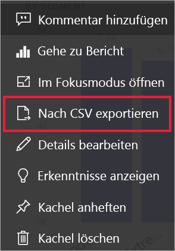
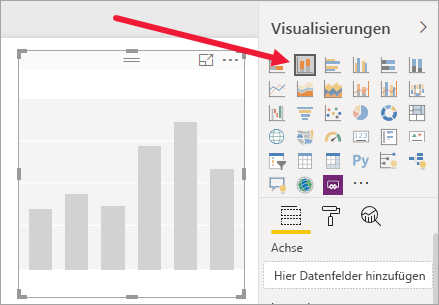
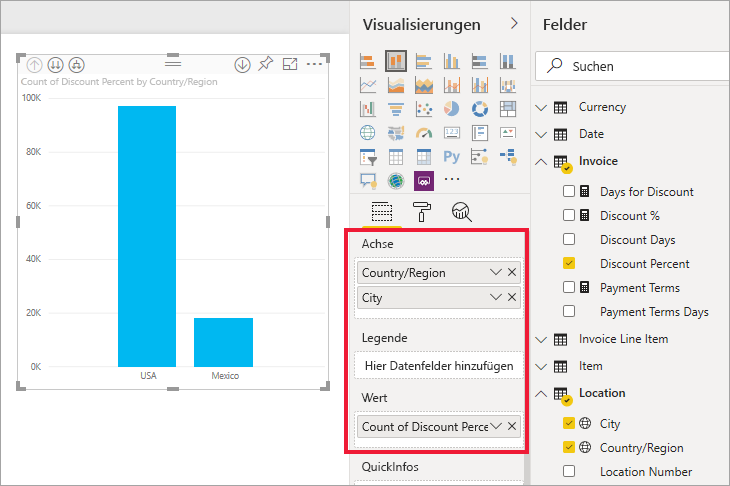
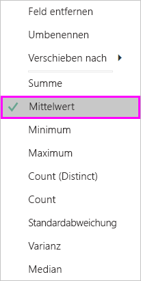
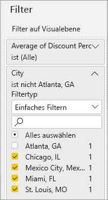
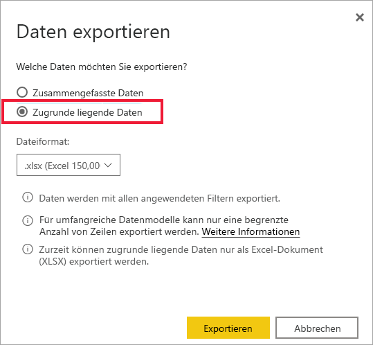

# Exportieren der Daten, die zum Erstellen einer Visualisierung verwendet wurden

> [!IMPORTANT]
> Nicht alle Daten können von allen Benutzern angezeigt oder exportiert werden. Es gibt Sicherheitsvorrichtungen, über die Designer und Administratoren eine Meldung erhalten, wenn Dashboards und Berichte erstellt werden. Einige Daten sind eingeschränkt, vertraulich oder werden ausgeblendet und können ohne Sonderberechtigungen nicht abgerufen oder exportiert werden. 

## Wer kann Daten exportieren?

Wenn Sie über die nötigen Berechtigungen für die Daten verfügen, können Sie die Daten abrufen und exportieren, die Power BI verwendet, um Visualisierungen zu erstellen. Häufig sind Daten vertraulich oder auf bestimmte Benutzer beschränkt. In diesen Fällen wird es Ihnen nicht möglich sein, Daten abzurufen oder zu exportieren. Weitere Informationen finden Sie im Abschnitt **Einschränkungen und Überlegungen** am Ende dieses Dokuments. 

## Abrufen und Exportieren von Daten

Wenn Sie die Daten anzeigen möchten, auf deren Grundlage eine Visualisierung erstellt wurde, können Sie die [Daten in Power BI anzeigen](service-reports-show-data.md). Sie können diese Daten auch als *XLSX*- oder *CSV*-Datei in Excel exportieren. Für das Exportieren von Daten sind eine Pro- oder Premium-Lizenz und Bearbeitungsberechtigungen für das Dataset und den Bericht erforderlich. <!--If you have access to the dashboard or report but the data is classified as *highly confidential*, Power BI will not allow you to export the data.-->

Sehen Sie zu, wie Will Daten aus einer der Visualisierungen in seinem Bericht exportiert, als *XLSX*-Datei speichert und dann in Excel öffnet. Befolgen Sie dann die schrittweisen Anleitungen unter dem Video, um es selbst ausprobieren. Hinweis: In diesem Video wird eine ältere Version von Power BI verwendet.

<iframe width="560" height="315" src="https://www.youtube.com/embed/KjheMTGjDXw" frameborder="0" allowfullscreen></iframe>

## Exportieren von Daten aus einem Power BI-Dashboard

1. Klicken Sie rechts oben im Visual auf die Auslassungspunkte für weitere Optionen.

    

1. Wählen Sie die Option **In CSV exportieren** aus.

    

1. Power BI exportiert die Daten in eine *CSV*-Datei. Wenn Sie einen Filter auf die Visualisierung angewendet haben, enthält auch die Exportdatei im CSV-Format Filter. 

1. Sie werden im Browser zum Speichern der Datei aufgefordert.  Öffnen Sie die *CSV*-Datei nach dem Speichern in Excel.

    

## Exportieren von Daten aus einem Bericht

Öffnen Sie den Bericht [Procurement analysis sample](../sample-procurement.md) (Analysebeispiel für Beschaffung) in der Bearbeitungsansicht im Power BI-Dienst, um dem Tutorial besser folgen zu können. Fügen Sie eine neue leere Berichtsseite hinzu. Führen Sie anschließend die untenstehenden Schritte aus, um eine Aggregation, eine Hierarchie und einen Filter auf Visualisierungsebene hinzuzufügen.

### Erstellen eines neuen Diagramms mit gestapelten Säulen

1. Erstellen Sie ein neues **Gestapeltes Säulendiagramm**.

    

1. Wählen Sie im Bereich **Felder** **Location (Ort) > Stadt**, **Location (Ort) > Land/Region** und **Invoice > Discount Percent** (Rechnung > Rabatt in Prozent) aus.  Sie müssen **Discount Percent** (Rabatt in Prozent) möglicherweise in den Bereich **Value** (Wert) verschieben.

    

1. Ändern Sie die Aggregation für **Discount Percent** (Rabatt in Prozent) von **Count** (Anzahl) in **Average** (Durchschnitt). Wählen Sie im Bereich **Value** (Wert) den Pfeil rechts neben **Discount Percent** (Rabatt in Prozent) aus, wobei die Bezeichnung auch **Count of Discount Percent** (Höhe von Rabatt in Prozent) lauten kann, und wählen Sie **Average** (Durchschnitt) aus.

    

1. Fügen Sie **City** (Stadt) einen Filter hinzu, wählen Sie alle Städte aus, und entfernen Sie dann **Atlanta**.

    

   
1. Führen Sie für eine Ebene in der Hierarchie einen Drilldown aus. Aktivieren Sie die Drillingoption, und führen Sie einen Drilldown auf **Stadtebene** aus. 

    

Nun können Sie beide Optionen für das Exportieren von Daten ausprobieren.

### Exportieren von ***zusammengefassten*** Daten
Wählen Sie die Option **Zusammengefasste Daten** aus, wenn Sie die im Visual angezeigten Daten exportieren möchten.  Bei dieser Exportart werden nur die Daten (Spalten und Measures) angezeigt, die Sie zum Erstellen des Visuals ausgewählt haben.  Wenn das Visual über ein Aggregat verfügt, exportieren Sie aggregierte Daten. Wenn Sie beispielsweise über ein Balkendiagramm mit vier Balken verfügen, erhalten Sie vier Datenzeilen in Excel. Zusammengefasste Daten können im Power BI-Dienst als *XLSX*- und *CSV*-Dateien und in Power BI Desktop als CSV-Dateien exportiert werden.

1. Wählen Sie die Auslassungspunkte in der rechten oberen Ecke der Visualisierung aus. Wählen Sie **Daten exportieren** aus.

    

    Da die Visualisierung im Power BI-Dienst über ein Aggregat verfügt (Sie haben **Count** (Anzahl) in *Average* (Durchschnitt) geändert), haben Sie zwei Optionen:

    - **Zusammengefasste Daten**

    - **Zugrunde liegende Daten**

    Weitere Informationen zu Aggregaten finden Sie unter [Aggregate in Power BI](../service-aggregates.md).

    > [!NOTE]
    > In Power BI Desktop haben Sie nur die Option, zusammengefasste Daten in einer CSV-Datei zu exportieren. 
    
    
1. Wählen Sie unter **Daten exportieren** **Zusammengefasste Daten**, dann entweder *.xlsx* oder *.csv* und anschließend **Exportieren** aus. Die Daten werden aus Power BI exportiert.

    

1. Wenn Sie **Exportieren** auswählen, werden Sie in Ihrem Browser zum Speichern aufgefordert. Öffnen Sie die Datei nach dem Speichern in Excel.

    

    In diesem Beispiel wird im Excel-Export eine Summe für jede Stadt angezeigt. Da Atlanta herausgefiltert wurde, ist die Stadt nicht in den Ergebnissen enthalten. In der ersten Zeile der Tabelle sind die Filter aufgeführt, die Power BI beim Extrahieren der Daten angewendet hat.
    
    - Alle Daten, die von der Hierarchie verwendet werden, werden exportiert, nicht nur die Daten, die für die aktuelle Drillebene für das Visual verwendet werden. Beispielsweise wurde ein Drilldown auf die Stadtebene ausgeführt, aber die Exportdatei enthält ebenfalls Länderdaten.  

    - Die exportierten Daten werden aggregiert. Für jede Stadt wird insgesamt eine Spalte zurückgegeben.

    - Da Filter auf die Visualisierung angewendet wurden, werden die Daten entsprechend den Filtereinstellungen exportiert. Achten Sie darauf, ob in der ersten Zeile **Applied filters: City is not Atlanta, GA** (Angewendete Filter: Stadt ist nicht Atlanta (Georgia)) angezeigt wird. 

### Exportieren von ***zugrunde liegenden*** Daten

Wählen Sie diese Option aus, wenn Sie die Daten im Visual ***und*** zusätzliche Daten aus dem Dataset abrufen möchten. Im unten stehenden Diagramm erhalten Sie weitere Informationen. Wenn Ihre Visualisierung über ein Aggregat verfügt, wird dieses durch **Zugrunde liegende Daten** entfernt. In diesem Beispiel enthält der Excel-Export eine Zeile für jede einzelne Zeile „City“ (Stadt) im Dataset sowie den Rabatt in Prozent für den jeweiligen Eintrag. Power BI vereinfacht die Daten, anstatt sie zu aggregieren.  

Wenn Sie **Exportieren** auswählen, exportiert Power BI die Daten in eine *XLSX*-Datei, und Sie werden im Browser dazu aufgefordert, die Datei zu speichern. Öffnen Sie die Datei nach dem Speichern in Excel.

1. Wählen Sie die Auslassungspunkte in der rechten oberen Ecke der Visualisierung aus. Wählen Sie **Daten exportieren** aus.

    

    Da die Visualisierung im Power BI-Dienst über ein Aggregat verfügt (Sie haben **Count** (Anzahl) in **Average** (Durchschnitt) geändert), haben Sie zwei Optionen:

    - **Zusammengefasste Daten**

    - **Zugrunde liegende Daten**

    Weitere Informationen zu Aggregaten finden Sie unter [Aggregate in Power BI](../service-aggregates.md).

    > [!NOTE]
    > In Power BI Desktop können Sie nur zusammengefasste Daten exportieren. 
    
    
1. Wählen Sie unter **Daten exportieren** **Zugrunde liegende Daten** aus, und klicken Sie anschließend auf **Exportieren**. Die Daten werden aus Power BI exportiert.

    

1. Wenn Sie **Exportieren** auswählen, werden Sie in Ihrem Browser zum Speichern aufgefordert. Öffnen Sie die Datei nach dem Speichern in Excel.

    
    
    - Auf diesem Screenshot sehen Sie nur einen kleinen Teil der Excel-Datei, da diese mehr als 100.000 Zeilen enthält.  
    
    - Alle Daten, die von der Hierarchie verwendet werden, werden exportiert, nicht nur die Daten, die für die aktuelle Drillebene für das Visual verwendet werden. Beispielsweise wurde ein Drilldown auf die Stadtebene ausgeführt, aber die Exportdatei enthält ebenfalls Länderdaten.  

    - Da Filter auf die Visualisierung angewendet wurden, werden die Daten entsprechend den Filtereinstellungen exportiert. Achten Sie darauf, ob in der ersten Zeile **Applied filters: City is not Atlanta, GA** (Angewendete Filter: Stadt ist nicht Atlanta (Georgia)) angezeigt wird. 

## Schützen von proprietären Daten

Möglicherweise enthält Ihr Dataset Inhalte, die nicht alle Benutzer sehen sollten. Wenn Sie nicht aufpassen, kann es beim Exportieren von zugrunde liegenden Daten dazu kommen, dass den Benutzern sämtliche Daten zum betreffenden Visual angezeigt werden, d. h. alle Datenspalten und -zeilen. 

Power BI-Administratoren und -designer haben verschiedene Möglichkeiten, proprietäre Daten zu schützen. 

- Designer können [festlegen, welche *Exportoptionen*](#set-the-export-options) den Benutzern zur Verfügung stehen.  

- Power BI-Administratoren können den Datenexport für ihre Organisation deaktivieren. 

- Besitzer von Datasets können Sicherheit auf Zeilenebene (Row Level Security, RLS) festlegen. Die RLS schränkt den Zugriff für Benutzer mit Leseberechtigung ein. Wenn Sie jedoch einen App-Arbeitsbereich konfiguriert und den Mitgliedern die Berechtigung zum Bearbeiten erteilt haben, werden keine RLS-Rollen auf diese angewendet. Weitere Informationen finden Sie unter [Sicherheit auf Zeilenebene](../service-admin-rls.md).

- Berichts-Designer können Spalten ausblenden, sodass sie nicht in der Liste **Felder** angezeigt werden. Weitere Informationen finden Sie unter [Dataseteigenschaften](../developer/automation/api-dataset-properties.md).

- Power BI Administratoren können Dashboards, Berichten, Datasets und Datenflows [Vertraulichkeitsbezeichnungen](../admin/service-security-data-protection-overview.md) hinzufügen. Sie können dann Schutzeinstellungen wie die Verschlüsselung oder Wasserzeichen beim Exportieren von Daten erzwingen. 

- Power BI-Administratoren können [Microsoft Cloud App Security](../admin/service-security-data-protection-overview.md) verwenden, um den Zugriff und die Aktivitäten der Benutzer zu überwachen, Risikoanalysen in Echtzeit durchzuführen und bezeichnungsspezifische Steuerelemente festzulegen. Organisationen können Microsoft Cloud App Security beispielsweise für die Konfiguration einer Richtlinie verwenden, die Benutzer vom Herunterladen vertraulicher Daten von Power BI auf nicht verwaltete Geräte hindert. 

## Details zum Exportieren zugrunde liegender Daten

Die Anzeige beim Auswählen von **Zugrunde liegende Daten** variiert. Ihr Administrator oder Ihre IT-Abteilung kann Sie beim Verstehen der Details unterstützen. 

>

| Visual enthält | Was beim Export angezeigt wird  |
|---------------- | ---------------------------|
| Aggregate | das *erste* Aggregat und nicht ausgeblendete Daten der gesamten Tabelle für dieses Aggregat |
| Aggregate | verknüpfte Daten, wenn das Visual Daten aus anderen Datentabellen verwendet, die mit der Datentabelle *verknüpft* sind, die das Aggregat enthält (wenn die Beziehung \*:1 oder 1:1 ist) |
| Measures* | alle Measures im Visual *und* alle Measures aus einer beliebigen Datentabelle, die ein Measure, das in diesem Visual verwendet wird, enthält |
| Measures* | alle nicht ausgeblendeten Daten aus Tabellen, die dieses Measure enthalten (wenn die Beziehung \*:1 oder 1:1 ist) |
| Measures* | alle Daten aus allen Tabellen, die mit mindestens einer Tabelle, die die Measures enthalten, verknüpft sind (über eine Kette von \*:1 von 1:1) |
| Nur Measures | alle nicht ausgeblendeten Spalten aus allen verknüpften Tabellen (um das Measure zu erweitern) |
| Nur Measures | zusammengefasste Daten für alle doppelten Zeilen für Modellmeasures |

\* In Power BI Desktop oder im Power BI-Dienst wird in der Berichtsansicht ein *Measure* in der Liste **Felder** mit einem Taschenrechnersymbol  angezeigt. Measures können in Power BI Desktop erstellt werden.

### Festlegen der Exportoptionen

Power BI-Bericht-Designer kontrollieren die Typen der Datenexportoptionen, die für ihre Benutzer verfügbar sind. Die Optionen sind:

- Endbenutzern das Exportieren zusammengefasster Daten aus dem Power BI-Dienst oder Power BI-Berichtsserver gestatten

- Endbenutzern das Exportieren sowohl zusammengefasster als auch zugrunde liegender Daten aus dem Dienst oder Berichtsserver gestatten

- Benutzer das Exportieren von Daten aus dem Dienst oder Berichtsserver nicht gestatten

    > [!IMPORTANT]
    > Es wird empfohlen, dass die Designer von Berichten ältere Berichte erneut überprüfen und die Exportoption bei Bedarf manuell zurücksetzen.

So legen Sie diese Optionen fest:

1. Starten Sie in Power BI Desktop.

1. Wählen Sie in der oberen linken Ecke **Datei** > **Optionen und Einstellungen** > **Optionen** aus.

1. Wählen Sie unter **AKTUELLE DATEI** die Option **Berichtseinstellungen** aus.

    

1. Treffen Sie Ihre Auswahl im Abschnitt **Daten exportieren**.

Sie können diese Einstellung auch im Power BI-Dienst aktualisieren.

Es ist wichtig, zu beachten, dass die Administratoreinstellungen die Datenexporteinstellungen außer Kraft setzen, wenn die Einstellungen im Power BI-Administratorportal mit den Berichtseinstellungen für den Export von Daten in Konflikt stehen.

## Einschränkungen und Überlegungen
Diese Einschränkungen und Überlegungen gelten für Power BI Desktop und Power BI-Dienst, einschließlich Power BI Pro und Premium.

- Um die Daten aus einem visuellen Element exportieren zu können, benötigen Sie [Erstellungsberechtigungen für freigegebene Datasets](https://docs.microsoft.com/power-bi/service-datasets-build-permissions).

-  Die maximale Anzahl von Zeilen, die **Power BI Desktop** und **Power BI-Dienst** aus einem **Bericht im Importmodus** in eine *CSV*-Datei exportieren können, ist 30.000.

- Die maximale Anzahl von Zeilen, die die Anwendungen aus einem**Bericht im Importmodus** in eine *XLSX*-Datei exportieren können, ist 150.000.

- Das Exportieren mit *zugrunde liegenden Daten* funktioniert nicht, wenn:

  - Die Version älter als 2016 ist.

  - Die Tabellen im Modell keinen eindeutigen Schlüssel aufweisen.
    
  -  Ein Administrator oder Berichts-Designer dieses Feature deaktiviert hat.

- Das Exportieren mithilfe *Zugrunde liegender Daten* ist nicht möglich, wenn Sie für die Visualisierung, die Power BI exportiert, die Option *Elemente ohne Daten anzeigen* aktivieren.

- Wenn Sie DirectQuery verwenden, kann Power BI maximal 16 MB unkomprimierter Daten exportieren. Ein unbeabsichtigtes Ergebnis kann sein, dass Sie weniger als die maximale Anzahl von 150.000 Zeilen exportieren. Dies ist wahrscheinlich, wenn:

    - Viele Spalten vorhanden sind.

    - Die Daten schwierig zu komprimieren sind.

    - Andere Faktoren sind im Spiel, die die Dateigröße erhöhen und die Anzahl der Zeilen verringern, die Power BI exportieren kann.

- Wenn die Visualisierung Daten aus mehreren Datentabellen verwendet und keine Beziehung zwischen diesen Tabellen im Datenmodell besteht, exportiert Power BI nur Daten der ersten Tabelle.

- Power BI-Visuals und R-Visuals werden derzeit nicht unterstützt.

- Ein Feld (eine Spalte) können Sie in Power BI umbenennen, indem Sie doppelt auf das Feld klicken und einen neuen Namen eingeben. Power BI behandelt den neuen Namen wie einen *Alias*. Es ist möglich, dass im Power BI-Bericht doppelte Feldnamen vorhanden sind. Excel erlaubt jedoch keine Duplikate. Wenn Power BI die Daten also in Excel importiert, werden die Feldaliase auf ihre ursprünglichen Feld- bzw. Spaltennamen zurückgesetzt.  

- Wenn Unicode-Zeichen in der *CSV*-Datei vorhanden sind, wird der Text in Excel möglicherweise nicht korrekt angezeigt. Beispiele für Unicode-Zeichen sind Währungssymbole und Fremdwörter. Sie können die Datei im Editor öffnen, und die Unicode-Zeichen werden richtig angezeigt. Wenn Sie die Datei in Excel öffnen möchten, importieren Sie die *CSV*-Datei zur Problemumgehung. So importieren Sie die Datei in Excel:

  1. Öffnen Sie Excel.

  1. Wechseln Sie zur Registerkarte **Daten**.
  
  1. Wählen Sie **Externe Daten abrufen** > **Aus Text** aus.
  
  1. Wechseln Sie zu dem lokalen Ordner, in dem die Datei gespeichert ist, und wählen Sie die *CSV*-Datei aus.

- Power BI-Administratoren können das Exportieren von Daten deaktivieren.

Weitere Fragen? [Stellen Sie Ihre Frage in der Power BI-Community.](https://community.powerbi.com/)
