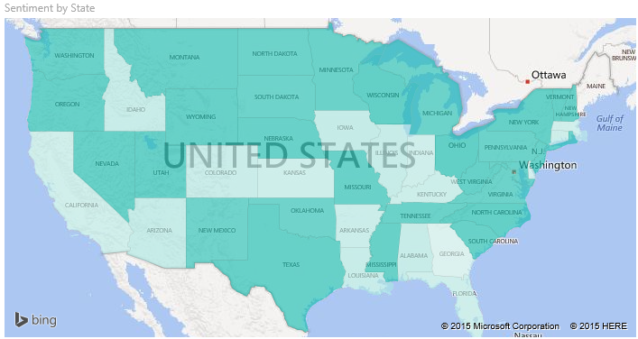
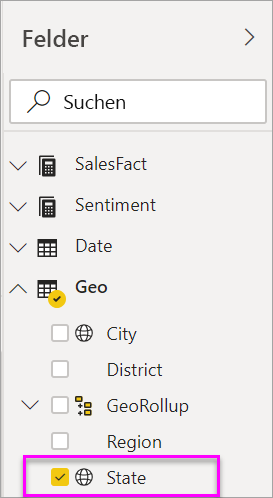
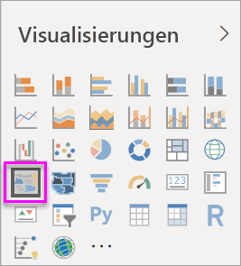
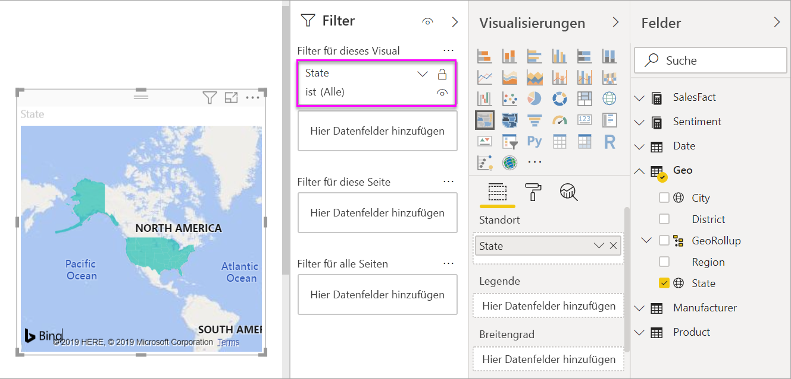
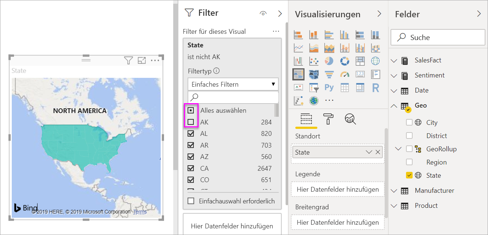
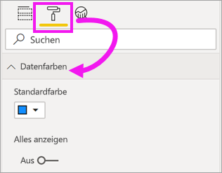
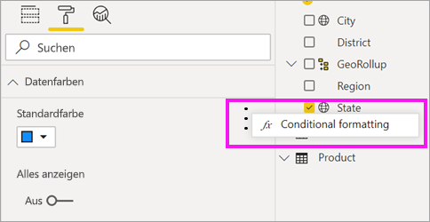
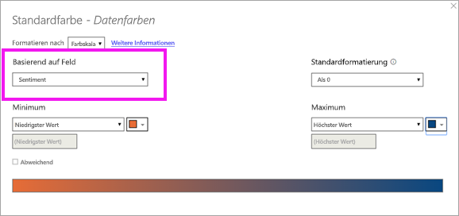
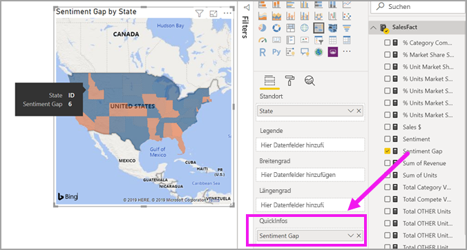
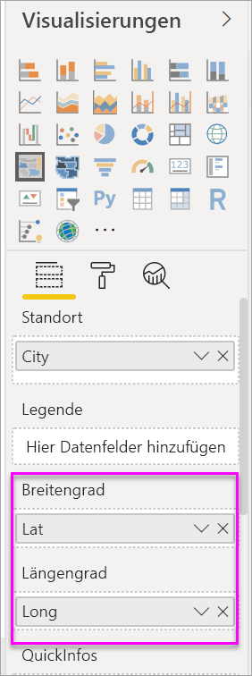

# Erstellen und Verwenden von Flächenkartogrammen (Choroplethenkarten) in Power BI

[!INCLUDE[consumer-appliesto-nyyn](../includes/consumer-appliesto-nyyn.md)]

[!INCLUDE [power-bi-visuals-desktop-banner](../includes/power-bi-visuals-desktop-banner.md)]

In einem Flächenkartogramm wird mithilfe von Schattierungen, Farben oder Mustern angezeigt, in welchem Verhältnis Werte innerhalb eines geografischen Gebiets stehen.  Diese relativen Unterschiede werden mithilfe von Schattierungen angezeigt, wobei hell eine geringe Menge/Häufigkeit und dunkel eine große Menge/Häufigkeit anzeigt.    

## An Bing gesendete Informationen
Power BI arbeitet mit Bing zusammen, um Standardkartenkoordinaten bereitzustellen (ein Prozess, der als Geocodierung bezeichnet wird). Wenn Sie im Power BI-Dienst oder in Power BI Desktop eine Kartenvisualisierung erstellen, werden die Daten in den Buckets **Standort**, **Breitengrad** und **Längengrad** (die dazu verwendet werden, diese Visualisierung zu erstellen) an Bing gesendet.

Sie oder der Administrator müssen möglicherweise die Firewall aktualisieren, um den Zugriff auf die von Bing für die Geocodierung verwendeten URLs zuzulassen.  Diese URLs lauten:
- https://dev.virtualearth.net/REST/V1/Locations    
- https://platform.bing.com/geo/spatial/v1/public/Geodata    
- https://www.bing.com/api/maps/mapcontrol

Weitere Informationen zu den an Bing gesendeten Daten sowie Tipps für eine erfolgreichere Geocodierung finden Sie unter [Tipps und Tricks für Power BI-Kartenvisualisierungen](power-bi-map-tips-and-tricks.md).

## Einsatz von Flächenkartogrammen
Flächenkartogramme sind gut für folgende Zwecke geeignet:

* Zum Anzeigen quantitativer Informationen auf einer Karte
* Zum Anzeigen räumlicher Muster und Beziehungen
* Bei standardisierten Daten
* Bei der Arbeit mit sozioökonomischen Daten
* Wenn bestimmte Regionen von Bedeutung sind
* Für einen Überblick in Bezug auf die Verteilung über geografische Standorte hinweg

### Voraussetzungen
In diesem Tutorial wird die [PBIX-Beispieldatei für Vertrieb und Marketing](https://download.microsoft.com/download/9/7/6/9767913A-29DB-40CF-8944-9AC2BC940C53/Sales%20and%20Marketing%20Sample%20PBIX.pbix) verwendet.
1. Wählen Sie im oberen linken Bereich der Menüleiste **Datei** > **Öffnen** aus.
   
2. Suchen Sie nach Ihrer Kopie der **PBIX-Beispieldatei für Vertrieb und Marketing**.

1. Öffnen Sie die **PBIX-Beispieldatei für Vertrieb und Marketing** in der Berichtsansicht .

1. Auswählen  um eine neue Seite hinzuzufügen.

> [!NOTE]
> Eine Freigabe Ihres Berichts für einen Power BI-Kollegen erfordert, dass Sie und Ihr Kollege jeweils eine eigene Power BI Pro-Lizenz haben oder dass der Bericht in der Premium-Kapazität gespeichert wird.    

### Erstellen eines Flächenkartogramms
1. Wählen Sie im Bereich „Felder“ das Feld **Geo** \> **State** (Bundesstaat) aus.    

   
2. [Wandeln Sie das Diagramm](power-bi-report-change-visualization-type.md) in ein Flächenkartogramm um. Beachten Sie, dass sich **Bundesstaat** jetzt im Bereich **Standort** befindet. Bing Maps verwendet das Feld unter **Standort**bereich, um die Karte zu erstellen.  Gültige Orte umfassen z. B. Länder, Bundesländer, Landkreise, Städte, Postleitzahlen usw. Bing Maps bietet verschiedene Formen für Orte auf der ganzen Welt. Ohne einen gültigen Wert im Bereich „Ort“ kann Power BI kein Flächenkartogramm erstellen.  

   
3. Filtern Sie die Karte, um nur die kontinentalen USA anzuzeigen.

   a.  Suchen Sie links neben dem Visualisierungsbereich nach dem Bereich **Filter**. Erweitern Sie den Bereich, wenn er minimiert ist.

   b.  Zeigen Sie auf **State**, und klicken Sie auf das Erweiterungssymbol.  
   

   c.  Aktivieren Sie das Kontrollkästchen **Alle**, und deaktivieren Sie das Kontrollkästchen **AK**.

   
4. Wählen Sie das Farbrollersymbol aus, um den Bereich „Formatierung“ zu öffnen, und wählen Sie **Datenfarben** aus.

    

5. Klicken Sie auf die drei vertikalen Punkte, und wählen Sie **Bedingte Formatierung** aus.

    

6. Verwenden Sie die Anzeige **Standardfarbe – Datenfarben**, um festzulegen, wie das Flächenkartogramm schattiert wird. Die verfügbaren Optionen umfassen, auf welchem Feld die Schattierung basiert und wie sie angewendet wird. In diesem Beispiel verwenden wir das Feld **SalesFact** > **Sentiment** (SalesFact > Stimmung) und legen für den niedrigsten Stimmungswert Orange und für den höchsten Wert Blau fest. Werte zwischen dem Maximum und dem Minimum sind Schattierungen von Orange und Blau. Die Abbildung am unteren Rand der Anzeige stellt den Bereich der Farben dar, die verwendet werden. 

    

7. Das Flächenkartogramm ist grün und rot schattiert. Rot steht dabei für schlechtere und grün für bessere (d.h. positive) Stimmungsdaten.  Ziehen Sie ein Feld in den QuickInfo-Bereich, um weitere Details anzuzeigen.  Hier haben wir **SalesFact** > **Sentiment gap** (SalesFact > Stimmungslücke) hinzugefügt. Wenn Sie den Status von Idaho (ID) hervorheben, sehen Sie, dass die Stimmungslücke bei 6 liegt und damit niedrig ist.
   

10. [Speichern Sie den Bericht](../create-reports/service-report-save.md).

Mithilfe von Power BI können Sie die Darstellung Ihres Flächenkartogramms umfassend steuern. Verschieben Sie die Steuerelemente für die Datenfarbe, bis Ihnen das Ergebnis gefällt. 

## Hervorheben und Kreuzfiltern
Informationen zur Verwendung des Filterbereichs finden Sie unter [Hinzufügen eines Filters zu einem Bericht in Power BI](../create-reports/power-bi-report-add-filter.md).

Das Markieren eines Orts in einem Flächenkartogramm ermöglicht das Kreuzfiltern anderer Visualisierungen auf der Berichtsseite – und umgekehrt.

1. Speichern Sie zunächst den Bericht, indem Sie auf **Datei > Speichern** klicken. 

2. Kopieren Sie das Flächenkartogramm, indem Sie STRG+C drücken.

3. Klicken Sie unten im Berichtsbereich auf die Registerkarte **Stimmung**, um die Seite mit dem Stimmungsbericht zu öffnen.

    

4. Bewegen Sie die Visuals auf der Seite, und ändern Sie deren Größe, um Platz zu schaffen. Drücken Sie anschließend STRG+V, um das Flächenkartogramm aus dem vorherigen Bericht einzufügen. (Siehe folgende Abbildungen)

   

5. Wählen Sie auf dem Flächenkartogramm einen Bundesstaat aus.  Dadurch erfolgt eine Kreuzhervorhebung und Kreuzfilterung der anderen Visualisierungen auf der Seite. Wenn Sie z. B. **Texas** auswählen, werden die Karten kreuzgefiltert, und es erfolgt eine Kreuzhervorhebung des Balkendiagramms. Sie wissen nun, dass der Stimmungswert bei 75 liegt und dass sich Texas im Central District Nr. 23 befindet.   
   
2. Wählen Sie in dem Liniendiagramm „VanArsdel - Sentiment by Month“ (VanArsdel – Stimmung nach Monat) aus. Dadurch wird das Flächenkartogramm gefiltert, sodass nur die Stimmungsdaten für VanArsdel und nicht für die Konkurrenz angezeigt werden.  
   

## Zu beachtende Aspekte und Problembehandlung
Kartendaten sind unter Umständen nicht eindeutig.  Neben Paris in Frankreich gibt es auch noch ein Paris in Texas. Ihre geografischen Daten sind wahrscheinlich in separaten Spalten gespeichert – eine Spalte für den Ortsnamen, eine Spalte für den Namen des Bundeslands oder des Landkreises usw. Für Bing ist es daher nicht eindeutig, welches Paris gemeint ist. Wenn das Dataset bereits Daten für die Breiten- und Längengrade enthält, umfasst Power BI spezielle Felder, mithilfe derer die Kartendaten eindeutig zugeordnet werden können. Ziehen Sie das Feld mit den Breitengraddaten in den Bereich „Visualisierungen \> Breitengrad“.  Führen Sie für den Längengrad die gleichen Schritte aus.    

Wenn Sie zum Bearbeiten des Datasets in Power BI Desktop berechtigt sind, erfahren Sie in diesem Video, wie Sie Mehrdeutigkeiten in Karten beheben.

> [VIDEO https://www.youtube.com/embed/Co2z9b-s_yM ]

[Führen Sie zum Aktualisieren des Datasets diese Anweisungen aus](https://support.office.com/article/Maps-in-Power-View-8A9B2AF3-A055-4131-A327-85CC835271F7), wenn Sie zwar über Bearbeitungszugriff für das Dataset, aber nicht über Zugriff auf die Breiten- und Längengraddaten verfügen.

Weitere Hilfe zu Kartenvisualisierungen finden Sie unter [Tipps und Tricks für Kartenvisualisierungen](../power-bi-map-tips-and-tricks.md).

## Nächste Schritte

[Formenzuordnung](desktop-shape-map.md)

[Visualisierungstypen in Power BI](power-bi-visualization-types-for-reports-and-q-and-a.md)

