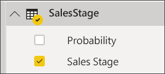
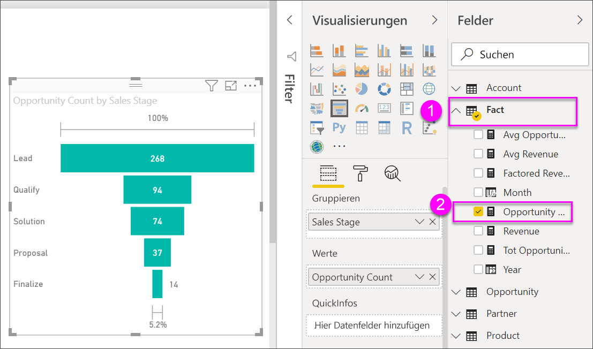

# Trichterdiagramme

[!INCLUDE [power-bi-visuals-desktop-banner](../includes/power-bi-visuals-desktop-banner.md)]

Mit einem Trichterdiagramm kann ein linearer Prozess mit aufeinanderfolgenden und miteinander verbundenen Phasen visuell dargestellt werden. Ein Beispiel ist etwa ein Trichterdiagramm für den Verkauf, das die von den Kunden durchlaufenen Phasen nachverfolgt: Lead \> Qualifizierter Lead \> Potenzieller Kunde \> Vertrag \> Abschluss.  Die Form des Trichterdiagramms zeigt auf einen Blick den Zustand des nachverfolgten Prozesses an.

Jede Phase des Diagramms stellt einen prozentualen Anteil am Gesamtwert dar. Daher hat ein Trichterdiagramm in den meisten Fällen die Form eines Trichters, wobei die erste Phase am größten und jede nachfolgende Phase etwas kleiner ist.  Ein birnenförmiges Diagramm ist hilfreich, um ein Problem im Prozess zu identifizieren.  In der Regel ist jedoch die erste Phase (die „Trichteröffnung“) am größten.

## Einsatz von Trichterdiagrammen
Trichterdiagramme sind gut für folgende Zwecke geeignet:

* Bei fortlaufenden Daten über mindestens vier Phasen hinweg
* Bei einer voraussichtlich größeren Anzahl an „Elementen“ in der ersten Phase im Vergleich zur letzten Phase
* Zum Berechnen potenzieller Werte (Umsatz/Verkäufe/Aufträge usw.) nach Phasen
* Zum Berechnen und Nachverfolgen der Konvertierungs- und Kundenbindungsrate
* Zum Erkennen von Engpässen in einem linearen Prozess
* Zum Nachverfolgen des Workflows in Bezug auf den Warenkorb
* Zum Nachverfolgen des Fortschritts und Erfolgs von Click-Through-Werbe-/Marketingkampagnen

## Arbeiten mit Trichterdiagrammen
Trichterdiagramme:

* Sortierbar
* Vielfachunterstützung
* Hervorheben und Kreuzfiltern durch andere Visualisierungen auf der gleichen Berichtseite möglich
* Verwendung zum Hervorheben und Kreuzfiltern anderer Visualisierungen auf der gleichen Berichtseite möglich
   > [!NOTE]
   > In diesem Video sehen Sie, wie ein Trichterdiagramm anhand des Beispiels für Vertrieb und Marketing erstellt wird. Befolgen Sie dann die Schritte unterhalb des Videos, um es anhand der PBIX-Datei zum Analysebeispiel für Opportunity selbst auszuprobieren.
   > 
   > 
## Voraussetzung

Dieses Tutorial verwendet die [PBIX-Datei zum Analysebeispiel für Opportunity](http://download.microsoft.com/download/9/1/5/915ABCFA-7125-4D85-A7BD-05645BD95BD8/Opportunity%20Analysis%20Sample%20PBIX.pbix
).

1. Wählen Sie im oberen linken Bereich der Menüleiste die Option **Datei** > **Öffnen** aus.
   
2. Suchen Sie nach Ihrer Kopie der **PBIX-Datei zum Analysebeispiel für Opportunity**.

1. Öffnen Sie die **PBIX-Datei zum Analysebeispiel für Opportunity** in der Berichtsansicht .

1. Auswählen  um eine neue Seite hinzuzufügen.

## Erstellen eines einfachen Trichterdiagramms
In diesem Video sehen Sie, wie ein Trichterdiagramm anhand des Beispiels für Vertrieb und Marketing erstellt wird.

<iframe width="560" height="315" src="https://www.youtube.com/embed/qKRZPBnaUXM" frameborder="0" allow="autoplay; encrypted-media" allowfullscreen></iframe>

Erstellen Sie jetzt ein eigenes Trichterdiagramm, das die Anzahl der Verkaufschancen in jeder der Verkaufsphasen anzeigt.

1. Beginnen Sie auf einer leeren Berichtsseite, und wählen Sie **SalesStage** \> **Vertriebsphase** aus.
   
    

1. Wählen Sie das Trichtersymbol aus,  um das Säulendiagramm in ein Trichterdiagramm zu konvertieren.

2. Wählen Sie im Bereich **Felder** die Option **Fakt** \> **Anzahl an Verkaufschancen** aus.
   
    
4. Wenn Sie mit dem Mauszeiger auf einen Balken zeigen, werden zahlreiche Informationen angezeigt.
   
   * Name der Phase
   * Anzahl aktueller Verkaufschancen in dieser Phase
   * Gesamte Konversionsrate (% der Leads) 
   * Änderungen zwischen den einzelnen Phasen in Prozent (in diesem Fall zwischen Angebots- und Lösungsphase)
     
     

6. [Speichern Sie den Bericht](../service-report-save.md).

## Hervorheben und Kreuzfiltern
Informationen zur Verwendung des Filterbereichs finden Sie unter [Hinzufügen eines Filters zu einem Bericht in Power BI](../power-bi-report-add-filter.md).

Durch Markieren eines Balkens in einem Trichterdiagramm werden Kreuzfilter zu anderen Visualisierungen auf der Berichtsseite aktiviert und umgekehrt. Fügen Sie hierfür der Berichtsseite, die das Trichterdiagramm enthält, einige weitere visuelle Elemente hinzu.

1. Wählen Sie im Trichterdiagramm den Balken **Angebot** aus. Dadurch erfolgt eine Kreuzhervorhebung der anderen Visualisierungen auf der Seite. Mit STRG können Sie mehrere Elemente auswählen.
   
   
2. Informationen zum Festlegen der Einstellungen für die Kreuzhervorhebung und Kreuzfilterung von visuellen Elementen finden Sie unter [Interaktionen mit Visualisierungen in einem Power BI-Bericht](../service-reports-visual-interactions.md).

## Nächste Schritte

[Messanzeigen in Power BI](power-bi-visualization-radial-gauge-charts.md)

[Visualisierungstypen in Power BI](power-bi-visualization-types-for-reports-and-q-and-a.md)
