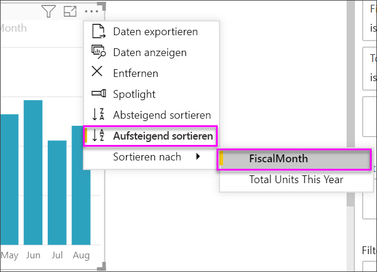
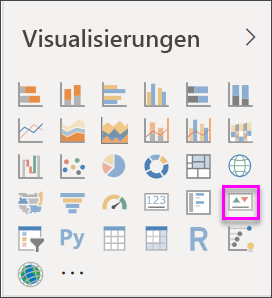
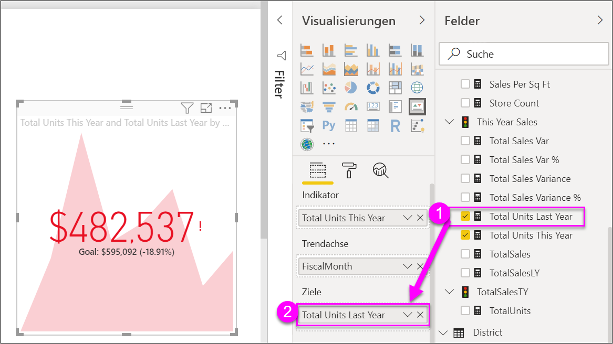

# KPI-Visualisierungen (Key Performance Indicator)

[!INCLUDE [power-bi-visuals-desktop-banner](../includes/power-bi-visuals-desktop-banner.md)]

Ein Key Performance Indicator (KPI) ist ein visueller Hinweis, mit dem der Fortschritt in Bezug auf ein messbares Ziel kommuniziert wird. Weitere Informationen über KPIs finden Sie unter [Key Performance Indicators (KPIs) in PowerPivot](/previous-versions/sql/sql-server-2012/hh272050(v=sql.110)).

Schauen Sie Will beim Erstellen von Einzelmetrikvisualisierungen wie Messgeräten, Karten und KPIs zu.
   > [!NOTE]
   > In diesem Video wird eine ältere Version von Power BI Desktop verwendet.
   > 
   > 
<iframe width="560" height="315" src="https://www.youtube.com/embed/xmja6EpqaO0?list=PL1N57mwBHtN0JFoKSR0n-tBkUJHeMP2cP" frameborder="0" allowfullscreen></iframe>

## Einsatzmöglichkeiten von KPIs

KPIs sind für folgende Zwecke gut geeignet:

* Um den Fortschritt zu messen. Zum Beantworten der Frage: „Wie weit bin ich voraus bzw. im Rückstand?“

* Um die Entfernung zu einem Ziel zu messen. Zum Beantworten der Frage: „Wie weit bin ich voraus bzw. im Rückstand?“

## KPI-Anforderungen

Ein Designer verwendet ein bestimmtes Measure als Basis für eine KPI-Visualisierung. Die KPI soll Ihnen helfen, den aktuellen Wert und Status einer Metrik anhand eines definierten Ziels zu bewerten. Eine KPI-Visualisierung erfordert eine *Basiskennzahl*, die im Hinblick auf einen Wert ausgewertet wird, eine *Zielkennzahl* bzw. einen Zielwert sowie einen *Schwellenwert* oder ein *Ziel*.

Ein KPI-Dataset muss Zielwerte für eine KPI enthalten. Wenn Ihr Dataset keine Zielwerte enthält, können Sie sie erstellen, indem Sie dem Datenmodell oder der PBIX-Datei ein Excel-Arbeitsblatt mit Zielen hinzufügen.

## Voraussetzungen

In diesem Tutorial wird die [PBIX-Datei mit einem Analysebeispiel für den Einzelhandel](https://download.microsoft.com/download/9/6/D/96DDC2FF-2568-491D-AAFA-AFDD6F763AE3/Retail%20Analysis%20Sample%20PBIX.pbix) verwendet.

1. Wählen Sie im oberen linken Bereich der Menüleiste **Datei** > **Öffnen** aus.

1. Suchen Sie Ihre Kopie der **PBIX-Datei mit einem Analysebeispiel für den Einzelhandel**.

1. Öffnen Sie die **PBIX-Datei mit einem Analysebeispiel für den Einzelhandel** in der Berichtsansicht. 

1. Wählen Sie **+** aus, um eine neue Seite hinzuzufügen. 

## Erstellen eines KPI

In diesem Beispiel erstellen Sie eine KPI (Key Performance Indicator, Leistungskennzahl), die Ihren Fortschritt beim Erreichen von Umsatzzielen misst.

1. Wählen Sie im Bereich **Felder** **Verkäufe > Gesamte Einheiten in diesem Jahr** aus.  Dieser Wert wird der Indikator.

1. Fügen Sie **Zeit > FiscalMonth** hinzu.  Dieser Wert stellt den Trend dar.

1. Wählen Sie in der oberen rechten Ecke des Visuals die Auslassungspunkte aus, und überprüfen Sie, ob Power BI die Spalten in aufsteigender Reihenfolge nach **FiscalMonth** sortiert hat.

    > [!IMPORTANT]
    > Nachdem Sie die Visualisierung in eine KPI konvertiert haben, ist **keine** Option zum Sortieren vorhanden. Sie müssen sie jetzt ordnungsgemäß sortieren.

    

    Nach ordnungsgemäßer Sortierung sieht Ihre Visualisierung wie folgt aus:

    

1. Wandeln Sie die Visualisierung in eine KPI um, indem Sie im Bereich **Visualisierung** das **KPI**-Symbol auswählen.

    

1. Um ein Ziel hinzuzufügen, ziehen Sie **Gesamte Einheiten im letzten Jahr** auf das Feld **Ziel**.

    

1. Optional können Sie den KPI formatieren. Wählen Sie dazu das Farbrollensymbol aus, um den Formatierungsbereich zu öffnen.

    * **Indikator**: Dient zum Steuern der Anzeigeeinheiten und der Dezimalstellen des Indikators.

    * **Trendachse**: Wenn hier **Ein** festgelegt ist, zeigt das Visual die Trendachse als Hintergrund der KPI-Visualisierung an.  

    * **Ziele**: Wenn hier **Ein** festgelegt ist, zeigt das Visual das Ziel und die Entfernung vom Ziel als Prozentsatz an.

    * **Farbcodierung > Richtung**: Manche schätzen einige KPIs als besser für *höhere* Werte und andere als besser für *niedrigere* Werte ein. Nehmen Sie als Beispiel Erlös und Wartezeit. Im Gegensatz zur Wartezeit ist beim Erlös ist ein höherer Wert besser. Wählen Sie **Hoch ist gut** aus, und ändern Sie optional die Farbeinstellungen.

KPIs sind auch im Power BI-Dienst und auf Ihren Mobilgeräten verfügbar. So verlieren Sie nie den Kontakt zu den essentiellen Vorgängen in Ihrem Unternehmen.

## Zu beachtende Aspekte und Problembehandlung

Wenn die KPI nicht wie in der Abbildung oben aussieht, haben Sie möglicherweise keine Sortierung nach **FiscalMonth** ausgeführt. KPIs haben keine Sortieroption. Sie müssen neu beginnen und nach **FiscalMonth** sortieren, *bevor* Sie die Visualisierung in eine KPI umwandeln.

## Nächste Schritte

* [Tipps und Tricks für Power BI-Kartenvisualisierungen](power-bi-map-tips-and-tricks.md)

* [Visualisierungstypen in Power BI](power-bi-visualization-types-for-reports-and-q-and-a.md)

Weitere Fragen? [Wenden Sie sich an die Power BI-Community](https://community.powerbi.com/)
