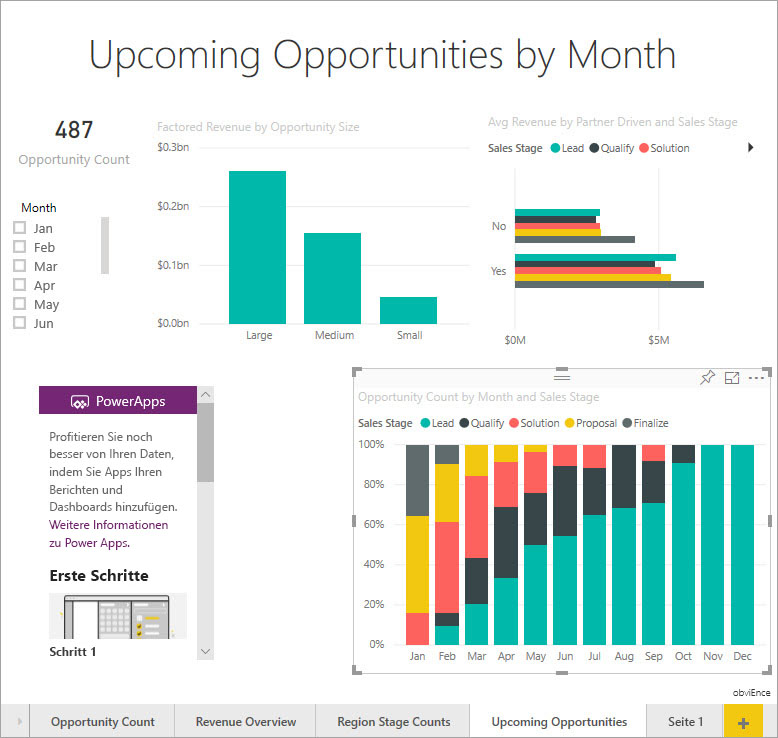
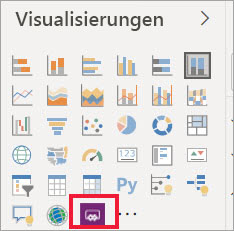
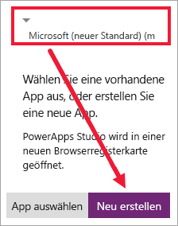
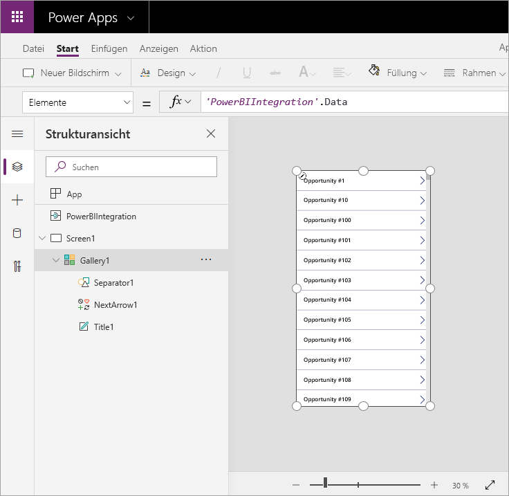
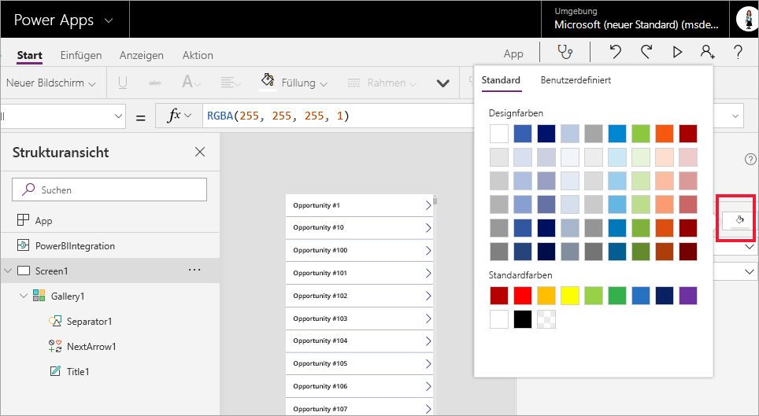
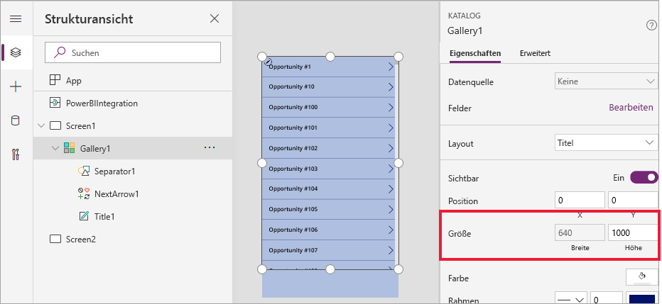
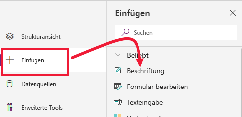
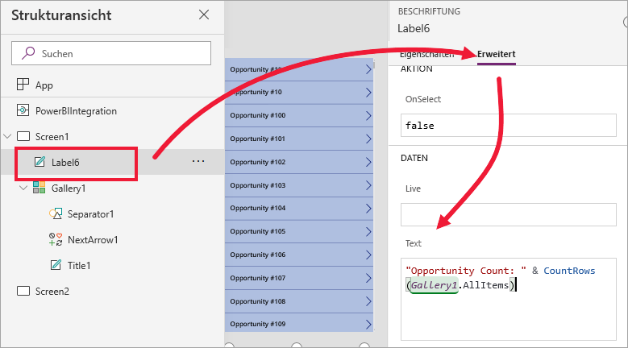
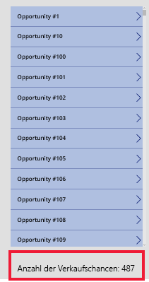
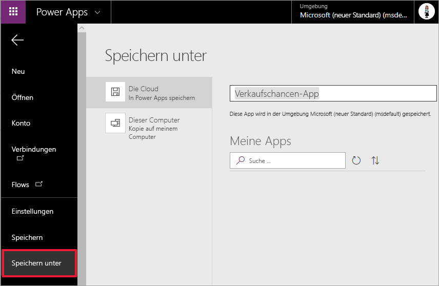

# Tutorial: Einbetten eines Power Apps-Visuals in einen Power BI-Bericht

In diesem Tutorial verwenden Sie das Power Apps-Visual, um eine neue App zu erstellen, die in einen Power BI-Beispielbericht eingebettet ist. Diese App interagiert mit anderen Visuals in diesem Bericht.

Wenn Sie kein Power Apps-Abonnement besitzen, [erstellen Sie ein kostenloses Konto](https://web.powerapps.com/signup?redirect=marketing&email=), bevor Sie beginnen.

In diesem Tutorial erhalten Sie Informationen zu den folgenden Vorgängen:
> [!div class="checklist"]
> * Hinzufügen eines Power Apps-Visuals zu einem Power BI-Bericht
> * Erstellen einer neuen App in Power Apps, die Daten aus dem Power BI-Bericht verwendet
> * Anzeigen von und Interagieren mit dem Power Apps-Visual im Bericht

## Voraussetzungen

* [Google Chrome](https://www.google.com/chrome/browser/) oder [Microsoft Edge](https://www.microsoft.com/windows/microsoft-edge)
* Ein [Power BI-Abonnement](https://docs.microsoft.com/power-bi/service-self-service-signup-for-power-bi), für das das [Analysebeispiel für Opportunity](https://docs.microsoft.com/power-bi/sample-opportunity-analysis#get-the-content-pack-for-this-sample) installiert ist.
* Grundlegende Kenntnisse der Vorgehensweise beim [Erstellen von Apps in Power Apps](https://docs.microsoft.com/powerapps/maker/canvas-apps/data-platform-create-app-scratch) und beim [Bearbeiten von Power BI-Berichten](https://docs.microsoft.com/power-bi/service-the-report-editor-take-a-tour)

## Erstellen einer neuen App
Wenn Sie das Power Apps-Visual zu Ihrem Bericht hinzufügen, wird Power Apps Studio mit einer Livedatenverbindung zwischen Power Apps und Power BI gestartet.

1. Öffnen Sie den Beispielbericht „Opportunity Analysis“, und wählen Sie die Seite *Upcoming Opportunities* aus. 

2. Verschieben Sie einige Berichtskacheln, und ändern Sie deren Größe, um Platz für das neue Visual zu schaffen.

    

2. Wählen Sie im Bereich „Visualisierungen“ das Power Apps-Symbol aus, und passen Sie die Größe des Visuals auf den Platz an, den Sie geschaffen haben.

    

3. Wählen Sie im Bereich **Felder** **Name**, **Produktcode** und **Vertriebsphase** aus. 

    

4. Wählen Sie im Power Apps-Visual die Power Apps-Umgebung aus, in der Sie die App erstellen möchten, und klicken Sie dann auf **Neu erstellen**.

    

    In Power Apps Studio können Sie sehen, dass eine einfache App erstellt wurde. In einem Katalog (*Gallery*) wird eins der in Power BI ausgewählten Felder angezeigt.

    

5.  Ändern Sie die Größe des Katalogs, sodass dieser nur die Hälfte des Bildschirms einnimmt. 

6. Wählen Sie im linken Bereich **Screen1** aus, und legen Sie dann die **Fill**-Eigenschaft der Anzeige auf „LightBlue“ fest, damit diese im Bericht besser zu erkennen ist.

    

6. Schaffen Sie Platz für ein Steuerelement für eine Beschriftung. 

    

8. Fügen Sie unter **Gallery** ein Steuerelement für eine Textbeschriftung ein.

   

7. Ziehen Sie die Beschriftung in einen Bereich unter Ihrem Visual. Legen Sie die Eigenschaft **Text** auf `"Opportunity Count: " & CountRows(Gallery1.AllItems)` fest. Jetzt sollte die Gesamtanzahl der Verkaufsmöglichkeiten im Dataset angezeigt werden.

    

    

7. Speichern Sie die App mit dem Namen „Opportunies app“. 

    

## Abrufen der App in dem Bericht
Die App ist jetzt im Power BI-Bericht verfügbar und interagiert mit anderen Visuals, weil diese die gleiche Datenquelle haben.

Klicken Sie im Power BI-Bericht im Slicer auf **Jan**. Dadurch wird der gesamte Bericht einschließlich der Daten in der App gefiltert.

Achten Sie darauf, dass die Anzahl der Verkaufsmöglichkeiten in der App mit der Anzahl übereinstimmt, die im oberen linken Bereich des Berichts angezeigt wird. Sie können auch andere Elemente aus dem Bericht auswählen. Dann werden die Daten in der App aktualisiert.

## Bereinigen von Ressourcen
Wenn Sie das Analysebeispiel für Opportunity nicht mehr verwenden möchten, können Sie das Dashboard, den Bericht und das Dataset löschen.

## Nächste Schritte
[Visualisierungstypen in Power BI](power-bi-visualization-types-for-reports-and-q-and-a.md)    
[Tutorial: Power Apps-Visual für Power BI](https://docs.microsoft.com/powerapps/maker/canvas-apps/powerapps-custom-visual)