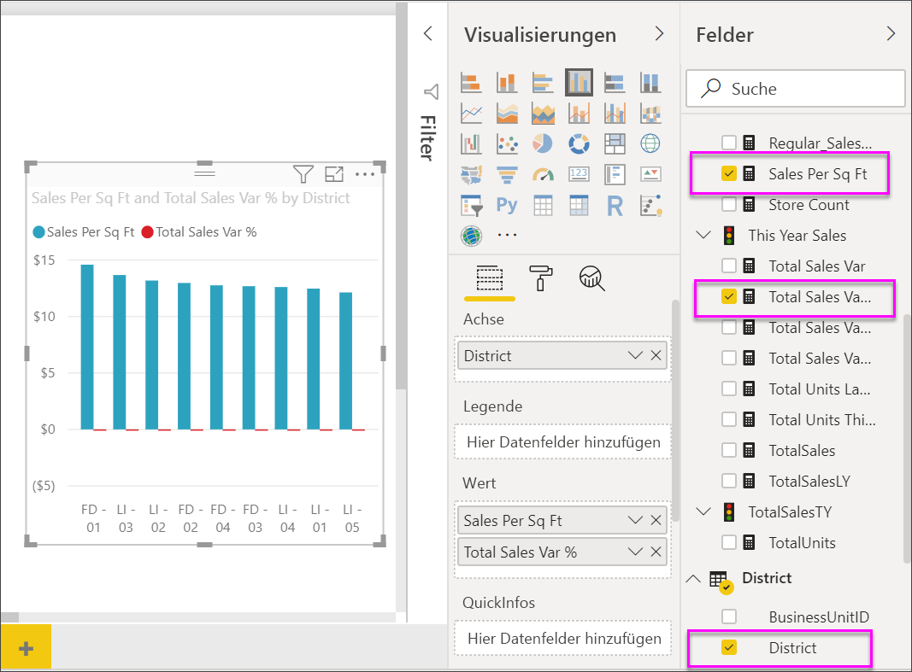
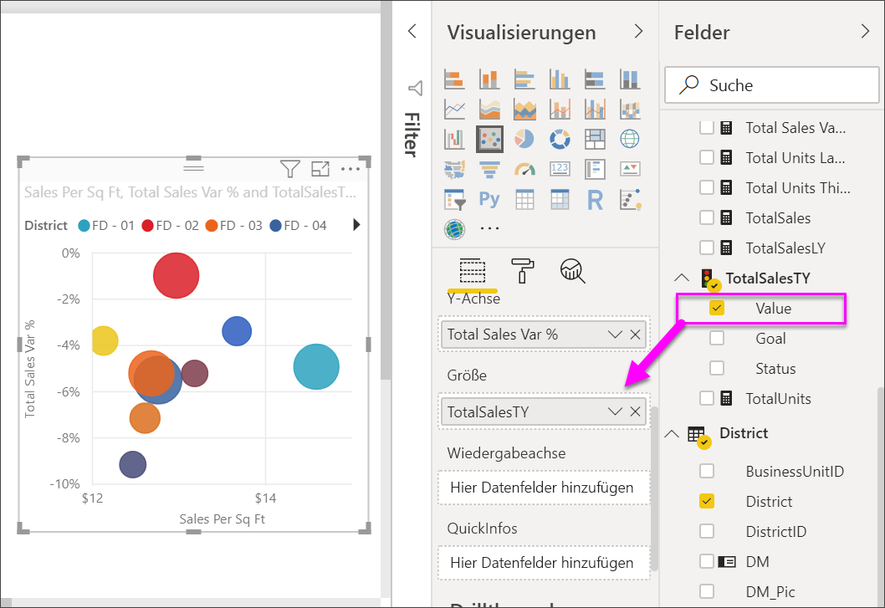
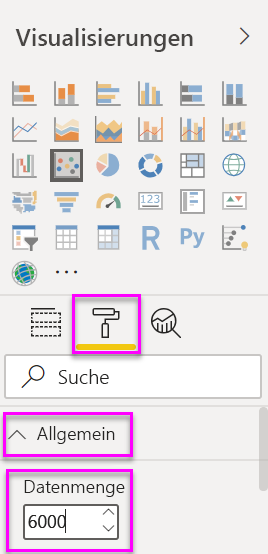
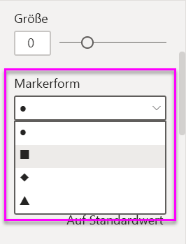
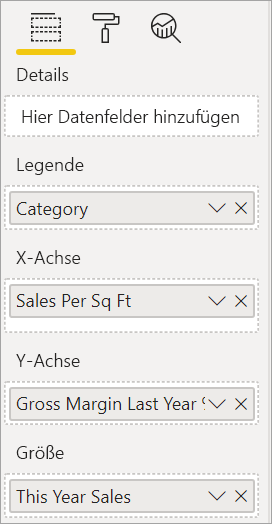
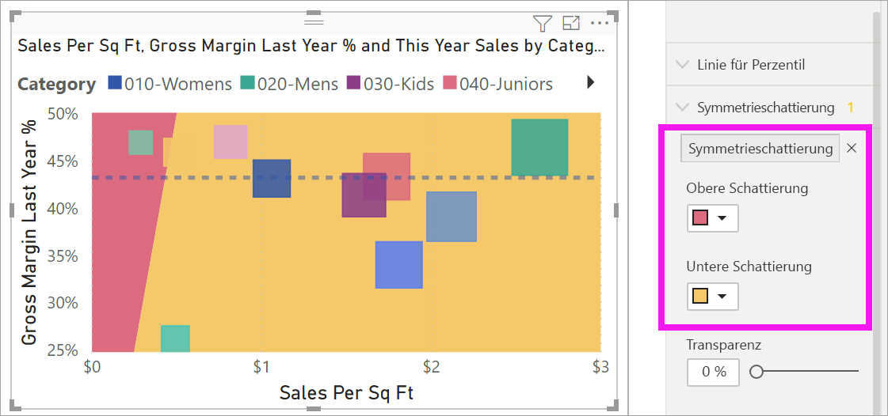
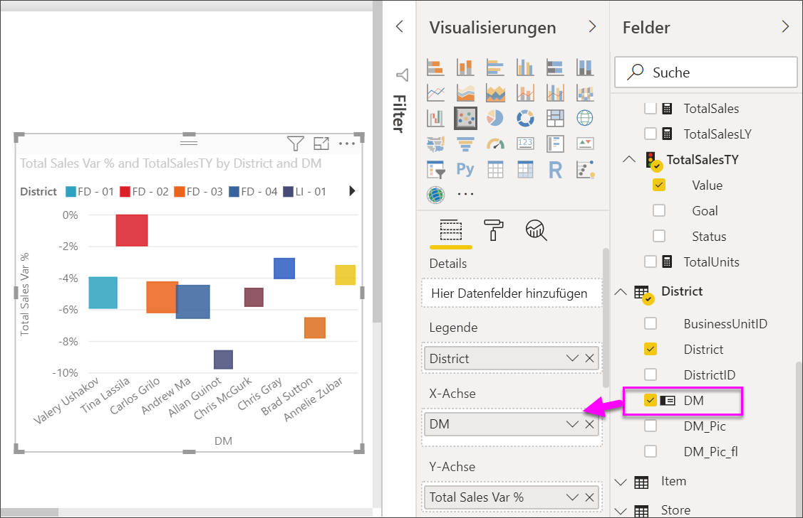
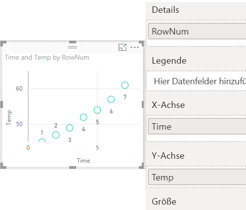
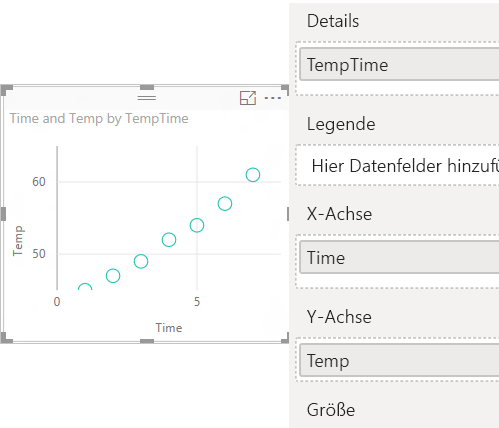

# Punktdiagramme, Punktplotdiagramme und Blasendiagramme in Power BI

[!INCLUDE [power-bi-visuals-desktop-banner](../includes/power-bi-visuals-desktop-banner.md)]

Ein Punktdiagramm weist immer zwei Wertachsen auf, sodass ein Satz von numerischen Daten entlang einer horizontalen Achse und ein anderer Satz von numerischen Werten entlang einer vertikalen Achse angezeigt wird. Das Diagramm zeigt Schnittpunkte von x- und y-Zahlenwerten an, wobei diese Werte in jeweils einem einzelnen Punkt kombiniert werden. Power BI kann diese Datenpunkte gleichmäßig oder ungleichmäßig auf der horizontalen Achse verteilen. Es hängt von den Daten ab, die das Diagramm darstellt.

In diesem Video sehen Sie, wie Will ein Punktdiagramm erstellt. Mit den unten beschriebenen Schritten können Sie dann selbst ein solches Diagramm erstellen.
   > [!NOTE]
   > In diesem Video wird eine ältere Version von Power BI Desktop verwendet.
   > 
   > 
<iframe width="560" height="315" src="https://www.youtube.com/embed/PVcfPoVE3Ys?list=PL1N57mwBHtN0JFoKSR0n-tBkUJHeMP2cP" frameborder="0" allowfullscreen></iframe>

Sie können die Anzahl der Datenpunkte auf maximal 10.000 festlegen.  

## Wann sollte ein Punktdiagramm, Blasendiagramm oder Punktplotdiagramm verwendet werden?

### Punkt- und Blasendiagramme

Ein Punktdiagramm zeigt die Beziehung zwischen zwei numerischen Werten an. In einem Blasendiagramm werden Datenpunkte durch Blasen ersetzt. Hierbei repräsentiert die *Größe* der Blase eine zusätzliche dritte Datendimension.

Punktdiagramme sind in folgenden Fällen gut geeignet:

* Zum Anzeigen von Beziehungen zwischen zwei numerischen Werten.

* Zum Darstellen zweier Gruppen von Zahlen als eine Reihe von X- und Y-Koordinaten.

* Zur Verwendung anstelle eines Liniendiagramms, wenn Sie die Skalierung der horizontalen Achse ändern möchten.

* Zum Darstellen der horizontalen Achse in logarithmischer Skalierung.

* Zum Anzeigen von Arbeitsblattdaten, die Paare oder gruppierte Werte enthalten.

    > [!TIP]
    > In einem Punktdiagramm können Sie die unabhängigen Skalierungen der Achsen anpassen, um weitere Informationen zu den gruppierten Werten anzugeben.

* Um Muster in großen Mengen von Daten aufzuzeigen, z.B. lineare oder nicht lineare Trends, Ansammlungen oder Ausreißer.

* Um große Mengen von Datenpunkten ohne Berücksichtigung der Zeit zu vergleichen.  Je mehr Daten Sie in ein Punktdiagramm aufnehmen, desto bessere Vergleiche können Sie vornehmen.

Zusätzlich zu dem, was Punktdiagramme für Sie tun können, sind Blasendiagramme eine gute Wahl:

* Wenn Ihre Daten drei Datenreihen aufweisen, die jeweils einen Satz von Werten enthalten.

* Zum Präsentieren von Finanzdaten.  Unterschiedliche Blasengrößen sind nützlich zum optischen Hervorheben bestimmter Werte.

* Für die Verwendung mit Quadranten.

### Punktplotdiagramme

Ein Punktplotdiagramm ähnelt einem Blasen- und einem Punktdiagramm, aber wird stattdessen verwendet, um Kategoriedaten entlang der X-Achse darzustellen.

Sie sind eine hervorragende Wahl, wenn Sie Kategoriedaten entlang der X-Achse einschließen möchten.

## Voraussetzungen

In diesem Tutorial wird die [PBIX-Datei mit einem Analysebeispiel für den Einzelhandel](https://download.microsoft.com/download/9/6/D/96DDC2FF-2568-491D-AAFA-AFDD6F763AE3/Retail%20Analysis%20Sample%20PBIX.pbix) verwendet.

1. Wählen Sie im oberen linken Bereich der Menüleiste **Datei** > **Öffnen** aus.
   
2. Suchen Sie Ihre Kopie der **PBIX-Datei mit einem Analysebeispiel für den Einzelhandel**.

1. Öffnen Sie die **PBIX-Datei mit einem Analysebeispiel für den Einzelhandel** in der Berichtsansicht .

1. Auswählen  um eine neue Seite hinzuzufügen.

## Erstellen eines Punktdiagramms

1. Beginnen Sie auf einer leeren Berichtsseite, und wählen Sie im Bereich **Felder** folgende Felder aus:

    * **Umsätze** > **Umsätze pro Quadratmeter**

    * **Umsätze** > **Abweichungen der Gesamtumsätze in Prozent**

    * **Region** > **Region**

    

1. Wählen Sie im Bereich **Visualisierungen** aus, um das gruppierte Säulendiagramm in ein Punktdiagramm zu konvertieren.

   

1. Ziehen Sie **Region** von **Details** auf **Legende**.

    Power BI zeigt ein Punktdiagramm an, in dem die **Abweichungen des Gesamtumsatzes in Prozent** auf der Y-Achse und der **Umsatz pro Quadratmeter** auf der X-Achse dargestellt werden. Die Farben der Datenpunkte stellen die Regionen dar:

    

Nun fügen wir eine dritte Dimension hinzu.

## Erstellen eines Blasendiagramms

1. Ziehen Sie aus dem Bereich **Felder** die Option **Umsätze** > **Umsätze dieses Jahr** > **Wert** in den Bereich **Größe**. Die Datenpunkte werden zu Werten erweitert, die proportional zu den Umsatzwerten sind.

   

1. Zeigen Sie auf eine Blase. Die Größe der Blase gibt den Wert von **Umsätze dieses Jahr**an.

    

1. Wenn Sie die Anzahl der im Blasendiagramm anzuzeigenden Datenpunkte festlegen möchten, erweitern Sie im Abschnitt **Format** des Bereichs **Visualisierungen** **Allgemein**, und passen Sie die **Datenmenge** an.

    

    Sie können die maximale Datenmenge auf eine beliebige Zahl bis 10.000 festlegen. Sobald Sie höhere Zahlen erreichen, wird empfohlen, zuerst einen Test durchzuführen, um gute Leistung sicherzustellen.

    > [!NOTE]
    > Mehr Datenpunkte können längere Ladezeit bedeuten. Wenn Sie sich dafür entscheiden, Berichte mit Einschränkungen am oberen Ende der Skala zu veröffentlichen, sollten Sie Ihre Berichte im Web und ebenfalls auf Mobilgeräten testen. Sie möchten bestätigen, dass die Leistung des Diagramms den Erwartungen Ihrer Benutzer entspricht.

1. Sie können u. a. Visualisierungsfarben, Bezeichnungen, Titel und Hintergrund formatieren. Zum [Verbessern der Barrierefreiheit](../desktop-accessibility.md) sollten Sie das Hinzufügen von Markierungsformen zu jeder Linie in Betracht ziehen. Sie können zum Auswählen der Markierungsform **Formen** erweitern und dann **Markierungsform** sowie eine Form auswählen.

    

    Ändern Sie die Markierungsform in Raute, Dreieck oder Quadrat. Die Verwendung einer anderen Markierungsform für jede Linie erleichtert den Benutzern des Berichts, die Linien (oder Flächen) voneinander zu unterscheiden.

1. Öffnen Sie den Bereich „Analyse“  zum Hinzufügen zusätzlicher Informationen zur Visualisierung.  
    - Fügen Sie eine Linie für den Medianwert hinzu. Wählen Sie **Median** > **Hinzufügen** aus. Standardmäßig wird von Power BI eine Medianlinie für *Umsatz pro Quadratfuß* hinzugefügt. Dies ist nicht besonders nützlich, da offensichtlich 10 Datenpunkte vorhanden sind und der Median mit fünf Datenpunkten auf jeder Seite erstellt wird. Wechseln Sie stattdessen zum **Measure** *Gesamtumsatzabweichung in Prozent*.  

        

    - Fügen Sie Symmetrieschattierung hinzu, um anzuzeigen, welche Punkte über einen höheren Wert für das x-Achsen-Measure im Vergleich zum y-Achsen-Measure verfügen und umgekehrt. Wenn Sie im Bereich „Analyse“ die Symmetrieschattierung aktivieren, zeigt Power BI den Hintergrund des Punktdiagramms symmetrisch basierend auf den oberen und unteren Begrenzungen der aktuellen Achse an. So können Sie schnell erkennen, welches Achsenmeasure ein Datenpunkt begünstigt, insbesondere wenn die x- und y-Achse unterschiedliche Achsenbereiche verwenden.

        a. Ändern Sie das Feld **Abweichungen der Gesamtumsätze in Prozent** in **Bruttogewinn % Vorjahr**.

        

        b. Fügen Sie im Bereich „Analyse“ **Symmetrieschattierung** hinzu. Anhand der Schattierung lässt sich erkennen, dass nur die Kategorie „Strumpfwaren“ (die grüne Blase im rosa schattierten Bereich) den Bruttogewinn und nicht den Umsatz pro Ladenfläche begünstigt. 

        

    - Sehen Sie sich den Analysebereich weiter an, um interessante Einblicke aus Ihren Daten zu gewinnen. 

        

## Erstellen eines Punktplotdiagramms

Um ein Punktplotdiagramm zu erstellen, ersetzen Sie das numerische Feld **X-Achse** durch ein Kategoriefeld.

Entfernen Sie im Bereich **X-Achse** das Feld **Verkäufe pro qm**, und ersetzen Sie es durch **Distrikt** > **Regionalmanager**.

## Zu beachtende Aspekte und Problembehandlung

### Das Punktdiagramm weist nur einen Datenpunkt auf

Weist Ihr Punktdiagramm nur einen Datenpunkt auf, in dem alle Werte auf der X- und der Y-Achse zusammengefasst sind?  Oder werden alle Werte auf einer einzelnen horizontalen oder vertikalen Linie zusammengefasst?

Fügen Sie im Bereich **Details** ein Feld hinzu, sodass Power BI erkennt, wie die Werte gruppiert werden sollen. Das Feld muss für jeden Punkt, der dargestellt werden soll, eindeutig sein. Ein einfaches Zeilennummern- oder ID-Feld reicht.

Wenn dies mit Ihren Daten nicht möglich ist, erstellen Sie ein Feld, in dem die X- und Y-Werte für jeden Punkt auf individuelle Weise dargestellt werden:

Um ein neues Feld zu erstellen, [fügen Sie mit dem Abfrage-Editor von Power BI Desktop dem Dataset eine Indexspalte hinzu](../desktop-add-custom-column.md). Fügen Sie diese Spalte dann dem Bereich **Details** Ihrer Visualisierung hinzu.

## Nächste Schritte

Folgende Artikel könnten Sie ebenfalls interessieren:

* [Stichprobenentnahme mit hoher Dichte in Power BI-Punktdiagrammen](desktop-high-density-scatter-charts.md)
* [Visualisierungstypen in Power BI](power-bi-visualization-types-for-reports-and-q-and-a.md)
* [Tipps zum Sortieren und Verteilen von Datenplots in Power BI-Berichten](../guidance/report-tips-sort-distribute-data-plots.md)

Weitere Fragen? [Wenden Sie sich an die Power BI-Community](https://community.powerbi.com/)
