# Slicer in Power BI

[!INCLUDE [applies-to](../includes/applies-to.md)] [!INCLUDE [yes-desktop](../includes/yes-desktop.md)] [!INCLUDE [yes-service](../includes/yes-service.md)]

Angenommen, die Leser des Berichts sollen die gesamten Vertriebsmetriken einsehen, aber auch die Leistung einzelner Bezirksleiter und in unterschiedlichen Zeiträumen hervorheben können. Sie können separate Berichte oder vergleichende Diagramme erstellen. Alternativ können Sie auch *Datenschnitte* verwenden. Ein Slicer stellt eine Alternative zur Filterung dar. Er schränkt den Teil des Datasets ein, das in den anderen Visualisierungen in einem Bericht angezeigt wird. 

Dieser Artikel führt Sie durch das Erstellen und Formatieren eines einfachen Datenschnitts mit dem kostenlosen [Analysebeispiel für den Einzelhandel](../sample-retail-analysis.md). Es wird auch gezeigt, wie Sie steuern können, welche Visuals von einem Datenschnitt betroffen sind und wie eine Synchronisierung mit Datenschnitten auf anderen Seiten durchführen. Hier finden Sie weitere Artikel, in denen erläutert wird, wie bestimmte Datenschnitttypen erstellt werden:

- [Datenschnitt für numerischen Bereich](../desktop-slicer-numeric-range.md)
- [Relativer Datenschnitt mit Datum](desktop-slicer-filter-date-range.md)
- Reaktionsfähige und [größenveränderbare Datenschnitte](../power-bi-slicer-filter-responsive.md)
- [Hierarchiedatenschnitte](../create-reports/power-bi-slicer-hierarchy-multiple-fields.md) mit mehreren Feldern

## Verwenden von Slicern
Slicer sind für folgende Zwecke gut geeignet:

* Anzeigen häufig verwendeter oder wichtiger Filter für den einfacheren Zugriff im Zeichenbereich des Berichts
* Einfacheres Anzeigen des aktuellen gefilterten Zustands, ohne dass das Öffnen einer Dropdownliste erforderlich ist. 
* Filtern nach Spalten, die nicht benötigt und in den Datentabellen ausgeblendet werden.
* Erstellen fokussierterer Berichte durch das Einfügen von Slicern neben wichtigen visuellen Elementen.

Power BI-Slicer unterstützen Folgendes nicht:

- Eingabefelder
- Drilldown

## Erstellen von Slicern

Dieser Datenschnitt filtert Daten vom Bezirksleiter. Wenn Sie dieses Verfahren durchlaufen möchten, laden Sie die [PBIX-Datei mit dem Analysebeispiel für den Einzelhandel herunter](https://download.microsoft.com/download/9/6/D/96DDC2FF-2568-491D-AAFA-AFDD6F763AE3/Retail%20Analysis%20Sample%20PBIX.pbix).

1. Öffnen Sie Power BI Desktop, und wählen Sie über die Menüleiste **Datei** > **Öffnen** aus.
   
1. Wechseln Sie zur **PBIX-Datei mit dem Analysebeispiel für den Einzelhandel**, und wählen Sie dann **Öffnen** aus.

1. Wählen Sie im linken Bereich das Symbol **Bericht** aus, um die Datei in der Berichtsansicht zu öffnen.

1. Wählen Sie auf der Seite **Übersicht**, auf der im Berichtszeichenbereich keine Auswahl getroffen wurde, im Bereich **Visualisierungen** das Symbol **Slicer** aus, um einen neuen Slicer zu erstellen. 

1. Wählen Sie nach Auswahl des neuen Slicers im Bereich **Felder** den Eintrag **District (Bezirk)**  > **DM (Bezirksleiter)** aus, um den Slicer aufzufüllen. 

    Der neue Slicer wird nun mit einer Liste der Namen der Bezirksleiter und ihrer zugehörigen Auswahlfelder aufgefüllt.
    
    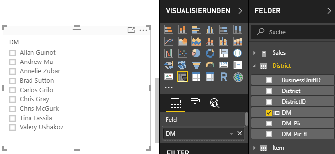
    
1. Sie können die Größe der Elemente im Zeichenbereich ändern und diese ziehen, um Platz für den Slicer zu machen. Beachten Sie, dass die Elemente des Slicers abgeschnitten werden, wenn Sie ihn zu stark verkleinern. 

1. Wählen Sie im Slicer Namen aus, und beachten Sie die Auswirkungen auf die anderen Visualisierungen auf der Seite. Wählen Sie die Namen erneut aus, um ihre Auswahl aufzuheben. Oder halten Sie die **STRG**-TASTE gedrückt, um mehrere Namen auszuwählen. Die Auswahl sämtlicher Namen hat die gleiche Wirkung wie die Auswahl keiner Namen. 

1. Wählen Sie alternativ im Bereich **Visualisierungen** den Befehl **Format** (Farbrollensymbol) aus, um Ihren Slicer zu formatieren. 

   Es gibt zu viele Möglichkeiten, um sie alle hier zu beschreiben. Experimentieren Sie daher, und erstellen Sie einen für Sie geeigneten Slicer. In der folgenden Abbildung hat der erste Slicer eine horizontale Ausrichtung und farbige Hintergründe für die Elemente. Der zweite Slicer ist vertikal ausgerichtet und färbt den Text für ein eher standardmäßiges Aussehen.

   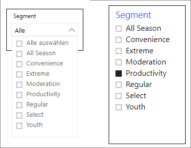

   >[!TIP]
   >Slicerelemente für Listen werden standardmäßig in aufsteigender Reihenfolge sortiert. Wenn Sie die Sortierreihenfolge in absteigend umkehren möchten, klicken Sie rechts oben im Slicer auf die Auslassungspunkte ( **...** ) und anschließend auf **Absteigend sortieren**.

## Steuern der Auswirkungen von Slicern auf visuelle Seitenelemente
Auf Berichtsseiten haben Slicer standardmäßig auf alle anderen Visualisierungen auf dieser Seite Auswirkungen, auch untereinander. Beachten Sie die Auswirkungen auf die anderen Visualisierungen, wenn Sie gerade erstellte Werte in der Liste und Schieberegler für Datumsangaben auswählen. Die gefilterten Daten stellen eine Schnittmenge der Werte dar, die in beiden Slicern ausgewählt wurden. 

Mithilfe visueller Interaktionen können Sie ausschließen, dass einige Seitenvisualisierungen von anderen beeinflusst werden. Auf der Seite **Übersicht** zeigt das Diagramm **Total Sales Variance by FiscalMonth and District Manager** (Abweichung vom Gesamtumsatz nach Geschäftsmonat und Bezirksleiter) die gesamten Vergleichsdaten für Bezirksleiter nach Monat, die jederzeit sichtbar bleiben sollen. Sie können mithilfe visueller Interaktionen verhindern, dass dieses Diagramm anhand der Auswahl im Slicer gefiltert wird. 

1. Wechseln Sie zur Seite **Übersicht** des Berichts, und wählen Sie dann den Slicer **DM** (Bezirksleiter) aus, den Sie zuvor erstellt haben.

1. Wählen Sie in im Power BI Desktop-Menü unter **Visual Tools** das Menü **Format** und anschließend **Interaktionen bearbeiten** aus.
   
   Über allen Visuals auf der Seite werden Filtersteuerelemente  jeweils mit der Option **Filter** und **Ohne** angezeigt. Anfänglich ist die Option **Filter** in allen Steuerelementen vorab ausgewählt.
   
1. Wählen Sie das Symbol **Ohne** über dem Diagramm **Total Sales Variance by FiscalMonth and District Manager** (Abweichung vom Gesamtumsatz nach Geschäftsmonat und Bezirksleiter) aus, um die Filterung durch den Slicer **DM** zu beenden. 

1. Wählen Sie den Slicer **OpenDate** und dann die Option **Ohne** über dem Diagramm **Total Sales Variance by FiscalMonth and District Manager** (Abweichung vom Gesamtumsatz nach Geschäftsmonat und Bezirksleiter) aus, um die Filterung durch diesen Slicer zu beenden. 

   Wenn Sie in den Slicern Namen und Datumsbereiche ausgewählt haben, bleibt das Diagramm **Total Sales Variance by FiscalMonth and District Manager** (Abweichung vom Gesamtumsatz nach Geschäftsmonat und Bezirksleiter) unverändert.

Weitere Informationen zur Bearbeitung von Interaktionen finden Sie unter [Ändern der Interaktion von Visualisierungen in einem Power BI-Bericht](../service-reports-visual-interactions.md).

## Synchronisieren und Verwenden von Slicern auf anderen Seiten
Ab dem Power BI-Update von Februar 2018 können Sie einen Slicer synchronisieren und auf einer beliebigen Seite oder allen Seiten in einem Bericht verwenden. 

Im aktuellen Bericht enthält die Seite **District Monthly Sales** (Monatsumsätze nach Bezirk) auch den Slicer **District Manager** (Bezirksleiter). Aber was wäre, wenn wir uns diesen Slicer auch auf der Seite **New Stores** (Neue Filialen) wünschen würden? Die Seite **New Stores** (Neue Filialen) hat ebenfalls einen Slicer, liefert aber nur Informationen zu **Store Name** (Filialname). Im Bereich **Slicer synchronisieren** können Sie den Slicer **District Manager** (Bezirksleiter) mit diesen Seiten synchronisieren, damit sich die Auswahl der Slicer auf einer beliebigen Seite auf Visualisierungen auf allen drei Seiten auswirkt.

1. Klicken Sie im Power BI Desktop-Menü **Ansicht** auf **Slicer synchronisieren**.

    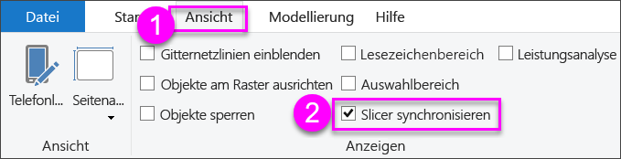

    Der Bereich **Slicer synchronisieren** wird zwischen den Bereichen **Filter** und **Visualisierungen** angezeigt.

    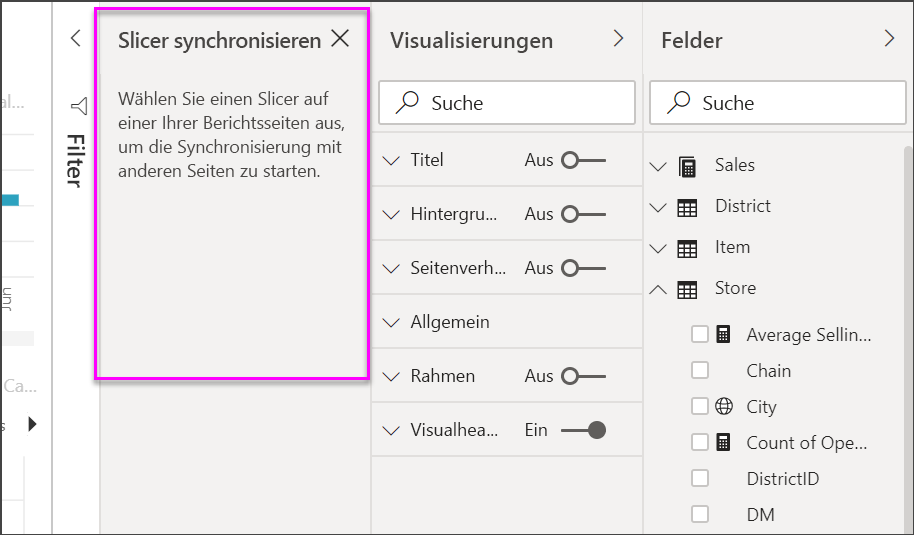

1. Wählen Sie auf der Seite **District Monthly Sales** (Monatsumsätze nach Bezirk) des Berichts den Slicer **District Manager** (Bezirksleiter) aus. 

    Da Sie auf der Seite **Übersicht** bereits den Slicer **District Manager** (**DM**) erstellt haben, wird der Bereich **Slicer synchronisieren** wie folgt angezeigt:
    
    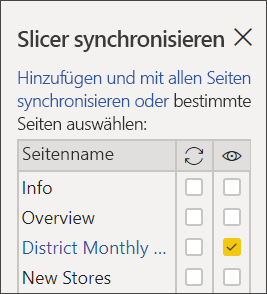
    
1. Wählen Sie in der Spalte **Synchronisieren** des Bereichs **Slicer** die Seiten **Overview** (Übersicht), **District Monthly Sales** (Monatsumsätze nach Bezirk) und **New Stores** (Neue Filialen) aus. 

    Diese Auswahl bewirkt, dass der Slicer **District Monthly Sales** (Monatsumsätze nach Bezirk) auf diesen drei Seiten synchronisiert wird. 
    
1. Wählen Sie in der Spalte **Sichtbar** des Bereichs **Slicer** die Seite **New Stores** (Neue Filialen) aus. 

    Diese Auswahl bewirkt, dass der Slicer **District Monthly Sales** (Monatsumsätze nach Bezirk) auf diesen drei Seiten sichtbar ist. Der Bereich **Slicer synchronisieren** wird nun wie folgt angezeigt:

    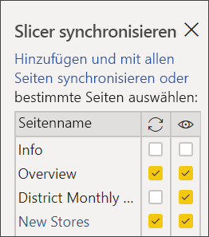

1. Beobachten Sie die Auswirkungen der Synchronisierung des Slicers und der Sichtbarmachung auf den anderen Seiten. Auf der Seite **District Monthly Sales** (Monatsumsätze nach Bezirk) zeigt der Slicer für **District Manager** (Bezirksleiter) jetzt die gleiche Auswahl wie auf der Seite **Übersicht**. Auf der Seite **New Stores** (Neue Filialen) ist nun der Slicer **District Manager** (Bezirksleiter) sichtbar, was sich auf die Auswahlmöglichkeiten auswirkt, die im Slicer **Store Name** (Filialnamen) sichtbar sind. 
    
    >[!TIP]
    >Der Slicer wird zwar auf den synchronisierten Seiten zunächst in der gleichen Größe und an der gleichen Position wie auf der ursprünglichen Seite angezeigt, Sie können die synchronisierten Slicer auf den verschiedenen Seiten jedoch unabhängig voneinander verschieben, formatieren und ihre Größe ändern. 

    >[!NOTE]
    >Wenn Sie einen Slicer auf einer Seite synchronisieren, ihn auf dieser Seite jedoch nicht sichtbar machen, werden die Daten auf der Seite von den auf den anderen Seiten ausgewählten Slicern weiterhin gefiltert.
 
## Filterslicer
Sie können Filter auf Visualebene auf Slicer anwenden, um die Liste der Werte zu reduzieren, die im Slicer angezeigt werden. Beispielsweise können Sie leere Werte aus einem Listenslicer oder bestimmte Datumsangaben aus einem Bereichsslicer herausfiltern. Hierbei werden nur *die Werte beeinflusst, die im Slicer angezeigt werden*, nicht *der Filter, den der Slicer auf andere Visuals anwendet*, wenn Sie eine Auswahl treffen. Angenommen, Sie wenden einen Filter auf einen Bereichsslicer an, um nur bestimmte Datumsangaben anzuzeigen. Die Auswahl im Slicer zeigt nur die ersten und letzten Datumsangaben aus dem Bereich an, die anderen Datumsangaben werden jedoch in Ihren anderen Visuals angezeigt. Sobald Sie Änderungen am ausgewählten Bereich im Slicer vornehmen, werden auch die anderen Visuals geändert. Wenn der Slicer gelöscht wird, werden wieder alle Datumsangaben angezeigt.

Weitere Informationen über Filter auf Visualebene finden Sie unter [Filtertypen](../power-bi-report-filter-types.md).

## Formatieren von Slicern
Abhängig vom Slicertyp sind verschiedene Formatierungsoptionen verfügbar. Wenn Sie die Ausrichtung **Horizontal**, das Layout **Dynamisch** und die Farbgebung für **Elemente** auswählen, können Sie anstelle von Standardlistenelementen Schaltflächen oder Kacheln erstellen und die Größe von Slicerelementen an verschiedene Bildschirmgrößen und Layouts anpassen.  

1. Klicken Sie bei ausgewähltem Slicer für **District Manager** (Bezirksleiter) auf einer Seite im Bereich **Visualisierungen** auf das Symbol **Format**, um die Formatierungssteuerelemente anzuzeigen. 
    
    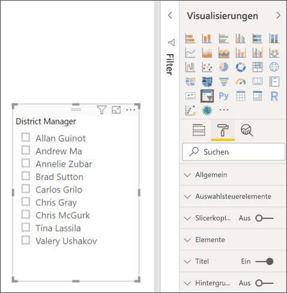
    
1. Klicken Sie neben den einzelnen anzuzeigenden Kategorien auf die Dropdown-Pfeile, und bearbeiten Sie die Optionen. 

### Allgemeine Optionen
1. Wählen Sie unter **Format** die Option **Allgemein** aus. Wählen Sie unter **Konturfarbe** eine rote Farbe aus, und ändern Sie dann **Konturstärke** in *2*. 

    Diese Einstellung ändert Farbe und Stärke der Kopfzeilen, Elementkonturen und Unterstriche.

1. Für **Ausrichtung** ist **Vertikal** die Standardeinstellung. Wählen Sie **Horizontal** aus, um einen Slicer mit horizontal angeordneten Kacheln oder Schaltflächen sowie Scrollpfeilen zu erzeugen, über die auf Elemente zugegriffen werden kann, die nicht in den Slicer passen.
    
    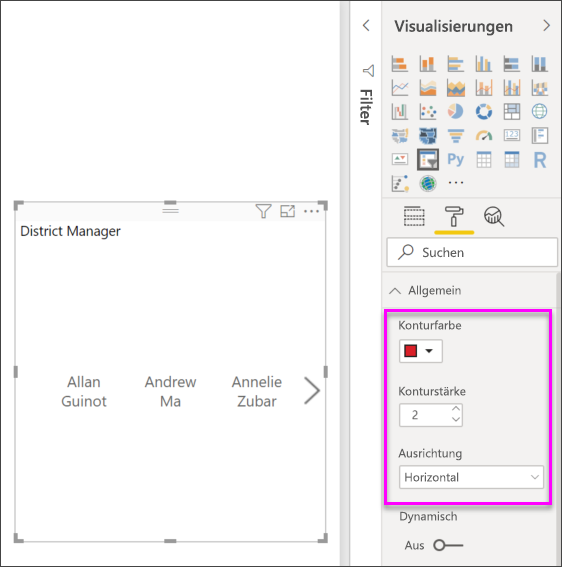
    
1. **Aktivieren** Sie das Layout **Dynamisch**, um Größe und Anordnung der Slicerelemente entsprechend der Bildschirm- und Slicergröße zu ändern. 

    Bei Slicern verhindert das dynamische Layout, dass Elemente auf kleinen Bildschirmen abgeschnitten werden. Es ist nur in horizontaler Ausrichtung verfügbar. Bei Schieberegler-Slicern für Bereiche wird durch die dynamische Formatierung die Art des Schiebereglers geändert. Zudem kann die Größe flexibler geändert werden. Beide Slicertypen werden zu kleinen Filtersymbolen.
    
    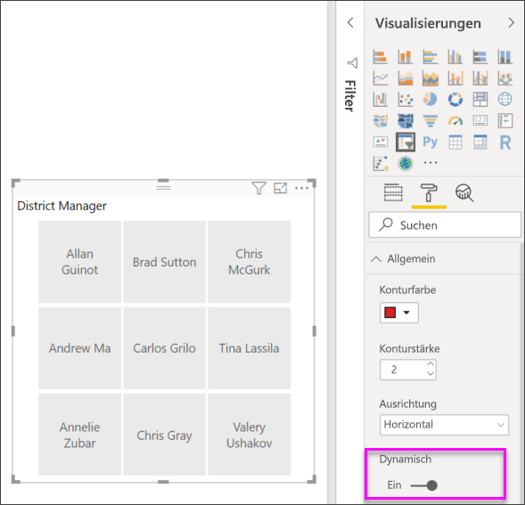
    
    >[!NOTE]
    >Durch dynamische Layoutänderungen können bestimmte, von Ihnen festgelegte Formatierungen von Überschriften und Elementen überschrieben werden. 
    
1. Legen Sie Position und Größe des Slicers unter **X-Position**, **Y-Position**, **Breite** und **Höhe** mit numerischer Genauigkeit fest, oder verschieben Sie den Slicer direkt im Zeichenbereich, und ändern Sie seine Größe. 

    Experimentieren Sie mit verschiedenen Größen und Anordnungen der Elemente, und beachten Sie, wie sich die dynamische Formatierung entsprechend ändert. Diese Optionen sind nur verfügbar, wenn Sie die horizontale Ausrichtung auswählen. 

    

Weitere Informationen zur horizontalen Ausrichtung und zum dynamischen Layout finden Sie unter [Erstellen eines dynamischen Datenschnitts mit anpassbarer Größe in Power BI](../power-bi-slicer-filter-responsive.md).

### Optionen für Auswahlsteuerelemente (nur bei Slicern für Listen)
1. Legen Sie unter **Auswahlsteuerelemente** die Option **Option "Alles auswählen" anzeigen** auf **Ein** fest, um dem Slicer das Element **Alle auswählen** hinzuzufügen. 

    **Option "Alles auswählen" anzeigen** ist standardmäßig **deaktiviert**. Falls aktiviert, werden beim Umschalten alle Elemente ausgewählt, oder ihre Auswahl wird aufgehoben. Wenn Sie alle Elemente auswählen, wird die Auswahl eines Elements durch Klicken oder Tippen darauf aufgehoben, wodurch ein Filter des Typs *is-not* (ist nicht) möglich wird.
    
    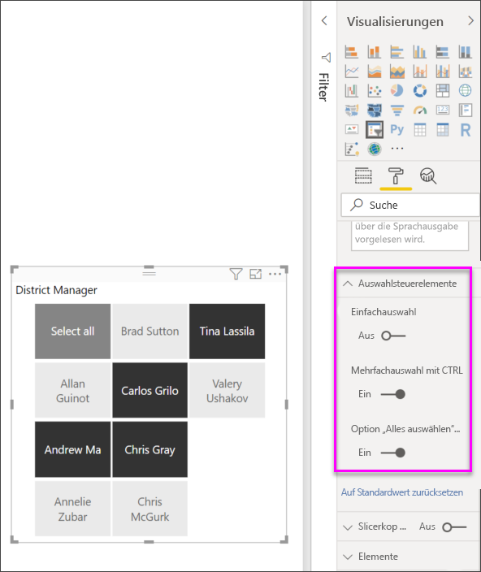
    
1. Legen Sie **Einfachauswahl** auf **Aus** fest, damit mehrere Elemente ausgewählt werden können, ohne dass die **STRG**-TASTE gedrückt werden muss. 

    **Einfachauswahl** ist standardmäßig **aktiviert**. Durch Klicken oder Tippen auf ein Element wird es ausgewählt. Wenn Sie die **STRG**-TASTE gedrückt halten, werden mehrere Elemente ausgewählt. Durch erneutes Klicken oder Tippen auf ein Element wird seine Auswahl aufgehoben.

### Titeloptionen
**Titel** ist standardmäßig **aktiviert**. Diese Auswahl zeigt den Namen des Datenfelds oben im Slicer. 
- Formatieren Sie für diesen Artikel den Titeltext wie folgt: 
   - **Schriftfarbe**: rot
   - **Textgröße**: **14 pt**
   - **Ausrichtung**: **Zentriert**
   - **Schriftfamilie**: **Arial Black**

### Elementoptionen (nur bei Slicern für Listen)
1. Formatieren Sie für diesen Artikel die Optionen für **Elemente** wie folgt:
    - **Schriftfarbe**: schwarz
    - **Hintergrund**: hellrot
    - **Textgröße**: **10 pt**
    - **Schriftfamilie**: **Arial**
 
1. Wählen Sie unter **Kontur** die Option **Rahmen** aus, um eine Umrandung für die einzelnen Elemente in der unter **Allgemeine Optionen** festgelegten Größe und Farbe zu zeichnen. 
    
    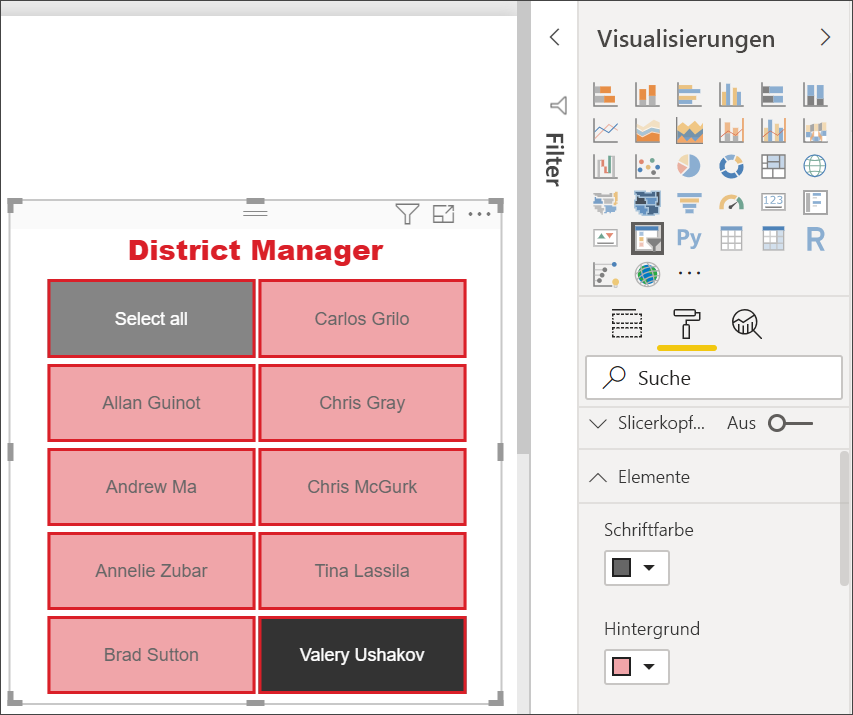
    
    >[!TIP]
    >- Bei Auswahl von **Allgemein** > **Ausrichtung** > **Horizontal** weisen Elemente mit aufgehobener Auswahl die gewählten Text- und Hintergrundfarben auf, während ausgewählte Elemente den Systemstandard verwenden (in der Regel schwarzer Hintergrund mit weißem Text).
    >- Bei Auswahl von **Allgemein** > **Ausrichtung > Vertikal** werden Elemente immer in den festgelegten Farben angezeigt, während Kontrollkästchen immer schwarz sind, wenn sie aktiviert werden. 

### Optionen für die Eingabe von Datumsangaben/numerischen Werten und Schieberegleroptionen (nur bei Schieberegler-Slicern für Bereiche)
- Optionen für Slicer für Listen zur Eingabe von Datumsangaben/numerischen Werten sind mit den Optionen für **Elemente** identisch. Eine Ausnahme ist, dass es keine Optionen für Konturen und Unterstriche gibt.
- Mit Optionen für **Schieberegler** können Sie die Farbe des Schiebereglers für Bereiche festlegen oder den Schieberegler **deaktivieren**, sodass nur die numerischen Eingaben bleiben.

### Weitere Formatierungsoptionen
Die weiteren Formatierungsoptionen sind standardmäßig **deaktiviert**. **Aktivieren** Sie diesen Optionen, um Sie zu steuern: 
- **Hintergrund:** Fügt eine Hintergrundfarbe zum Slicer hinzu und legt dessen Transparenz fest.
- **Seitenverhältnis fixieren**: Behält bei einer Größenänderung die Form des Slicers bei.
- **Rahmen**: Fügt einen Rahmen um den Slicer hinzu und legt dessen Farbe fest. Dieser Slicerrahmen ist separat von den **allgemeinen** Einstellungen, die keinen Einfluss auf ihn haben. 

## Nächste Schritte
Weitere Informationen finden Sie in den folgenden Artikeln:

- [Visualisierungstypen in Power BI](power-bi-visualization-types-for-reports-and-q-and-a.md)

- [Tabellen in Power BI](power-bi-visualization-tables.md)

