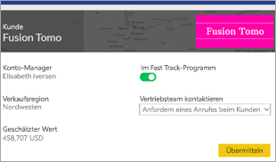
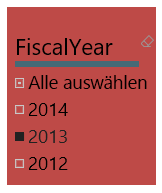

# Visualisierungstypen in Power BI
## Power BI-Visualisierungen
Wir werden neue Visualisierungen hinzufügen, seien Sie gespannt!

Besuchen Sie auch [Microsoft AppSource](https://appsource.microsoft.com/marketplace/apps?product=power-bi-visuals). Sie finden dort eine wachsende Anzahl von [Power BI-Visuals](../developer/visuals/power-bi-custom-visuals.md), die Sie herunterladen und in eigenen Dashboards und Berichten verwenden können. Sind Sie kreativ? [Erfahren Sie, wie Sie eigene Visuals erstellen und zur Communitywebsite hinzufügen können](../developer/visuals/office-store.md).  

## Liste der in Power BI verfügbaren Visualisierungen
Alle genannten Visualisierungen können zu Power BI-Berichten hinzugefügt, in Fragen und Antworten angegeben und auf Dashboards angeheftet werden.

### Flächendiagramme: einfach (überlappend) und gestapelt

>[!TIP]
>Das einfache Flächendiagramm basiert auf dem Liniendiagramm, wobei beim Flächendiagramm der Bereich zwischen Achse und Linie ausgefüllt ist.

Weitere Informationen finden Sie unter [Grundlegendes Flächendiagramm](power-bi-visualization-basic-area-chart.md).

### Balken- und Säulendiagramme

 

>[!TIP]
>Balkendiagramme sind die Standarddarstellung für einen bestimmten Wert über verschiedene Kategorien hinweg.

### Karten: mehrzeilig

### Karten: einzelne Zahl

Weitere Informationen finden Sie unter [Erstellen einer Karte (Kachel für große Zahlen)](power-bi-visualization-card.md).

### Kombinationsdiagramme

>[!TIP]
>Ein Kombinationsdiagramm vereinigt Säulendiagramm und Liniendiagramm. Wählen Sie entweder *Linien- und gestapeltes Säulendiagramm* oder *Linien- und gruppiertes Säulendiagramm* aus.

Weitere Informationen finden Sie unter [Kombinationsdiagramme in Power BI](power-bi-visualization-combo-chart.md).

### Ringdiagramme

>[!TIP]
>Ringdiagramme ähneln Kreisdiagrammen.  Sie zeigen die Beziehung von Teilen zu einem Ganzen.

Weitere Informationen finden Sie unter [Ringdiagramme in Power BI](power-bi-visualization-doughnut-charts.md).

### Trichterdiagramme

>[!TIP]
>Trichter unterstützen die Visualisierung von Prozessen mit Phasen, bei denen Elemente fortlaufend von einer Phase in die nächste übergehen.  Verwenden Sie einen Trichter, wenn zwischen Phasen ein fortlaufender Fluss herrscht, z.B. bei einem Vertriebsprozess, der mit Kundenkontakten beginnt und mit dem vollendeten Kauf endet.

Weitere Informationen finden Sie unter [Trichterdiagramme in Power BI](power-bi-visualization-funnel-charts.md).

### Messgerätdiagramme

>[!TIP]
>Zeigt den aktuellen Status in Bezug auf ein Ziel an.

Weitere Informationen finden Sie unter [Messgerätediagramme in Power BI](power-bi-visualization-radial-gauge-charts.md).

### Diagramm für die wichtigsten Einflussfaktoren

Ein Diagramm für die wichtigsten Einflussfaktoren stellt die wichtigsten Beiträge zu einem ausgewählten Ergebnis oder Wert dar.

Weitere Informationen finden Sie unter [Diagramme der wichtigsten Einflussfaktoren in Power BI](power-bi-visualization-influencers.md).

### KPIs

>[!TIP]
>Hiermit wird der Fortschritt bezogen auf einen messbaren Zielwert angezeigt.

Weitere Informationen finden Sie unter [KPIs in Power BI](power-bi-visualization-kpi.md).

### Liniendiagramme

>[!TIP]
>Diese heben die allgemeine Form einer ganzen Wertereihe hervor, in der Regel im Zeitverlauf.

### Karten: einfache Karten

>[!TIP]
>Diese werden verwendet, um kategorische und quantitative Informationen mit räumlichen Standorten zu verknüpfen.

Weitere Informationen finden Sie unter [Tipps und Tricks für Kartenvisualisierungen](power-bi-map-tips-and-tricks.md).

### Karten: ArcGIS-Karten

Weitere Informationen finden Sie unter [ArcGIS Maps in Power BI](power-bi-visualization-arcgis.md).

### Karten: gefüllte Karten (Choropleth)

>[!TIP]
>Je intensiver die Farbe, desto größer der Wert.

Weitere Informationen finden Sie unter [Flächenkartogramme in Power BI](power-bi-visualization-filled-maps-choropleths.md).

### Karten: Flächenkartogramme

>[!TIP]
>Regionen werden durch Farben voneinander abgetrennt.

Weitere Informationen finden Sie unter [Flächenkartogramme in Power BI](desktop-shape-map.md).

### Matrix

>[!TIP]
>Eine Tabelle unterstützt zwei Dimensionen, aber eine Matrix erleichtert die sinnvolle Darstellung von Daten über mehrere Dimensionen hinweg – sie unterstützt ein abgestuftes Layout. Die Matrix aggregiert die Daten automatisch und ermöglicht einen Drilldown. 

Weitere Informationen finden Sie unter [Matrixvisuals in Power BI](desktop-matrix-visual.md).

### Kreisdiagramme

>[!TIP]
>Kreisdiagramme zeigen die Beziehung von Teilen zum Ganzen. 

### Power Apps-Visual

Entwickler von Berichten können eine Power App erstellen und als Visual in einen Power BI-Bericht einbetten. Benutzer können mit diesem Visual im Power BI-Bericht interagieren. 

Weitere Informationen finden Sie unter [Hinzufügen eines Power Apps-Visuals zu Ihrem Bericht](power-bi-visualization-powerapp.md).

### Q&A-Visuals

>[!TIP]
>Ähnlich wie bei der [Verwendung der Q&A-Funktion in Dashboards](../create-reports/power-bi-tutorial-q-and-a.md) können Sie mit dem Visual für Fragen und Antworten Fragen zu Ihren Daten in natürlicher Sprache stellen. 

Weitere Informationen finden Sie unter [Visuals für Fragen und Antworten in Power BI](power-bi-visualization-q-and-a.md).

### Visuelle R-Skriptelemente

>[!TIP]
>Mit R-Skripts erstellte visuelle Elemente, sogenannte*Visuelle R-Skriptelemente*, können erweiterte Datenstrukturierung und -analysen wie z.B. Vorhersagen darstellen, indem sie sich das Leistungsvermögen von R hinsichtlich Analysen und Visualisierung zu Nutze machen. Visuelle R-Elemente können in Power BI Desktop erstellt und im Power BI-Dienst veröffentlicht werden.   

Weitere Informationen finden Sie unter [Erstellen von visuellen R-Elementen im Power BI-Dienst](service-r-visuals.md).

### Bänderdiagramm

>[!TIP]
>Bänderdiagramme zeigen, welche Datenkategorie den höchsten Rang (bzw. höchsten Wert) hat. Menübanddiagramme eignen sich gut zum Anzeigen von Rangänderungen, wobei der höchste Rang (Wert) immer für jeden Zeitraum oben angezeigt wird.

Weitere Informationen finden Sie unter [Menübanddiagramme in Power BI](desktop-ribbon-charts.md).

### Punkt- und Blasendiagramme

>[!TIP]
>Zeigen Sie die Beziehungen zwischen zwei (Punktdiagramm) oder drei (Blasendiagramm) quantitativen Maßeinheiten an – Vorhandensein, Reihenfolge usw.

Weitere Informationen finden Sie unter [Punktdiagramme in Power BI](power-bi-visualization-scatter.md).

### Punktdiagramme mit hoher Dichte

>[!TIP]
>Wenn es zu viele Datenpunkte für ein Visual gibt, kann dies Einfluss auf dessen Leistung haben. Daher wird ein ausgereifter Algorithmus für die Stichprobenentnahme verwendet, um die Genauigkeit der Visualisierung sicherzustellen.

Weitere Informationen finden Sie unter [High Density Scatter charts in Power BI (Punktdiagramme mit hoher Dichte in Power BI)](../create-reports/desktop-high-density-scatter-charts.md).

### Datenschnitte

Weitere Informationen finden Sie unter [Slicer in Power BI](power-bi-visualization-slicers.md).

### Eigenständige Bilder

Weitere Informationen finden Sie unter [Hinzufügen eines Widgets zu einem Dashboard](../create-reports/service-dashboard-add-widget.md).

### Tabellen

>[!TIP]
>Gut geeignet für quantitative Vergleiche zwischen Elementen mit vielen Kategorien.

Weitere Informationen finden Sie unter [Arbeiten mit Tabellen in Power BI](power-bi-visualization-tables.md).

### Treemaps

Weitere Informationen finden Sie unter [Treemaps in Power BI](power-bi-visualization-treemaps.md).

>[!TIP]
>Dies sind Diagramme mit farbigen Rechtecken, deren Größe einen Wert darstellt.  Sie können eine hierarchische Struktur aufweisen, bei denen Rechtecke in den Hauptrechtecken geschachtelt werden.

### Wasserfalldiagramme

>[!TIP]
>Wasserfalldiagramme zeigen eine laufende Summe an, während Werte hinzugefügt oder entfernt werden.

Weitere Informationen finden Sie unter [Wasserfalldiagramme in Power BI](power-bi-visualization-waterfall-charts.md).

## Angeben der verwendeten Visualisierung für Q&A
Bei der Eingabe von Abfragen in natürlicher Sprache über den Bereich für Fragen und Antworten in Power BI können Sie den Visualisierungstyp in der Abfrage angeben.  Beispiel:

***Umsätze nach Bundesland als Treemap***

Wenn Ihr Dashboard über kein Feld für Fragen und Antworten verfügt, wurde es möglicherweise vom Administrator Ihres Mandanten deaktiviert. 

## Nächste Schritte
[Visualisierungen in Power BI-Berichten](power-bi-report-visualizations.md)    
[„The right visual reference“ von sqlbi.com](https://www.sqlbi.com/wp-content/uploads/videotrainings/dashboarddesign/visuals-reference-may2017-A3.pdf)

