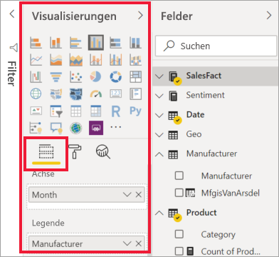
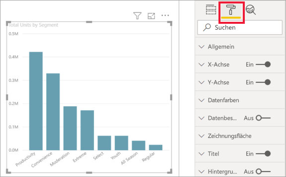
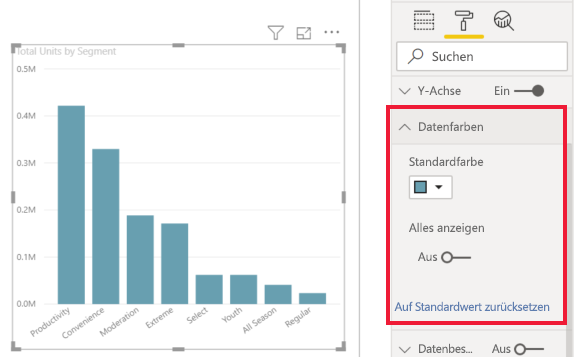
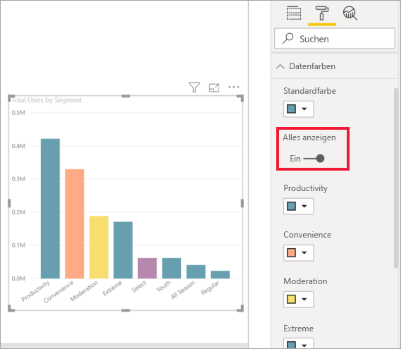
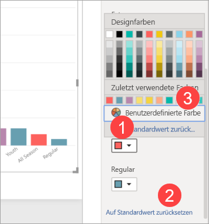
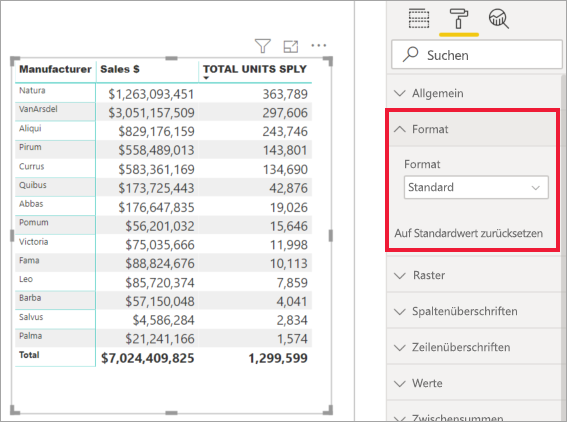
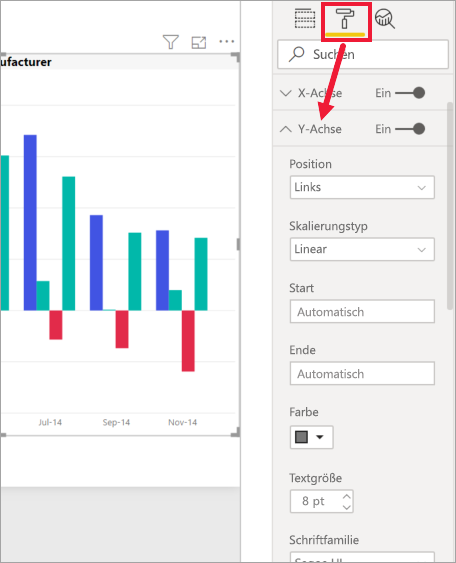
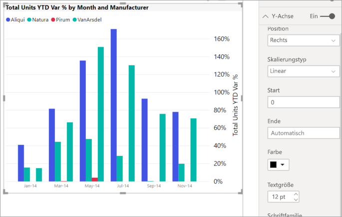
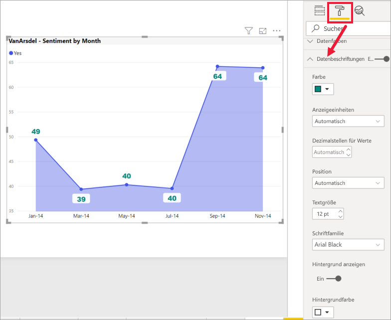

# Einstieg in den Formatierungsbereich
Wenn Sie über die nötigen Berechtigungen zum Bearbeiten von Berichten verfügen, stehen Ihnen zahlreiche Formatierungsoptionen zur Verfügung. In Power BI-Berichten können Sie die Farbe von Datenreihen und Datenpunkten und sogar den Hintergrund von Visualisierungen ändern. Sie können ändern, wie die x- und die y-Achse dargestellt werden. Sie können auch die Schriftarteigenschaften von Visualisierungen, Formen und Titeln formatieren. Power BI bietet Ihnen vollständige Kontrolle darüber, wie Ihre Berichte aussehen.

Öffnen Sie zunächst einen Bericht in Power BI Desktop oder im Power BI-Dienst. Beide Dienste bieten beinahe identische Formatierungsoptionen. Wenn Sie einen Bericht im Power BI-Dienst öffnen, müssen Sie in der Menüleiste auf **Bearbeiten** klicken. 

Wenn Sie einen Bericht bearbeiten und eine Visualisierung ausgewählt haben, wird der Bereich **Visualisierungen** angezeigt. In diesem Bereich können Sie Visualisierungen bearbeiten. Direkt unter dem Bereich **Visualisierungen** werden drei Symbole angezeigt: **Felder** (zwei Kästchen), **Format** (eine Farbwalze) und **Analyse** (eine Lupe). In der folgenden Abbildung ist das Symbol **Felder** ausgewählt, was Sie am gelben Balken unterhalb des Symbols erkennen.

Wenn Sie **Format** auswählen, zeigt der Bereich unterhalb des Symbols die Anpassungsmöglichkeiten für die aktuell ausgewählte Visualisierung an.  

Sie können viele Elemente einer Visualisierung anpassen. Welche Optionen verfügbar sind, hängt vom ausgewählten Visual ab. Zu diesen Optionen gehören unter anderem:

* Legende
* X-Achse
* Y-Achse
* Datenfarben
* Datenbeschriftungen
* Formen
* Zeichnungsfläche
* Titel
* Hintergrund
* Seitenverhältnis fixieren
* Rahmen
* QuickInfos
* Visualheader
* Formen
* Position    
und vieles mehr...

> [!NOTE]
>  
> Nicht bei jedem Visualisierungstyp werden all diese Elemente angezeigt. Die ausgewählte Visualisierung wirkt sich darauf aus, welche Anpassungen verfügbar sind. So wird Ihnen beispielsweise bei einem Kreisdiagramm keine X-Achse angezeigt, da Kreisdiagramme über keine X-Achsen verfügen.

Beachten Sie außerdem, dass **Filter** anstelle der Symbole angezeigt werden, wenn keine Visualisierung ausgewählt wurde. Dadurch können Sie die Filter auf alle Visualisierungen auf der Seite anwenden.

Wie Sie die Formatierungsoptionen verwenden, lernen Sie am besten, indem Sie sie einfach ausprobieren. Sie können Ihre Änderungen jederzeit rückgängig machen oder den Standardwert wiederherstellen. Es sind unglaublich viele Optionen verfügbar – und ständig kommen neue hinzu. Deshalb ist es nicht möglich, in diesem Artikel alle Formatierungsoptionen zu erklären. Um Ihnen den Einstieg zu erleichtern, werden die wichtigsten hier vorgestellt. 

1. Im Visual verwendete Farben ändern   
2. Einen Stil anwenden    
3. Achseneigenschaften ändern    
4. Datenbezeichnungen hinzufügen    

## Arbeiten mit Farben

Gehen Sie folgendermaßen vor, wenn Sie die Farben in einer Visualisierung ändern möchten:

1. Wählen Sie eine Visualisierung aus, um sie zu aktivieren.

2. Klicken Sie auf den Farbroller, um die Registerkarte mit den Formatierungsoptionen zu öffnen. Hier werden alle für das ausgewählte Visual verfügbaren Formatierungselemente angezeigt.

    

3. Klicken Sie auf **Datenfarben**, um sich die verfügbaren Anpassungen anzeigen zu lassen.  

    

4. Legen Sie für **Alle anzeigen** die Einstellung „Ein“ fest, und wählen Sie unterschiedliche Säulenfarben aus.

    

Hier noch ein paar hilfreiche Tipps für den Umgang mit Farben. Die Zahlen in der folgenden Auflistung werden auf dem Bildschirm unten ebenfalls angezeigt. So sehen Sie, wo Sie auf diese Elemente zugreifen oder diese ändern.

1. Eine Farbe gefällt Ihnen nicht? Kein Problem: Über **Auf Standardwert zurücksetzen** können Sie die Auswahl wieder auf die Standardeinstellung zurücksetzen. 

2. Alle Farbänderungen gefallen Ihnen nicht? Klicken Sie unten im Abschnitt **Datenfarben** auf **Auf Standardwert zurücksetzen**, damit wieder die Standardfarben verwendet werden. 

3. Möchten Sie eine Farbe auswählen, die Sie in der Palette nicht finden? Wählen Sie einfach **Benutzerdefinierte Farbe**aus, und Ihnen wird ein Farbspektrum angezeigt.  

   

Gefällt Ihnen die zuletzt vorgenommene Änderung nicht? Mit **STRG + Z** machen Sie die letzte Änderung wie gewohnt rückgängig.

## Anwenden eines Stils auf eine Tabelle
Manche Power BI-Visualisierungen bieten Ihnen die Option **Stil**. So können Sie mit nur einem Klick eine ganze Reihe von Formatierungsoptionen auf Ihre Visualisierung anwenden. 

1. Wählen Sie eine Tabelle oder eine Matrix aus, um sie zu aktivieren.   
1. Öffnen Sie die Registerkarte „Formatierung“, und wählen Sie **Stil** aus.

   

1. Wählen Sie einen Stil aus der Dropdownliste aus. 

   

Auch nachdem Sie einen Stil angewendet haben, können Sie die Eigenschaften der Visualisierung weiter ändern, einschließlich der Farbe.

## Ändern der Achseneigenschaften

Häufig soll auch die X-Achse oder die Y-Achse geändert werden. Ähnlich wie bei den Farbeinstellungen können Sie auch die Achseneigenschaften ändern, indem Sie links neben der zu ändernden Achse den Pfeil nach unten auswählen, wie in der folgenden Abbildung dargestellt.  

Im folgenden Beispiel wurden folgende Formatierungen an der y-Achse vorgenommen:
- Verschieben der Bezeichnungen auf die rechte Seite der Visualisierung

- Ändern des Anfangswerts zu Null

- Ändern der Schriftfarbe der Bezeichnungen zu Schwarz

- Erhöhen der Schriftgröße der Bezeichnung auf 12

- Hinzufügen eines Titels für die Y-Achse

    

Sie können die Achsenbezeichnungen komplett entfernen, indem Sie neben **X-Achse** oder **Y-Achse** auf das Optionsfeld klicken. Das Optionsfeld neben **Titel**legt fest, ob Achsentitel ein- oder ausgeblendet werden.  

## Hinzufügen von Datenbezeichnungen    

Hier noch ein letztes Formatierungsbeispiel, bevor Sie die Formatierungsoptionen selbst erkunden.  Einem Flächendiagramm wurden Datenbezeichnungen hinzugefügt. 

So sah das Diagramm *vorher* aus. 

So sah das Diagramm *nach* der Formatierung aus.

Wir haben die Visualisierung ausgewählt, um Sie zu aktivieren, und die Registerkarte „Formatierung“ geöffnet.  Wir haben die Option **Datenbezeichnungen** ausgewählt und aktiviert. Dann haben wir die Schriftart auf 12 geändert, die Schriftfamilie „Arial Black“ ausgewählt, die Option **Hintergrund anzeigen** aktiviert und einen weißen Hintergrund mit einer Transparenz von 5 % eingestellt.

Das sind nur ein paar der vielen möglichen Formatierungsaufgaben. Öffnen Sie einen Bericht im Bearbeitungsmodus, und machen Sie sich mit der Registerkarte „Formatierung“ vertraut, um ansprechende und informative Visualisierungen zu erstellen.

## Nächste Schritte
Weitere Informationen finden Sie im folgenden Artikel:  

* [Tipps und Tricks zur Farbformatierung in Power BI](service-tips-and-tricks-for-color-formatting.md)  
* [Bedingte Formatierung in Tabellen](../desktop-conditional-table-formatting.md)

