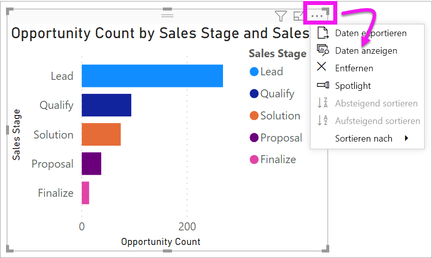
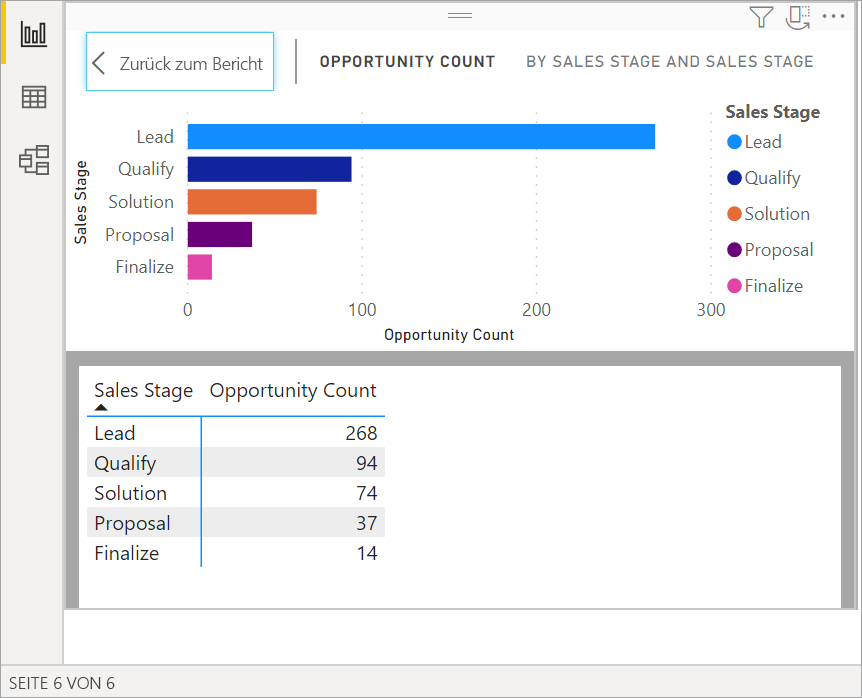
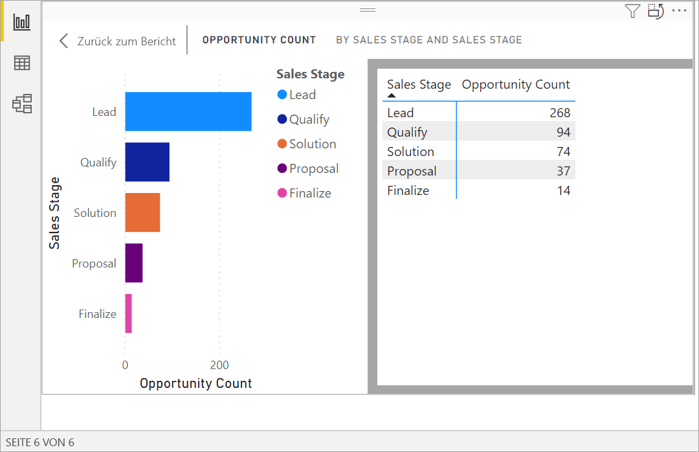
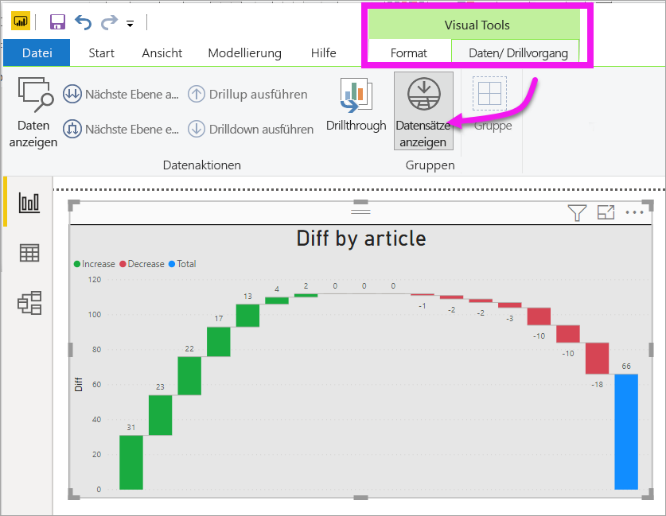

# Anzeigen der zugrunde liegenden Daten einer Visualisierung

[!INCLUDE[consumer-appliesto-yyyn](../includes/consumer-appliesto-nyyn.md)]    

## Anzeigen von Daten
Eine Power BI-Visualisierung wird mithilfe von Daten aus Ihren Datasets erstellt. Sie haben in Power BI die Möglichkeit, die Daten *anzuzeigen*, die der Visualisierung zugrunde liegen. Wenn Sie **Daten anzeigen** auswählen, werden die Daten in Power BI unter (oder neben) der Visualisierung angezeigt.

Sie können die Daten, mit denen die Visualisierung erstellt wurde, auch als XLSX- oder CSV-Datei exportieren und in Excel anzeigen. Weitere Informationen finden Sie unter [Exportieren von Daten aus Power BI-Visualisierungen](power-bi-visualization-export-data.md).

> [!NOTE]
> *Daten anzeigen* und *Daten exportieren* sind sowohl im Power BI-Dienst als auch in Power BI Desktop verfügbar. Power BI Desktop bietet jedoch eine zusätzliche Detailebene. [Mit *Datensätze anzeigen* werden die tatsächlichen Zeilen aus dem Dataset angezeigt](../create-reports/desktop-see-data-see-records.md).
> 
> 

## Verwenden *Daten anzeigen* 
1. Wählen Sie in Power BI Desktop eine Visualisierung aus, um sie zu aktivieren.

2. Wählen Sie die Auslassungspunkte (...) für **Weitere Aktionen** und **Daten anzeigen** aus. 
    

3. Standardmäßig werden die Daten unter der Visualisierung angezeigt.
   
   

4. Wählen Sie zum Ändern der Ausrichtung das vertikale Layout  in der rechten oberen Ecke der Visualisierung aus.
   
   
5. Wählen Sie zum Exportieren der Daten in eine CSV-Datei die Auslassungspunkte und anschließend **Daten exportieren** aus.
   
    
   
    Weitere Informationen zum Exportieren der Daten in Excel finden Sie unter [Exportieren von Daten aus Power BI-Visualisierungen](power-bi-visualization-export-data.md).
6. Wenn die Daten ausgeblendet werden sollen, deaktivieren Sie **Durchsuchen** > **Daten anzeigen**.

## Verwenden von „Datensätzen anzeigen“
Sie können den Fokus auch auf einen Datensatz einer Visualisierung legen und die zugrunde liegenden Daten genauer betrachten. 

1. Wählen Sie für die Verwendung von **Datensätze anzeigen** eine Visualisierung aus, um sie zu aktivieren. 

2. Wählen Sie im Menüband „Desktop“ die Registerkarte **Visual Tools** > **Daten/Drill** > **Datensätze anzeigen** aus. 

    

3. Wählen Sie einen Datenpunkt oder eine Zeile in der Visualisierung aus. In diesem Beispiel wurde die vierte Spalte von links ausgewählt. Power BI zeigt den Datasetdatensatz für diesen Datenpunkt an.

    

4. Wählen Sie **Zurück zum Bericht** aus, um zur Canvas des Desktopberichts zurückzukehren. 

## Zu beachtende Aspekte und Problembehandlung

- Wenn die Schaltfläche **Datensätze anzeigen** im Menüband deaktiviert und ausgegraut ist, bedeutet dies, dass die ausgewählte Visualisierung die Option „Datensätze anzeigen“ nicht unterstützt.
- Sie können die Daten in der Ansicht „Datensätze anzeigen“ nicht ändern und wieder im Bericht speichern.
- Wenn die Visualisierung ein berechnetes Measure beinhaltet, können Sie „Datensätze anzeigen“ nicht verwenden.
- Sie können „Datensätze anzeigen“ nicht verwenden, wenn Sie mit einem aktiven mehrdimensionalen Modell (MD-Modell) verbunden sind.  

## Weitere Schritte
[Exportieren von Daten aus Power BI-Visualisierungen](power-bi-visualization-export-data.md)    

Weitere Fragen? [Wenden Sie sich an die Power BI-Community](https://community.powerbi.com/)

